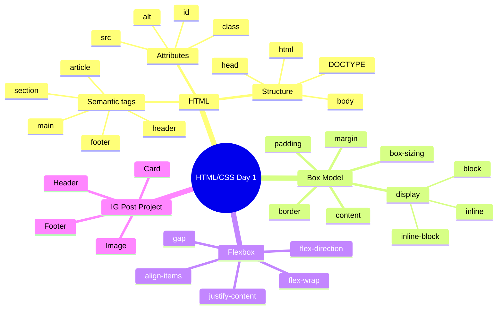

[🇪🇸 Español](README.md) | 🇬🇧 **English**

# 📋 Day 1: HTML/CSS Fundamentals

## 📚 Context

Your first day in the bootcamp. This is where you build the foundation everything else stands on: **HTML structure**, **the box model**, and **Flexbox layout**. If you master these three concepts, you'll be able to recreate almost any UI you see on the web.

---

## 🎯 Goals for the day

By the end of this day you should be able to:

- Write a semantic, well-structured HTML document
- Explain the 4 zones of the box model (content, padding, border, margin)
- Lay out components in a row or column using Flexbox
- Build an "Instagram-style post" card combining HTML + CSS

---

## 🗺️ Mind Map: HTML/CSS Fundamentals



---

## 🎯 Syllabus resources

- **READ** – [Introduction to 4Geeks Academy](https://4geeks.com/syllabus/spain-fs-pt-129/read/intro-to-4geeks-full-stack)
- **READ** – [Before Starting Full Stack Development](https://4geeks.com/syllabus/spain-fs-pt-129/read/before-we-start-the-fullstack)
- **PROJECT** – [Instagram Post Layout](https://4geeks.com/syllabus/spain-fs-pt-129/project/instagram-post)

---

## 🗂️ Structure of the day

```text
day_01/
├── README.md
├── step0-intro-html/
│   └── README.md          # HTML structure and semantic tags
├── step1-modelo-caja/
│   └── README.md          # Box model and display properties
├── step2-flexbox/
│   └── README.md          # Flexbox: rows, columns, alignment
├── step3-proyecto-instagram-post/
│   └── README.md          # IG Post project walkthrough
├── 01-Flex/               # Standalone Flexbox practice
├── 02-Grid/               # Standalone CSS Grid practice
├── 03-Position/           # Standalone position practice
├── 04-IG-Feed/            # Final project of the day
└── html-hello/            # Your first "Hello world" HTML
```

---

## 🧭 Suggested study order

1. `step0-intro-html` — Learn how to structure an HTML document
2. `step1-modelo-caja` — Understand how CSS sizes and spaces boxes
3. `step2-flexbox` — Lay out components aligned in a row or column
4. `step3-proyecto-instagram-post` — Apply everything in the day's project

---

## 💻 Local projects

This directory contains five hands-on mini-projects:

| Folder | Topic |
|--------|-------|
| [`01-Flex/`](01-Flex/index.html) | Flexbox practice |
| [`02-Grid/`](02-Grid/index.html) | CSS Grid practice |
| [`03-Position/`](03-Position/index.html) | Practice with `position` (relative, absolute, fixed, sticky) |
| [`04-IG-Feed/`](04-IG-Feed/index.html) | Instagram feed layout |
| [`html-hello/`](html-hello/index.html) | Your first "Hello world" HTML |

Each folder has its own `index.html` and `style.css`. To see them, open `index.html` directly in the browser.

---

## ✅ End-of-day checklist

- [ ] I understand the basic structure of an HTML document (`<html>`, `<head>`, `<body>`)
- [ ] I can use semantic tags (`<header>`, `<main>`, `<article>`, `<footer>`)
- [ ] I know the box model (margin, border, padding, content) and `box-sizing`
- [ ] I can lay out with Flexbox: `flex-direction`, `justify-content`, `align-items`, `gap`
- [ ] I completed the Instagram Post Layout project
