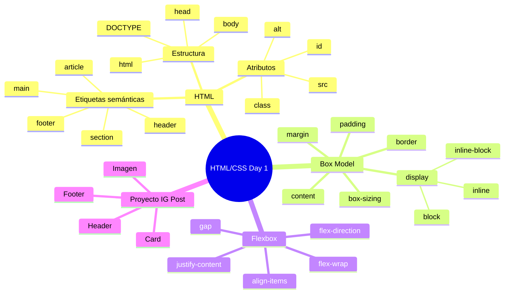

🇪🇸 **Español** | [🇬🇧 English](README.en.md)

# 📋 Día 1: Fundamentos de HTML/CSS

## 📚 Contexto

Tu primer día en el bootcamp. Aquí construyes la base sobre la que se sustenta todo lo que viene después: **estructura HTML**, **modelo de caja** y **maquetación con Flexbox**. Si dominas estos tres conceptos, podrás recrear casi cualquier interfaz que veas en la web.

---

## 🎯 Objetivos del día

Al terminar este día deberías poder:

- Escribir un documento HTML semántico y bien estructurado
- Explicar las 4 zonas del modelo de caja (content, padding, border, margin)
- Maquetar componentes en una fila o columna con Flexbox
- Construir una tarjeta tipo "post de Instagram" combinando HTML + CSS

---

## 🗺️ Mapa Mental: HTML/CSS Fundamentals



---

## 🎯 Recursos del syllabus

- **READ** – [Introduction to 4Geeks Academy](https://4geeks.com/syllabus/spain-fs-pt-129/read/intro-to-4geeks-full-stack)
- **READ** – [Before Starting Full Stack Development](https://4geeks.com/syllabus/spain-fs-pt-129/read/before-we-start-the-fullstack)
- **PROJECT** – [Instagram Post Layout](https://4geeks.com/syllabus/spain-fs-pt-129/project/instagram-post)

---

## 🗂️ Estructura del día

```text
day_01/
├── README.md
├── step0-intro-html/
│   └── README.md          # Estructura HTML y etiquetas semánticas
├── step1-modelo-caja/
│   └── README.md          # Box model y propiedades display
├── step2-flexbox/
│   └── README.md          # Flexbox: filas, columnas, alineación
├── step3-proyecto-instagram-post/
│   └── README.md          # Walkthrough del proyecto IG Post
├── 01-Flex/               # Práctica suelta de Flexbox
├── 02-Grid/               # Práctica suelta de CSS Grid
├── 03-Position/           # Práctica suelta de position
├── 04-IG-Feed/            # Proyecto final del día
└── html-hello/            # Tu primer "Hola mundo" HTML
```

---

## 🧭 Orden sugerido de estudio

1. `step0-intro-html` — Aprender a estructurar un documento HTML
2. `step1-modelo-caja` — Entender cómo CSS dimensiona y espacia las cajas
3. `step2-flexbox` — Maquetar componentes alineados en fila o columna
4. `step3-proyecto-instagram-post` — Aplicar todo en el proyecto del día

---

## 💻 Proyectos locales

En este directorio encontrarás cinco mini-proyectos prácticos:

| Carpeta | Tema |
|---------|------|
| [`01-Flex/`](01-Flex/index.html) | Práctica de Flexbox |
| [`02-Grid/`](02-Grid/index.html) | Práctica de CSS Grid |
| [`03-Position/`](03-Position/index.html) | Práctica de `position` (relative, absolute, fixed, sticky) |
| [`04-IG-Feed/`](04-IG-Feed/index.html) | Maquetación del feed de Instagram |
| [`html-hello/`](html-hello/index.html) | Tu primer HTML "Hola mundo" |

Cada carpeta tiene su propio `index.html` y `style.css`. Para verlos, abre el `index.html` directamente en el navegador.

---

## ✅ Checklist de cierre del día

- [ ] Entiendo la estructura básica de un documento HTML (`<html>`, `<head>`, `<body>`)
- [ ] Sé usar etiquetas semánticas (`<header>`, `<main>`, `<article>`, `<footer>`)
- [ ] Conozco el modelo de caja (margin, border, padding, content) y `box-sizing`
- [ ] Sé maquetar con Flexbox: `flex-direction`, `justify-content`, `align-items`, `gap`
- [ ] Completé el proyecto del Instagram Post Layout
