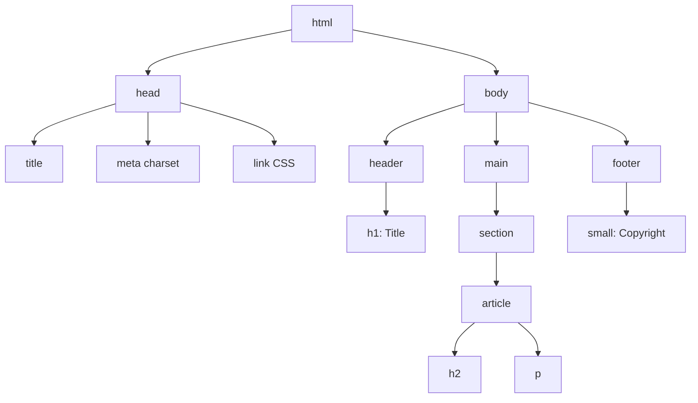

[🇪🇸 Español](README.md) | 🇬🇧 **English**

# Step 0: HTML Structure and Semantic Tags

## 🎯 Goal

Understand **how an HTML document is built** from scratch: which tags are required, what "semantics" means, and how to organize content so that both the browser and other developers can read it easily.

---

## 🤔 Why does this matter?

HTML is the **skeleton** of any web page. Before adding colors, animations, or JavaScript logic, you need to decide **what pieces the page has**: header, main content, cards, footer, etc.

If the skeleton is poorly built:

- Google won't understand your page (bad SEO)
- Screen readers can't navigate it (bad accessibility)
- You'll get lost in your own code within days

Good semantic HTML is **code that explains itself**.

---

## 🧱 Anatomy of an HTML document

Every `.html` file follows the same base structure:

```html
<!DOCTYPE html>
<html lang="en">
  <head>
    <meta charset="UTF-8" />
    <meta name="viewport" content="width=device-width, initial-scale=1.0" />
    <title>My first page</title>
    <link rel="stylesheet" href="styles.css" />
  </head>
  <body>
    <h1>Hello, world</h1>
    <p>This is my first paragraph.</p>
  </body>
</html>
```

### What does each piece do?

| Element | What it's for |
|---------|---------------|
| `<!DOCTYPE html>` | Tells the browser: "this is modern HTML5" |
| `<html lang="en">` | Root of the document. `lang` helps search engines and screen readers |
| `<head>` | **Invisible** information about the page (title, styles, metadata) |
| `<meta charset="UTF-8">` | Lets you use accents and special characters without breaking |
| `<meta name="viewport">` | Makes the page responsive on mobile |
| `<title>` | Text shown in the browser tab |
| `<link rel="stylesheet">` | Connects the external CSS file |
| `<body>` | Everything **visible** on the page goes here |

---

## 🧩 The DOM tree

When the browser reads your HTML, it turns it into a **tree of nodes** called the DOM (Document Object Model). Each tag is a node that can contain other nodes.



> 💡 **In your project:** The Instagram feed you'll build is exactly this: a `<header>` on top, a `<main>` with several `<article>` elements (the posts), and a `<footer>` at the bottom.

---

## 🏷️ Semantic tags vs. generic `<div>`s

Before HTML5, everything was done with `<div>` (generic boxes). Today we have tags with **meaning**:

| Semantic tag | Visually equals... | Meaning |
|--------------|---------------------|---------|
| `<header>` | a top `<div>` | Header of the page or a section |
| `<nav>` | a `<div>` with links | Navigation menu |
| `<main>` | the central `<div>` | Main, unique page content |
| `<section>` | a grouping `<div>` | Thematic block within the page |
| `<article>` | a `<div>` with standalone content | A piece that makes sense on its own (a post, a news item) |
| `<aside>` | a side `<div>` | Related but secondary content |
| `<footer>` | a bottom `<div>` | Page or section footer |

### Comparison: semantic HTML vs. "div soup"

```html
<!-- ❌ Bad: "div soup" — nothing is clear -->
<div class="top">
  <div class="title">My blog</div>
</div>
<div class="content">
  <div class="post">
    <div class="post-title">Hello</div>
    <div class="post-body">Post text</div>
  </div>
</div>

<!-- ✅ Good: semantic HTML — reads like an outline -->
<header>
  <h1>My blog</h1>
</header>
<main>
  <article>
    <h2>Hello</h2>
    <p>Post text</p>
  </article>
</main>
```

> 💡 **Rule of thumb:** If the tag describes **what it is** (not how it looks), use it. Fall back to `<div>` only when no semantic tag fits.

---

## ✍️ Most-used content tags

| Tag | Use |
|-----|-----|
| `<h1>` to `<h6>` | Hierarchical headings. `<h1>` is the most important; use **only one** per page |
| `<p>` | Paragraph of text |
| `<a href="...">` | Link to another page or section |
| `` | Image. The `alt` attribute is required for accessibility |
| `<ul>`, `<ol>`, `<li>` | Lists: unordered, ordered, and each item |
| `<strong>`, `<em>` | Bold / italic text with semantic meaning |
| `<figure>`, `<figcaption>` | An image with its caption |
| `<button>` | A clickable button |

---

## 🎨 Common attributes

Each tag can carry **attributes** that add information:

```html

<a href="https://4geeks.com" target="_blank">Go to 4Geeks</a>
<article class="card" id="post-1">...</article>
```

| Attribute | What it's for |
|-----------|---------------|
| `class` | Reusable label for applying CSS styles or selecting with JS |
| `id` | **Unique** identifier within the document |
| `src` | Path to the resource (image, video, script) |
| `alt` | Alternative text for an image (accessibility) |
| `href` | Link destination |
| `target="_blank"` | Opens the link in a new tab |

---

## 🧠 Question to reflect on

<details>
<summary>Why use `<article>` and not `<div>` for each feed post?</summary>

Because an Instagram feed post matches the exact definition of `<article>`:

- **It's self-contained content**: you can take a post and share it in another context (a tweet, a news item, a blog entry) and it still makes sense.
- **It's reusable**: every post has the same structure (title + image + text).
- **It's indexable**: Google and screen readers can treat each `<article>` as an independent unit.

Using `<div class="post">` would work visually the same, but you lose all that meaning. The rule is: **if it has its own name in real life (a post, a news item, a card), it's probably an `<article>`**.

</details>

---

## ✅ Step checklist

- [ ] I can write the base structure of an HTML file (`<!DOCTYPE>`, `<html>`, `<head>`, `<body>`)
- [ ] I know what goes in `<head>` and what goes in `<body>`
- [ ] I can tell semantic tags (`<header>`, `<main>`, `<article>`, `<footer>`) apart from generic `<div>`
- [ ] I know the most common attributes (`class`, `id`, `src`, `alt`, `href`)
- [ ] I understand why `alt` attributes matter on images
