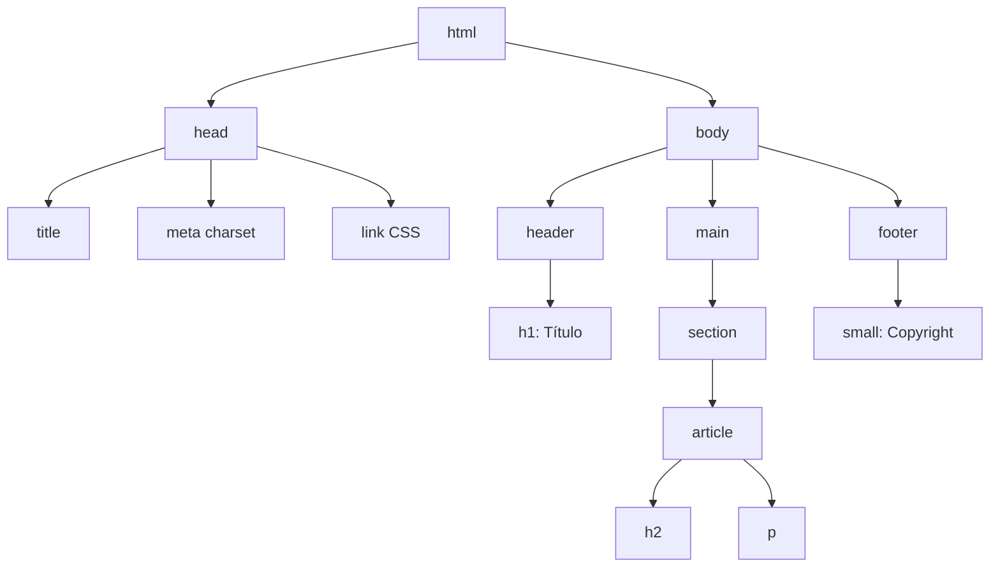

🇪🇸 **Español** | [🇬🇧 English](README.en.md)

# Step 0: Estructura HTML y Etiquetas Semánticas

## 🎯 Objetivo

Entender **cómo se construye un documento HTML** desde cero: qué etiquetas son obligatorias, qué significa "semántica" y cómo organizar el contenido para que tanto el navegador como otros desarrolladores lo lean fácilmente.

---

## 🤔 ¿Por qué importa?

HTML es el **esqueleto** de cualquier página web. Antes de poner colores, animaciones o lógica con JavaScript, necesitas decidir **qué piezas tiene la página**: cabecera, contenido principal, tarjetas, pie de página, etc.

Si el esqueleto está mal hecho:

- Google no entiende tu página (mal SEO)
- Los lectores de pantalla no pueden navegarla (mal en accesibilidad)
- Tú mismo te pierdes en tu propio código a los pocos días

Un buen HTML semántico es **código que se explica solo**.

---

## 🧱 Anatomía de un documento HTML

Todo archivo `.html` sigue la misma estructura base:

```html
<!DOCTYPE html>
<html lang="es">
  <head>
    <meta charset="UTF-8" />
    <meta name="viewport" content="width=device-width, initial-scale=1.0" />
    <title>Mi primera página</title>
    <link rel="stylesheet" href="styles.css" />
  </head>
  <body>
    <h1>Hola, mundo</h1>
    <p>Este es mi primer párrafo.</p>
  </body>
</html>
```

### ¿Qué hace cada pieza?

| Elemento | Para qué sirve |
|----------|----------------|
| `<!DOCTYPE html>` | Le dice al navegador: "esto es HTML5 moderno" |
| `<html lang="es">` | Raíz del documento. El `lang` ayuda a buscadores y lectores de pantalla |
| `<head>` | Información **invisible** sobre la página (título, estilos, metadatos) |
| `<meta charset="UTF-8">` | Permite usar tildes y caracteres especiales sin que se rompan |
| `<meta name="viewport">` | Hace la página responsive en móviles |
| `<title>` | Texto que aparece en la pestaña del navegador |
| `<link rel="stylesheet">` | Conecta el archivo CSS externo |
| `<body>` | Aquí va **todo lo que se ve** en la página |

---

## 🧩 El árbol del DOM

Cuando el navegador lee tu HTML, lo convierte en un **árbol de nodos** llamado DOM (Document Object Model). Cada etiqueta es un nodo que puede contener otros.



> 💡 **En tu proyecto:** El feed de Instagram que construirás es exactamente esto: un `<header>` arriba, un `<main>` con varias `<article>` (los posts), y un `<footer>` abajo.

---

## 🏷️ Etiquetas semánticas vs. `<div>` genéricos

Antes de HTML5, todo se hacía con `<div>` (cajas genéricas). Hoy tenemos etiquetas con **significado**:

| Etiqueta semántica | Equivale visualmente a... | Significado |
|--------------------|----------------------------|-------------|
| `<header>` | un `<div>` arriba | Cabecera de la página o de una sección |
| `<nav>` | un `<div>` con enlaces | Menú de navegación |
| `<main>` | el `<div>` central | Contenido principal y único de la página |
| `<section>` | un `<div>` agrupador | Bloque temático dentro de la página |
| `<article>` | un `<div>` con contenido autocontenido | Una pieza que tiene sentido por sí sola (un post, una noticia) |
| `<aside>` | un `<div>` lateral | Contenido relacionado pero secundario |
| `<footer>` | un `<div>` abajo | Pie de página o de sección |

### Comparativa: HTML semántico vs. "div soup"

```html
<!-- ❌ Mal: "div soup" — no se entiende nada -->
<div class="top">
  <div class="title">Mi blog</div>
</div>
<div class="content">
  <div class="post">
    <div class="post-title">Hola</div>
    <div class="post-body">Texto del post</div>
  </div>
</div>

<!-- ✅ Bien: HTML semántico — se lee como un esquema -->
<header>
  <h1>Mi blog</h1>
</header>
<main>
  <article>
    <h2>Hola</h2>
    <p>Texto del post</p>
  </article>
</main>
```

> 💡 **Regla práctica:** Si la etiqueta describe **qué es** (no cómo se ve), úsala. Solo recurre a `<div>` cuando ninguna semántica encaja.

---

## ✍️ Etiquetas de contenido más usadas

| Etiqueta | Uso |
|----------|-----|
| `<h1>` a `<h6>` | Títulos jerárquicos. `<h1>` es el más importante; usa **solo uno** por página |
| `<p>` | Párrafo de texto |
| `<a href="...">` | Enlace a otra página o sección |
| `` | Imagen. El `alt` es obligatorio para accesibilidad |
| `<ul>`, `<ol>`, `<li>` | Listas: sin orden, con orden, y cada elemento |
| `<strong>`, `<em>` | Texto en negrita / cursiva con significado semántico |
| `<figure>`, `<figcaption>` | Una imagen con su descripción |
| `<button>` | Un botón clicable |

---

## 🎨 Atributos comunes

Cada etiqueta puede llevar **atributos** que añaden información:

```html

<a href="https://4geeks.com" target="_blank">Ir a 4Geeks</a>
<article class="card" id="post-1">...</article>
```

| Atributo | Para qué sirve |
|----------|----------------|
| `class` | Etiqueta reutilizable para aplicar estilos CSS o seleccionar con JS |
| `id` | Identificador **único** dentro del documento |
| `src` | Ruta del recurso (imagen, vídeo, script) |
| `alt` | Texto alternativo de una imagen (accesibilidad) |
| `href` | Destino de un enlace |
| `target="_blank"` | Abre el enlace en una nueva pestaña |

---

## 🧠 Pregunta para reflexionar

<details>
<summary>¿Por qué `<article>` y no `<div>` para cada post del feed?</summary>

Porque un post del feed de Instagram cumple la definición exacta de `<article>`:

- **Es contenido autocontenido**: puedes sacar un post y compartirlo en otro contexto (un tuit, una noticia, una entrada de blog) y sigue teniendo sentido.
- **Es reutilizable**: cada post tiene la misma estructura (título + imagen + texto).
- **Es indexable**: Google y los lectores de pantalla pueden tratar cada `<article>` como una unidad independiente.

Usar `<div class="post">` funcionaría visualmente igual, pero pierdes todo ese significado. La regla es: **si tiene nombre propio en la realidad (un post, una noticia, una tarjeta), seguramente es un `<article>`**.

</details>

---

## ✅ Checklist de este step

- [ ] Puedo escribir la estructura base de un HTML (`<!DOCTYPE>`, `<html>`, `<head>`, `<body>`)
- [ ] Sé qué va en `<head>` y qué va en `<body>`
- [ ] Distingo entre etiquetas semánticas (`<header>`, `<main>`, `<article>`, `<footer>`) y `<div>` genérico
- [ ] Conozco los atributos más comunes (`class`, `id`, `src`, `alt`, `href`)
- [ ] Sé por qué importan los `alt` en las imágenes
