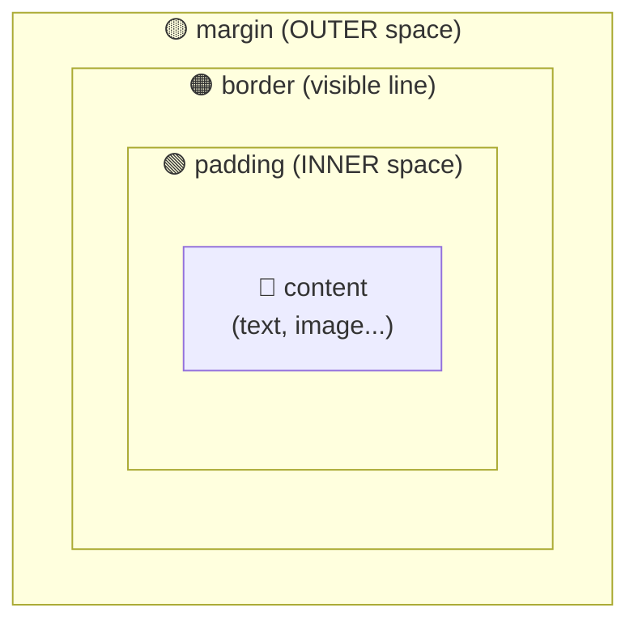
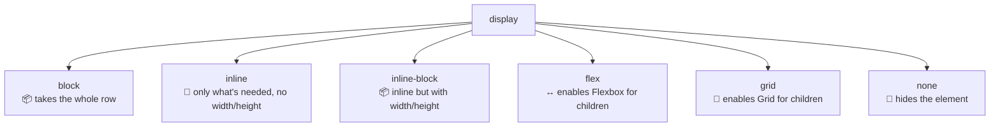

[🇪🇸 Español](README.md) | 🇬🇧 **English**

# Step 1: The Box Model

## 🎯 Goal

Understand **how CSS calculates the size and spacing** of every element on the page: the 4 zones of the box model, the `box-sizing` property, and the different `display` values.

---

## 🤔 Why does this matter?

Every HTML element you see on screen is, to the browser, **a rectangular box**. Whether it's a paragraph, a button, or an image: on the inside, it has the same anatomy.

If you don't understand the box model:

- You'll fight with spacing that appears "out of nowhere"
- You won't understand why your `width: 300px` actually takes 360px
- You won't know when to use `margin` vs. `padding`

Mastering this saves you **hours of frustration** every week.

---

## 📦 The 4 zones of a box

Each box has, from inside out:



| Zone | What it is | Example use |
|------|------------|-------------|
| **content** | The actual content (text, image, children) | Where what the user reads "lives" |
| **padding** | **Inner** space between content and the border | "Air" around the text inside a button |
| **border** | Visible line (can be invisible if you want) | Border of a card |
| **margin** | **Outer** space that separates this box from others | Spacing between two paragraphs |

### Visual example

```css
.card {
  width: 200px;
  padding: 20px;
  border: 2px solid black;
  margin: 30px;
  background: lightblue;
}
```

```
┌─────────── margin 30px ───────────┐
│                                   │
│  ┌─── border 2px ──────────────┐  │
│  │                             │  │
│  │  ┌── padding 20px ──────┐   │  │
│  │  │                      │   │  │
│  │  │   content 200px      │   │  │
│  │  │                      │   │  │
│  │  └──────────────────────┘   │  │
│  │                             │  │
│  └─────────────────────────────┘  │
│                                   │
└───────────────────────────────────┘
```

> 💡 **Quick rule:** `padding` pushes content **inward**. `margin` pushes the whole box **outward**.

---

## 🤯 The width "problem"

By default, CSS adds `padding` and `border` **on top of the `width` you declared**. This breaks intuition:

```css
.box {
  width: 200px;
  padding: 20px;
  border: 2px solid black;
}
/* REAL on-screen width: 200 + 20 + 20 + 2 + 2 = 244px 😱 */
```

### The fix: `box-sizing: border-box`

```css
* {
  box-sizing: border-box;
}

.box {
  width: 200px;
  padding: 20px;
  border: 2px solid black;
}
/* Now the REAL width is 200px. padding and border go INSIDE. ✅ */
```

| `box-sizing` value | How width is calculated |
|--------------------|-------------------------|
| `content-box` (default) | `width = content only` (padding and border add up) |
| `border-box` | `width = content + padding + border` (everything included) |

> 💡 **Best practice:** Always put at the top of your CSS:
> ```css
> *, *::before, *::after { box-sizing: border-box; }
> ```
> It'll save you headaches for the rest of your career.

---

## 🧱 The `display` property: how the box behaves

Not every box behaves the same. The `display` property decides the default behavior.

### Comparison of the most-used values

| Value | Takes the full line? | Accepts width/height? | Example tags with this default |
|-------|----------------------|------------------------|---------------------------------|
| `block` | ✅ Yes | ✅ Yes | `<div>`, `<p>`, `<h1>`, `<article>`, `<header>` |
| `inline` | ❌ No (only content width) | ❌ No | `<span>`, `<a>`, `<strong>`, `<em>` |
| `inline-block` | ❌ No | ✅ Yes | Has to be set manually |
| `none` | (not rendered) | — | Useful for hiding elements |
| `flex` / `grid` | ✅ Yes | ✅ Yes | Enable layout systems (next step) |

### Mental diagram



> 💡 **In your project:** The `<article class="card">` posts in the feed are `block` by default (stacked in a column). You'll turn their inner `<header>` into `flex` to place title and date on a single row.

---

## 🎯 Shorthand: write less CSS

Padding, margin, and border support **shorthand** (short form):

```css
/* 4 values: top, right, bottom, left */
padding: 10px 20px 30px 40px;

/* 2 values: top/bottom, left/right */
padding: 10px 20px;

/* 1 value: same on all 4 sides */
padding: 10px;

/* border shorthand: width, style, color */
border: 2px solid #232323;
```

### Mnemonic rule

```
4 values → ⏰ like a clock: 12, 3, 6, 9
2 values → vertical, horizontal
1 value  → all equal
```

---

## 📏 Most common units

| Unit | What it is | When to use it |
|------|------------|----------------|
| `px` | Fixed pixels | Borders, shadows, exact values |
| `%` | Percentage of the parent | Fluid widths inside a container |
| `rem` | Relative to the root size (1rem = 16px by default) | Consistent typography and spacing |
| `em` | Relative to the parent's size | Components that scale with context |
| `vw` / `vh` | 1% of viewport width/height | Full-screen layouts |

---

## 🧠 Question to reflect on

<details>
<summary>When do I use `margin` and when do I use `padding`?</summary>

Picture a cardboard box with a book inside:

- **`padding`** is the bubble wrap you put **inside** the box, between the book and the walls. It's part of the packaging.
- **`margin`** is the space you leave **between boxes** when you stack them on a shelf. It's not part of any single box.

Applied to CSS:

- Use **`padding`** when you want "air" **inside** the element (text away from a button's edge, content away from a card's edge).
- Use **`margin`** when you want to separate an element from **other elements** (gap between two cards, between a paragraph and the next).

**Extra tip:** If you set a background color and see the color "paint" in that zone → it was `padding`. If the zone stays transparent → it was `margin`.

</details>

---

## ✅ Step checklist

- [ ] I can name the 4 zones of the box model (content, padding, border, margin)
- [ ] I understand the difference between `padding` and `margin`
- [ ] I know what `box-sizing: border-box` does and why I almost always enable it
- [ ] I know the main `display` values (`block`, `inline`, `inline-block`, `flex`, `none`)
- [ ] I can write shorthand for `padding` and `margin` with 1, 2, or 4 values
