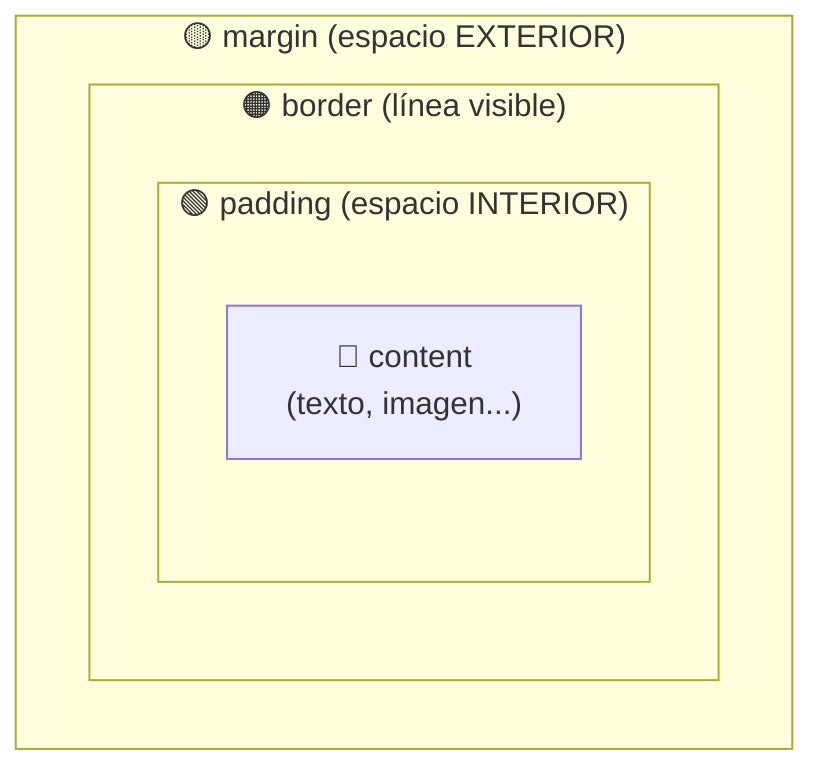
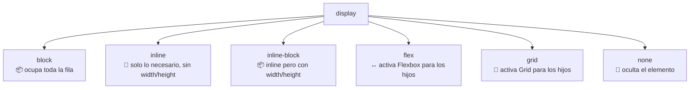

🇪🇸 **Español** | [🇬🇧 English](README.en.md)

# Step 1: El Modelo de Caja (Box Model)

## 🎯 Objetivo

Entender **cómo CSS calcula el tamaño y el espacio** de cada elemento en la página: las 4 zonas del modelo de caja, la propiedad `box-sizing` y los distintos valores de `display`.

---

## 🤔 ¿Por qué importa?

Cada elemento HTML que ves en pantalla es, para el navegador, **una caja rectangular**. Da igual si es un párrafo, un botón o una imagen: por dentro tiene la misma anatomía.

Si no entiendes el modelo de caja:

- Te peleas con espacios que aparecen "de la nada"
- No entiendes por qué tu `width: 300px` ocupa en realidad 360px
- No sabes cuándo usar `margin` y cuándo `padding`

Dominar esto te ahorra **horas de frustración** cada semana.

---

## 📦 Las 4 zonas de una caja

Cada caja tiene, de dentro hacia fuera:



| Zona | Qué es | Ejemplo de uso |
|------|--------|----------------|
| **content** | El contenido real (texto, imagen, hijos) | Donde "vive" lo que el usuario lee |
| **padding** | Espacio **interior** entre el contenido y el borde | "Aire" alrededor del texto dentro de un botón |
| **border** | Línea visible (puede ser invisible si quieres) | Borde de una tarjeta |
| **margin** | Espacio **exterior** que separa esta caja de otras | Separación entre dos párrafos |

### Ejemplo visual

```css
.tarjeta {
  width: 200px;
  padding: 20px;
  border: 2px solid black;
  margin: 30px;
  background: lightblue;
}
```

```
┌─────────── margin 30px ───────────┐
│                                   │
│  ┌─── border 2px ──────────────┐  │
│  │                             │  │
│  │  ┌── padding 20px ──────┐   │  │
│  │  │                      │   │  │
│  │  │   content 200px      │   │  │
│  │  │                      │   │  │
│  │  └──────────────────────┘   │  │
│  │                             │  │
│  └─────────────────────────────┘  │
│                                   │
└───────────────────────────────────┘
```

> 💡 **Regla rápida:** `padding` empuja el contenido **hacia adentro**. `margin` empuja la caja entera **hacia afuera**.

---

## 🤯 El "problema" del width

Por defecto, CSS suma `padding` y `border` **al `width` que tú declaraste**. Esto rompe la intuición:

```css
.caja {
  width: 200px;
  padding: 20px;
  border: 2px solid black;
}
/* Ancho REAL en pantalla: 200 + 20 + 20 + 2 + 2 = 244px 😱 */
```

### La solución: `box-sizing: border-box`

```css
* {
  box-sizing: border-box;
}

.caja {
  width: 200px;
  padding: 20px;
  border: 2px solid black;
}
/* Ahora el ancho REAL es 200px. El padding y el border van POR DENTRO. ✅ */
```

| Valor de `box-sizing` | Cómo se calcula el ancho |
|------------------------|--------------------------|
| `content-box` (por defecto) | `width = solo content` (padding y border se suman) |
| `border-box` | `width = content + padding + border` (todo incluido) |

> 💡 **Buena práctica:** Pon siempre al inicio de tu CSS:
> ```css
> *, *::before, *::after { box-sizing: border-box; }
> ```
> Te ahorrará dolores de cabeza el resto de tu carrera.

---

## 🧱 Propiedad `display`: cómo se comporta la caja

No todas las cajas se comportan igual. La propiedad `display` decide el comportamiento por defecto.

### Comparativa de los valores más usados

| Valor | ¿Ocupa toda la línea? | ¿Acepta width/height? | Ejemplo de etiquetas con este valor por defecto |
|-------|------------------------|------------------------|--------------------------------------------------|
| `block` | ✅ Sí | ✅ Sí | `<div>`, `<p>`, `<h1>`, `<article>`, `<header>` |
| `inline` | ❌ No (solo el ancho del contenido) | ❌ No | `<span>`, `<a>`, `<strong>`, `<em>` |
| `inline-block` | ❌ No | ✅ Sí | Hay que ponerlo manualmente |
| `none` | (no se renderiza) | — | Útil para ocultar elementos |
| `flex` / `grid` | ✅ Sí | ✅ Sí | Activan los sistemas de layout (siguiente step) |

### Diagrama mental



> 💡 **En tu proyecto:** Las `<article class="card">` del feed son `block` por defecto (se apilan en columna). Su `<header>` interno lo convertirás en `flex` para colocar título y fecha en una fila.

---

## 🎯 Shorthand: escribir menos CSS

Padding, margin y border admiten **shorthand** (forma corta):

```css
/* 4 valores: arriba, derecha, abajo, izquierda */
padding: 10px 20px 30px 40px;

/* 2 valores: arriba/abajo, izquierda/derecha */
padding: 10px 20px;

/* 1 valor: igual en los 4 lados */
padding: 10px;

/* border shorthand: grosor, estilo, color */
border: 2px solid #232323;
```

### Regla mnemotécnica

```
4 valores → ⏰ como el reloj: 12, 3, 6, 9
2 valores → vertical, horizontal
1 valor   → todos iguales
```

---

## 📏 Unidades de medida más comunes

| Unidad | Qué es | Cuándo usarla |
|--------|--------|---------------|
| `px` | Píxeles fijos | Bordes, sombras, valores exactos |
| `%` | Porcentaje del padre | Anchos fluidos dentro de un contenedor |
| `rem` | Relativo al tamaño raíz (1rem = 16px por defecto) | Tipografía y espaciado consistente |
| `em` | Relativo al tamaño del padre | Componentes que escalan con su contexto |
| `vw` / `vh` | 1% del ancho/alto de la ventana | Layouts a pantalla completa |

---

## 🧠 Pregunta para reflexionar

<details>
<summary>¿Cuándo uso `margin` y cuándo `padding`?</summary>

Piensa en una caja de cartón con un libro dentro:

- **`padding`** es el papel de burbujas que metes **dentro** de la caja, entre el libro y las paredes. Forma parte del envoltorio.
- **`margin`** es el espacio que dejas **entre cajas** cuando las apilas en una estantería. No es parte de la caja en sí.

Aplicado a CSS:

- Usa **`padding`** cuando quieras "aire" **dentro** del elemento (texto separado del borde de un botón, contenido separado del borde de una tarjeta).
- Usa **`margin`** cuando quieras separar un elemento de **otros elementos** (espacio entre dos tarjetas, entre un párrafo y el siguiente).

**Pista extra:** Si pones color de fondo y ves que el color "pinta" en esa zona → era `padding`. Si la zona queda transparente → era `margin`.

</details>

---

## ✅ Checklist de este step

- [ ] Sé nombrar las 4 zonas del modelo de caja (content, padding, border, margin)
- [ ] Entiendo la diferencia entre `padding` y `margin`
- [ ] Sé qué hace `box-sizing: border-box` y por qué casi siempre lo activo
- [ ] Conozco los valores principales de `display` (`block`, `inline`, `inline-block`, `flex`, `none`)
- [ ] Sé escribir shorthand para `padding` y `margin` con 1, 2 o 4 valores
