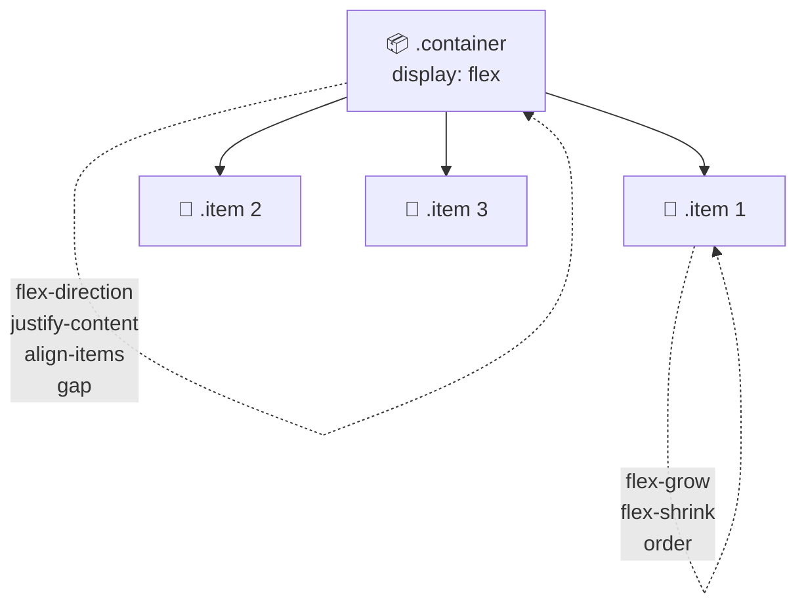
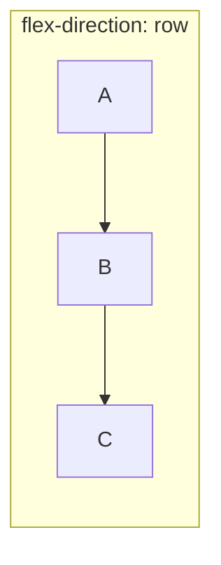
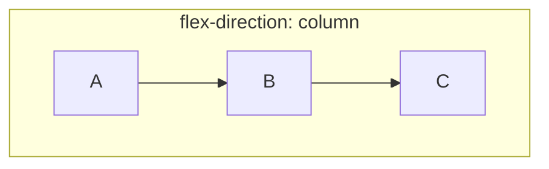
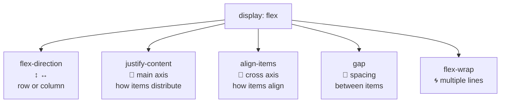

[🇪🇸 Español](README.md) | 🇬🇧 **English**

# Step 2: Layout with Flexbox

## 🎯 Goal

Learn to use **Flexbox** to place elements in a row or column, align them, and distribute them across the available space — without `float`, `position`, or old-school tricks.

---

## 🤔 Why does this matter?

Flexbox is **the most-used layout system** on the modern web. When you see a navbar with a logo on the left and links on the right, or a card with a title on top and an image below, Flexbox is almost always behind it.

Learning it lets you:

- Center anything, vertically and horizontally, in 3 lines of CSS
- Distribute elements across a row with equal spacing
- Build responsive layouts without writing media queries for every detail

Before Flexbox, this required 20 lines of CSS and quite a bit of black magic.

---

## 🧠 The key idea: container and items

Flexbox always involves **two roles**:



- The **container** (parent) decides **how the space is distributed**
- The **items** (children) decide **how they take their share**

Today we focus on the **container properties**, which are the ones you'll use the most.

---

## 🚀 Enabling Flexbox

```css
.container {
  display: flex;
}
```

With that single line, every direct child of `.container` lines up in a **horizontal row**. That's the default.

```html
<div class="container">
  <div class="item">A</div>
  <div class="item">B</div>
  <div class="item">C</div>
</div>
```

```
┌─────────────────────────┐
│ ┌───┐ ┌───┐ ┌───┐       │
│ │ A │ │ B │ │ C │       │
│ └───┘ └───┘ └───┘       │
└─────────────────────────┘
```

---

## 🔄 `flex-direction`: the main axis

Decides whether items go in a **row** or a **column**:

```css
.container {
  display: flex;
  flex-direction: row; /* default */
}
```

| Value | Result |
|-------|--------|
| `row` | Row, left to right (default) |
| `row-reverse` | Row, right to left |
| `column` | Column, top to bottom |
| `column-reverse` | Column, bottom to top |





> 💡 **In your project:** The `<section class="post-board">` (where cards stack) uses `flex-direction: column` so each post sits below the next.

---

## ↔️ `justify-content`: distribution on the main axis

Controls how space is spread **along** the main axis:

| Value | What it does | Visual (row) |
|-------|--------------|--------------|
| `flex-start` | Stuck to the start (default) | `[ABC      ]` |
| `flex-end` | Stuck to the end | `[      ABC]` |
| `center` | Centered | `[   ABC   ]` |
| `space-between` | First and last at the edges, rest spread | `[A   B   C]` |
| `space-around` | Equal space around each one | `[ A  B  C ]` |
| `space-evenly` | Identical space between every gap | `[ A B C ]` |

```css
.container {
  display: flex;
  justify-content: space-between;
}
```

---

## ↕️ `align-items`: alignment on the cross axis

Controls how items align **perpendicular** to the main axis. In a row, this is the vertical axis:

| Value | What it does |
|-------|--------------|
| `stretch` | Items fill the container's full height (default) |
| `flex-start` | Stuck to the top |
| `flex-end` | Stuck to the bottom |
| `center` | Centered vertically |
| `baseline` | Aligned by the text's baseline |

### The trick to center anything

```css
.container {
  display: flex;
  justify-content: center;  /* centers horizontally */
  align-items: center;      /* centers vertically */
  min-height: 100vh;
}
```

With this, **any child of the container ends up perfectly centered** on the screen. Before Flexbox, this was the Holy Grail.

---

## 📏 `gap`: spacing between items

Instead of putting `margin` on every item, use `gap` on the container:

```css
.container {
  display: flex;
  gap: 16px;
}
```

```
[A]  [B]  [C]   ← 16px between each one, without touching the items
```

`gap` works in Flexbox and also in Grid. It's the **modern, clean** way to space elements.

> 💡 **In your project:** You can use `gap` on `.post-board` to separate cards, instead of putting `margin-top` on every `.card`.

---

## 🌀 `flex-wrap`: when they don't fit on one line

By default, Flexbox **forces** all items onto a single line, shrinking them if needed. If you want them to wrap to the next line:

```css
.container {
  display: flex;
  flex-wrap: wrap;
}
```

| Value | Behavior |
|-------|----------|
| `nowrap` | Everything on one line (default) |
| `wrap` | Wraps to next line when it doesn't fit |
| `wrap-reverse` | Wraps upward |

---

## 🧭 Visual map: container properties



---

## 🛠️ Full example: card header

Look at this HTML from the feed project:

```html
<header class="card-header">
  <h2>A doggie 🐶</h2>
  <p class="cardDate">15/11</p>
</header>
```

And the CSS that places the title on the left and the date on the right:

```css
.card-header {
  display: flex;
  justify-content: space-between;  /* h2 on the left, p on the right */
  align-items: center;              /* both centered vertically */
  padding: 0 1rem;
}
```

Result:

```
┌────────────────────────────────────┐
│  A doggie 🐶                15/11  │
└────────────────────────────────────┘
```

> 💡 **In your project:** This exact pattern (`display: flex` + `justify-content: space-between` + `align-items: center`) will show up in dozens of components throughout the bootcamp. Memorize it.

---

## 🧠 Question to reflect on

<details>
<summary>What's the difference between `justify-content` and `align-items`?</summary>

The key is understanding the **two axes** of Flexbox:

- The **main axis** is the direction of `flex-direction`. In `row` it's horizontal; in `column` it's vertical.
- The **cross axis** is perpendicular to the main one.

The properties:

- **`justify-content`** controls distribution on the **main axis** (along the flow direction).
- **`align-items`** controls alignment on the **cross axis** (perpendicular).

**Mental trick:**
- In `flex-direction: row` → `justify-content` moves things **left/right**, `align-items` moves things **up/down**.
- In `flex-direction: column` → they swap! Now `justify-content` moves **up/down** and `align-items` moves **left/right**.

That's why changing `flex-direction` "mentally rotates" the entire behavior.

</details>

---

## ✅ Step checklist

- [ ] I can enable Flexbox with `display: flex`
- [ ] I tell apart the main axis (`flex-direction`) and the cross axis
- [ ] I can use `justify-content` to distribute items on the main axis
- [ ] I can use `align-items` to align items on the cross axis
- [ ] I can use `gap` to space items without using `margin`
- [ ] I can center any element vertically and horizontally in 3 lines of CSS
