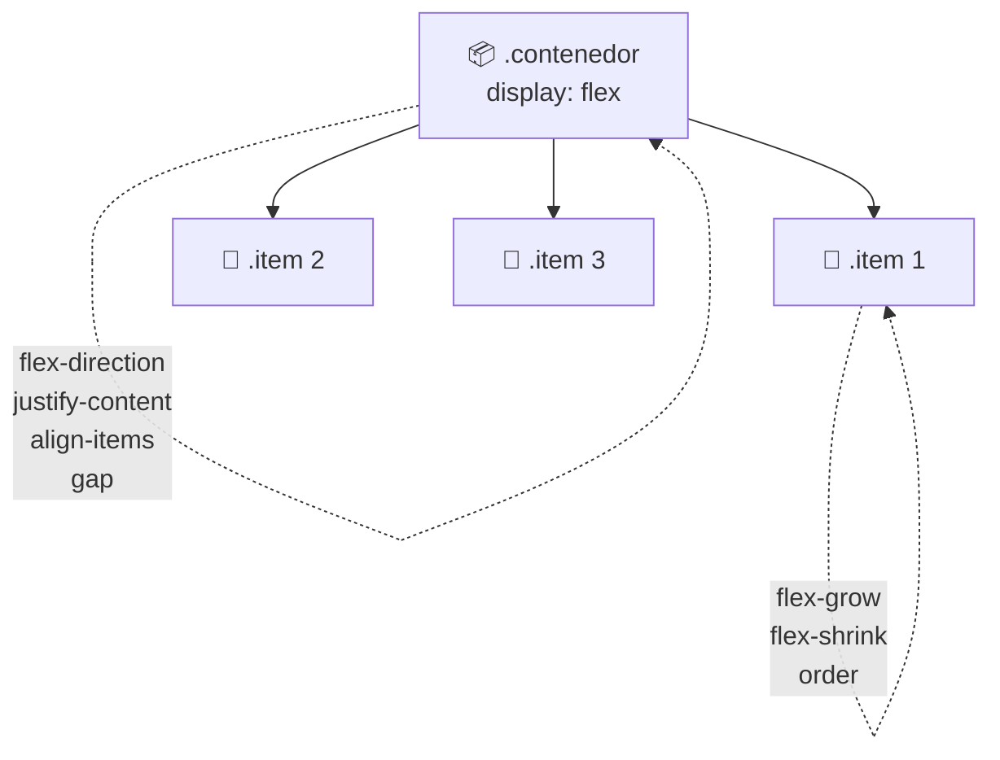
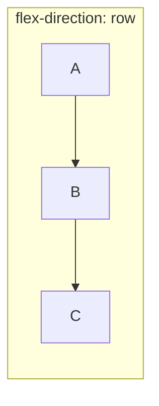
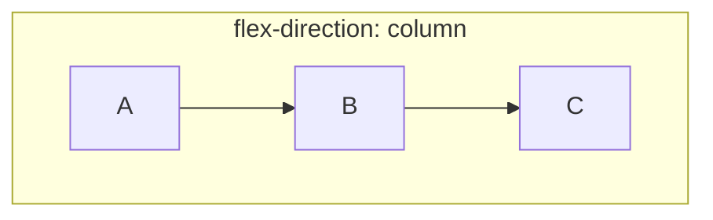
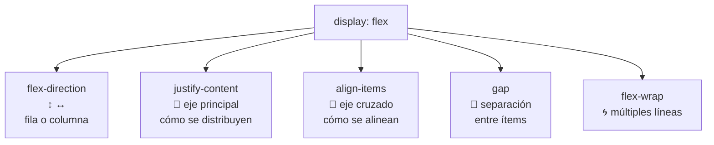

🇪🇸 **Español** | [🇬🇧 English](README.en.md)

# Step 2: Maquetación con Flexbox

## 🎯 Objetivo

Aprender a usar **Flexbox** para colocar elementos en una fila o columna, alinearlos y distribuirlos en el espacio disponible — sin necesidad de `float`, `position` ni trucos del pasado.

---

## 🤔 ¿Por qué importa?

Flexbox es **el sistema de layout más usado** en la web moderna. Cuando ves una barra de navegación con el logo a la izquierda y los enlaces a la derecha, o una tarjeta con título arriba e imagen abajo, casi siempre hay Flexbox detrás.

Aprenderlo te permite:

- Centrar cualquier cosa, vertical y horizontalmente, en 3 líneas de CSS
- Distribuir elementos en una fila con espacios iguales
- Hacer layouts responsive sin escribir media queries para cada detalle

Antes de Flexbox, esto requería 20 líneas de CSS y bastante magia negra.

---

## 🧠 La idea clave: contenedor e ítems

Flexbox siempre involucra **dos roles**:



- El **contenedor** (padre) decide **cómo se distribuye el espacio**
- Los **ítems** (hijos) deciden **cómo ocupan su parte**

Hoy nos centramos en las **propiedades del contenedor**, que son las que más usarás.

---

## 🚀 Activar Flexbox

```css
.contenedor {
  display: flex;
}
```

Con solo esa línea, todos los hijos directos del `.contenedor` se alinean en una **fila horizontal**. Eso es el comportamiento por defecto.

```html
<div class="contenedor">
  <div class="item">A</div>
  <div class="item">B</div>
  <div class="item">C</div>
</div>
```

```
┌─────────────────────────┐
│ ┌───┐ ┌───┐ ┌───┐       │
│ │ A │ │ B │ │ C │       │
│ └───┘ └───┘ └───┘       │
└─────────────────────────┘
```

---

## 🔄 `flex-direction`: el eje principal

Decide si los ítems van en **fila** o en **columna**:

```css
.contenedor {
  display: flex;
  flex-direction: row; /* por defecto */
}
```

| Valor | Resultado |
|-------|-----------|
| `row` | Fila, de izquierda a derecha (por defecto) |
| `row-reverse` | Fila, de derecha a izquierda |
| `column` | Columna, de arriba a abajo |
| `column-reverse` | Columna, de abajo a arriba |





> 💡 **En tu proyecto:** El `<section class="post-board">` (donde se apilan las tarjetas) usa `flex-direction: column` para que cada post quede uno debajo del otro.

---

## ↔️ `justify-content`: distribución en el eje principal

Controla cómo se reparte el espacio **a lo largo** del eje principal:

| Valor | Qué hace | Visual (fila) |
|-------|----------|---------------|
| `flex-start` | Pegados al inicio (por defecto) | `[ABC      ]` |
| `flex-end` | Pegados al final | `[      ABC]` |
| `center` | Centrados | `[   ABC   ]` |
| `space-between` | Primero y último a los extremos, resto reparte | `[A   B   C]` |
| `space-around` | Espacio igual alrededor de cada uno | `[ A  B  C ]` |
| `space-evenly` | Espacio idéntico entre todos los gaps | `[ A B C ]` |

```css
.contenedor {
  display: flex;
  justify-content: space-between;
}
```

---

## ↕️ `align-items`: alineación en el eje cruzado

Controla cómo se alinean los ítems **perpendicularmente** al eje principal. En una fila, esto es el eje vertical:

| Valor | Qué hace |
|-------|----------|
| `stretch` | Los ítems ocupan toda la altura del contenedor (por defecto) |
| `flex-start` | Pegados arriba |
| `flex-end` | Pegados abajo |
| `center` | Centrados verticalmente |
| `baseline` | Alineados por la línea base del texto |

### El truco para centrar cualquier cosa

```css
.contenedor {
  display: flex;
  justify-content: center;  /* centra horizontalmente */
  align-items: center;      /* centra verticalmente */
  min-height: 100vh;
}
```

Con esto, **cualquier hijo del contenedor queda perfectamente centrado** en pantalla. Antes de Flexbox, esto era el santo grial.

---

## 📏 `gap`: separación entre ítems

En lugar de poner `margin` a cada ítem, usa `gap` en el contenedor:

```css
.contenedor {
  display: flex;
  gap: 16px;
}
```

```
[A]  [B]  [C]   ← 16px entre cada uno, sin tocar los ítems
```

`gap` funciona en Flexbox y también en Grid. Es la forma **moderna y limpia** de espaciar elementos.

> 💡 **En tu proyecto:** Puedes usar `gap` en `.post-board` para separar las tarjetas, en vez de poner `margin-top` a cada `.card`.

---

## 🌀 `flex-wrap`: cuando no caben en una línea

Por defecto, Flexbox **fuerza** a que todos los ítems quepan en una sola línea, encogiéndolos si hace falta. Si quieres que salten a la siguiente:

```css
.contenedor {
  display: flex;
  flex-wrap: wrap;
}
```

| Valor | Comportamiento |
|-------|----------------|
| `nowrap` | Todo en una línea (por defecto) |
| `wrap` | Salta a la siguiente cuando no cabe |
| `wrap-reverse` | Salta hacia arriba |

---

## 🧭 Mapa visual: las propiedades del contenedor



---

## 🛠️ Ejemplo completo: header de tarjeta

Mira este HTML del proyecto del feed:

```html
<header class="card-header">
  <h2>Un perrito 🐶</h2>
  <p class="cardDate">15/11</p>
</header>
```

Y el CSS que lo coloca con título a la izquierda y fecha a la derecha:

```css
.card-header {
  display: flex;
  justify-content: space-between;  /* h2 a la izquierda, p a la derecha */
  align-items: center;              /* ambos centrados verticalmente */
  padding: 0 1rem;
}
```

Resultado:

```
┌────────────────────────────────────┐
│  Un perrito 🐶              15/11  │
└────────────────────────────────────┘
```

> 💡 **En tu proyecto:** Exactamente este patrón (`display: flex` + `justify-content: space-between` + `align-items: center`) lo usarás en docenas de componentes a lo largo del bootcamp. Memorízalo.

---

## 🧠 Pregunta para reflexionar

<details>
<summary>¿Cuál es la diferencia entre `justify-content` y `align-items`?</summary>

La clave es entender los **dos ejes** de Flexbox:

- El **eje principal** es la dirección de `flex-direction`. En `row` es horizontal; en `column` es vertical.
- El **eje cruzado** es perpendicular al principal.

Las propiedades:

- **`justify-content`** controla el reparto en el **eje principal** (a lo largo de la dirección del flujo).
- **`align-items`** controla la alineación en el **eje cruzado** (perpendicular).

**Truco mental:**
- En `flex-direction: row` → `justify-content` mueve **a izquierda/derecha**, `align-items` mueve **arriba/abajo**.
- En `flex-direction: column` → ¡se invierten! Ahora `justify-content` mueve **arriba/abajo** y `align-items` mueve **izquierda/derecha**.

Por eso, cambiar `flex-direction` "rota mentalmente" todo el comportamiento.

</details>

---

## ✅ Checklist de este step

- [ ] Sé activar Flexbox con `display: flex`
- [ ] Distingo entre eje principal (`flex-direction`) y eje cruzado
- [ ] Sé usar `justify-content` para distribuir ítems en el eje principal
- [ ] Sé usar `align-items` para alinear ítems en el eje cruzado
- [ ] Sé usar `gap` para separar ítems sin usar `margin`
- [ ] Puedo centrar cualquier elemento vertical y horizontalmente con 3 líneas de CSS
