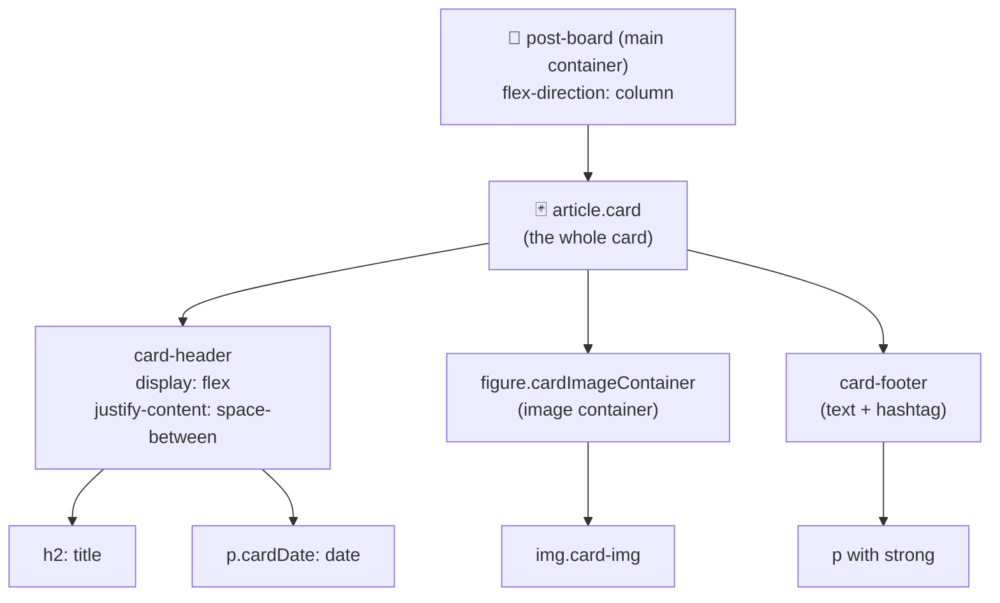

[🇪🇸 Español](README.md) | 🇬🇧 **English**

# Step 3: Project — Instagram Post Layout

## 🎯 Goal

Apply **semantic HTML**, the **box model**, and **Flexbox** to build an "Instagram-style post" card from scratch and stack it into a feed. It's the project of the day and lives in the [`04-IG-Feed/`](../04-IG-Feed/index.html) folder.

---

## 🤔 Why this project?

A social media post card is one of the **most common components** in any app you'll build throughout the bootcamp:

- It's **self-contained**: it has its own structure (header, image, footer).
- It's **repeatable**: the same card renders multiple times (perfect for mapping later with React).
- It combines **the three concepts of the day**: HTML structure, box-model spacing, and Flexbox alignment.

If you finish the day with this card working, you have the foundation to build Twitter, Reddit, Pinterest, LinkedIn — any feed.

---

## 🗺️ Visual anatomy of a post



---

## 🧱 Step 1 — The semantic HTML structure

Each post is an `<article>` because it matches the "self-contained content" definition from Step 0:

```html
<article class="card">
  <header class="card-header">
    <h2>A doggie 🐶</h2>
    <p class="cardDate">15/11</p>
  </header>
  <figure class="cardImageContainer">
    
  </figure>
  <footer class="card-footer">
    <p>This is a doggie <strong>#doggie</strong></p>
  </footer>
</article>
```

### Why each tag?

| Tag | Why we use it here |
|-----|--------------------|
| `<article>` | The post stands on its own, like a tweet or a blog entry |
| `<header>` | The post's header (title + date) |
| `<h2>` | It's a heading inside the `<article>`. The `<h1>` already belongs to the global `<header>` |
| `<figure>` | An image with content meaning (not decorative) |
| `` | `alt` is required for accessibility |
| `<footer>` | The post footer (description + hashtag) |
| `<strong>` | The hashtag carries semantic emphasis |

And all posts go inside a single container:

```html
<main class="wrapper">
  <section class="post-board">
    <article class="card">...</article>
    <article class="card">...</article>
    <article class="card">...</article>
  </section>
</main>
```

---

## 📦 Step 2 — Apply the box model

The `.card` needs:

- A **controlled width** (must not take the full screen)
- Inner **padding** so the content can breathe
- A soft **border-radius** to look like an Instagram card
- A **shadow** for depth

```css
.card {
  width: 80%;
  max-width: 500px;
  background-color: #f1f1f1;
  border-radius: 2%;
  box-shadow: 0px 0px 15px rgba(0, 0, 0, 0.8);
  overflow: hidden;
  margin-top: 3rem;
}
```

### Universal reset (recommended in `body`)

```css
*, *::before, *::after {
  box-sizing: border-box;
}

body {
  margin: 0;
  padding: 0;
  font-family: system-ui, sans-serif;
}
```

> 💡 **In your project:** Check the file [`04-IG-Feed/styles/styles.css`](../04-IG-Feed/styles/styles.css). You'll see `body` starts with `margin: 0` and `padding: 0`. That's the minimal "reset" that removes the default spacing the browser adds.

---

## ↕️ Step 3 — Stack the cards with Flexbox

The `.post-board` is the container that stacks `<article>` elements in a column and centers them horizontally:

```css
.post-board {
  display: flex;
  flex-direction: column;
  justify-content: center;
  align-items: center;
  max-width: 800px;
  margin: 0 auto;
}
```

### What does each line do?

| Line | Effect |
|------|--------|
| `display: flex` | Enables Flexbox |
| `flex-direction: column` | Cards stack **vertically** |
| `align-items: center` | Centers each card **horizontally** inside the board |
| `max-width: 800px` | Board never exceeds 800px (responsive-friendly) |
| `margin: 0 auto` | Centers the whole board in the viewport |

---

## ↔️ Step 4 — Align the post header

The header has the title on the left and the date on the right. Classic Flexbox pattern:

```css
.card-header {
  display: flex;
  justify-content: space-between;
  align-items: center;
  padding: 0 1rem;
}
```

Result:

```
┌────────────────────────────────────┐
│  A doggie 🐶                15/11  │  ← card-header
├────────────────────────────────────┤
│                                    │
│           [dog image]              │  ← cardImageContainer
│                                    │
├────────────────────────────────────┤
│  This is a doggie #doggie          │  ← card-footer
└────────────────────────────────────┘
```

---

## 🖼️ Step 5 — Make the image behave

The image has a typical problem: if the aspect ratio doesn't match the container, it warps or overflows. Solution:

```css
.cardImageContainer {
  width: 100%;
  height: 70%;
  margin: 0;
}

.card-img {
  width: 100%;
  height: 100%;
  object-fit: cover;
  object-position: center;
}
```

| Property | What it's for |
|----------|---------------|
| `object-fit: cover` | The image **fills** the container without warping (may crop) |
| `object-position: center` | Cropping happens from the center (not from a corner) |
| `overflow: hidden` (on `.card`) | Hides any part of the image that overflows |

---

## 📱 Step 6 — Responsive with a media query

When the screen is small, we want shorter cards and smaller titles:

```css
@media (max-width: 620px) {
  .title {
    font-size: 2rem;
  }
  .card {
    height: 300px;
  }
  .cardImageContainer {
    height: 50%;
  }
}
```

> 💡 **In your project:** Media queries apply **only when the condition is true**. `max-width: 620px` means: "these styles apply only on screens 620px wide or smaller".

---

## 🧪 How to view it in the browser

```bash
# From the repo root
cd day_01/04-IG-Feed
open index.html   # macOS
# Or double-click index.html in Finder/Explorer
```

You can inspect the card with **right-click → Inspect element** and see:

- In the **Elements** tab, the actual DOM tree
- In the **Computed** tab, the box model of any element (a visual diagram of margin/border/padding)
- In the **Layout** tab, whether Flexbox is active and how

---

## 🧠 Question to reflect on

<details>
<summary>What would you change to show the cards in a 3-column grid on large screens?</summary>

You have two valid paths:

**1. Change `flex-direction` and enable `flex-wrap`:**

```css
.post-board {
  display: flex;
  flex-direction: row;
  flex-wrap: wrap;
  gap: 2rem;
  justify-content: center;
}

.card {
  width: 30%;        /* roughly three per row */
  min-width: 280px;
}
```

**2. Use CSS Grid (you'll see it in `02-Grid/`):**

```css
.post-board {
  display: grid;
  grid-template-columns: repeat(auto-fit, minmax(280px, 1fr));
  gap: 2rem;
}
```

The Grid version is **cleaner** because you don't need to compute percentages by hand — the browser decides how many columns fit. This is what you'll learn in the `02-Grid/` exercise.

</details>

---

## ✅ Step checklist

- [ ] My feed shows at least 3 posts stacked vertically
- [ ] Each `<article class="card">` has `<header>`, `<figure>` with ``, and `<footer>`
- [ ] The `.card-header` uses Flexbox with `space-between` to separate title and date
- [ ] The image doesn't warp (I use `object-fit: cover`)
- [ ] I enabled `box-sizing: border-box` globally
- [ ] The layout adapts on mobile (media query)
