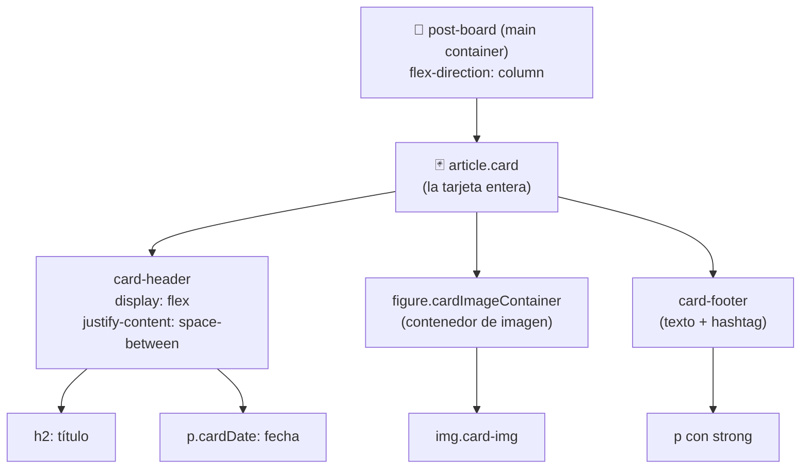

🇪🇸 **Español** | [🇬🇧 English](README.en.md)

# Step 3: Proyecto — Instagram Post Layout

## 🎯 Objetivo

Aplicar **HTML semántico**, **modelo de caja** y **Flexbox** para construir desde cero una tarjeta tipo "post de Instagram" y apilarla en un feed. Es el proyecto del día y vive en la carpeta [`04-IG-Feed/`](../04-IG-Feed/index.html).

---

## 🤔 ¿Por qué este proyecto?

Una tarjeta de post de red social es uno de los componentes **más comunes** en cualquier app que vas a construir a lo largo del bootcamp:

- Es **autocontenido**: tiene su propia estructura (cabecera, imagen, pie).
- Es **repetible**: la misma tarjeta se renderiza varias veces (perfecto para luego mapear con React).
- Combina **los tres conceptos del día**: estructura HTML, espaciado con el box model, y alineación con Flexbox.

Si terminas el día con esta tarjeta funcionando, tienes la base para construir Twitter, Reddit, Pinterest, LinkedIn… cualquier feed.

---

## 🗺️ Anatomía visual de un post



---

## 🧱 Paso 1 — La estructura HTML semántica

Cada post es un `<article>` porque encaja con la definición de "contenido autocontenido" del Step 0:

```html
<article class="card">
  <header class="card-header">
    <h2>Un perrito 🐶</h2>
    <p class="cardDate">15/11</p>
  </header>
  <figure class="cardImageContainer">
    
  </figure>
  <footer class="card-footer">
    <p>Este es un perrito <strong>#perrito</strong></p>
  </footer>
</article>
```

### ¿Por qué cada etiqueta?

| Etiqueta | Por qué la usamos aquí |
|----------|------------------------|
| `<article>` | El post tiene sentido por sí solo, como un tuit o una entrada de blog |
| `<header>` | La cabecera del post (título + fecha) |
| `<h2>` | Es un título dentro del `<article>`. El `<h1>` ya lo tiene el `<header>` global |
| `<figure>` | Una imagen con significado de contenido (no decorativa) |
| `` | El `alt` es obligatorio para accesibilidad |
| `<footer>` | El pie del post (descripción + hashtag) |
| `<strong>` | El hashtag tiene énfasis semántico |

Y todos los posts van dentro de un único contenedor:

```html
<main class="wrapper">
  <section class="post-board">
    <article class="card">...</article>
    <article class="card">...</article>
    <article class="card">...</article>
  </section>
</main>
```

---

## 📦 Paso 2 — Aplicar el modelo de caja

La `.card` necesita:

- Un **ancho controlado** (no debe ocupar toda la pantalla)
- **Padding** interior para que el contenido respire
- Un **border-radius** suave para parecerse a una tarjeta de Instagram
- Una **sombra** para dar profundidad

```css
.card {
  width: 80%;
  max-width: 500px;
  background-color: #f1f1f1;
  border-radius: 2%;
  box-shadow: 0px 0px 15px rgba(0, 0, 0, 0.8);
  overflow: hidden;
  margin-top: 3rem;
}
```

### Reset universal (recomendado en `body`)

```css
*, *::before, *::after {
  box-sizing: border-box;
}

body {
  margin: 0;
  padding: 0;
  font-family: system-ui, sans-serif;
}
```

> 💡 **En tu proyecto:** Mira el archivo [`04-IG-Feed/styles/styles.css`](../04-IG-Feed/styles/styles.css). Verás que el `body` arranca con `margin: 0` y `padding: 0`. Eso es el "reset" mínimo que evita los espacios que el navegador añade por defecto.

---

## ↕️ Paso 3 — Apilar las tarjetas con Flexbox

El `.post-board` es el contenedor que apila los `<article>` en columna y los centra horizontalmente:

```css
.post-board {
  display: flex;
  flex-direction: column;
  justify-content: center;
  align-items: center;
  max-width: 800px;
  margin: 0 auto;
}
```

### ¿Qué hace cada línea?

| Línea | Efecto |
|-------|--------|
| `display: flex` | Activa Flexbox |
| `flex-direction: column` | Las tarjetas se apilan **verticalmente** |
| `align-items: center` | Centra cada tarjeta **horizontalmente** dentro del board |
| `max-width: 800px` | El board nunca supera los 800px (responsive friendly) |
| `margin: 0 auto` | Centra el board entero respecto al viewport |

---

## ↔️ Paso 4 — Alinear el header del post

El header tiene el título a la izquierda y la fecha a la derecha. Patrón clásico de Flexbox:

```css
.card-header {
  display: flex;
  justify-content: space-between;
  align-items: center;
  padding: 0 1rem;
}
```

Resultado:

```
┌────────────────────────────────────┐
│  Un perrito 🐶              15/11  │  ← card-header
├────────────────────────────────────┤
│                                    │
│        [imagen del perrito]        │  ← cardImageContainer
│                                    │
├────────────────────────────────────┤
│  Este es un perrito #perrito       │  ← card-footer
└────────────────────────────────────┘
```

---

## 🖼️ Paso 5 — Hacer que la imagen se comporte

La imagen tiene un problema típico: si el aspect ratio no encaja con el contenedor, se deforma o se sale. Solución:

```css
.cardImageContainer {
  width: 100%;
  height: 70%;
  margin: 0;
}

.card-img {
  width: 100%;
  height: 100%;
  object-fit: cover;
  object-position: center;
}
```

| Propiedad | Para qué sirve |
|-----------|----------------|
| `object-fit: cover` | La imagen **rellena** el contenedor sin deformarse (puede recortar) |
| `object-position: center` | El recorte ocurre desde el centro (no desde una esquina) |
| `overflow: hidden` (en `.card`) | Esconde cualquier parte de la imagen que sobresalga |

---

## 📱 Paso 6 — Responsive con media query

Cuando la pantalla es pequeña, queremos tarjetas más bajas y títulos más chicos:

```css
@media (max-width: 620px) {
  .title {
    font-size: 2rem;
  }
  .card {
    height: 300px;
  }
  .cardImageContainer {
    height: 50%;
  }
}
```

> 💡 **En tu proyecto:** Las media queries se aplican **solo cuando se cumple la condición**. `max-width: 620px` significa: "estos estilos solo aplican en pantallas de 620px o menos".

---

## 🧪 Cómo verlo en el navegador

```bash
# Desde la raíz del repo
cd day_01/04-IG-Feed
open index.html   # macOS
# O abre index.html con doble click desde el Finder/Explorador
```

Puedes inspeccionar la tarjeta con **clic derecho → Inspeccionar elemento** y ver:

- En la pestaña **Elements**, el árbol DOM real
- En la pestaña **Computed**, el modelo de caja de cualquier elemento (un esquema visual de margin/border/padding)
- En la pestaña **Layout**, si Flexbox está activo y cómo

---

## 🧠 Pregunta para reflexionar

<details>
<summary>¿Qué cambiarías para que las tarjetas se vean en una rejilla (3 columnas) en pantallas grandes?</summary>

Tienes dos caminos válidos:

**1. Cambiar `flex-direction` y activar `flex-wrap`:**

```css
.post-board {
  display: flex;
  flex-direction: row;
  flex-wrap: wrap;
  gap: 2rem;
  justify-content: center;
}

.card {
  width: 30%;        /* tres por fila aproximadamente */
  min-width: 280px;
}
```

**2. Usar CSS Grid (lo verás en `02-Grid/`):**

```css
.post-board {
  display: grid;
  grid-template-columns: repeat(auto-fit, minmax(280px, 1fr));
  gap: 2rem;
}
```

La versión con Grid es **más limpia** porque no necesitas calcular porcentajes manualmente — el navegador decide cuántas columnas caben. Esto es lo que aprenderás en el ejercicio `02-Grid/`.

</details>

---

## ✅ Checklist de este step

- [ ] Mi feed muestra al menos 3 posts apilados verticalmente
- [ ] Cada `<article class="card">` tiene `<header>`, `<figure>` con ``, y `<footer>`
- [ ] El `.card-header` usa Flexbox con `space-between` para separar título y fecha
- [ ] La imagen no se deforma (uso `object-fit: cover`)
- [ ] Activé `box-sizing: border-box` globalmente
- [ ] La maquetación se adapta en móvil (media query)
