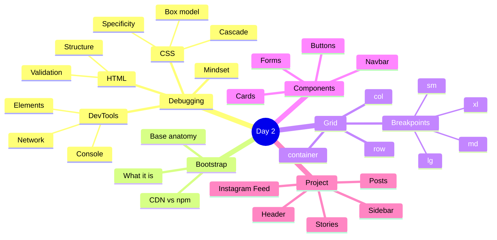

[🇪🇸 Español](README.md) | 🇬🇧 **English**

# 📋 Day 2: Bootstrap

## 📚 Context

Today you'll learn two superpowers you'll use every day as a developer: **debugging code** (finding and fixing errors) and **using a CSS framework** to build attractive interfaces in a fraction of the time.

Bootstrap is the most popular CSS framework in the world. Knowing Bootstrap lets you prototype landing pages, dashboards, and feeds in hours instead of days.

---

## 🎯 Goals for the day

By the end of this day you should be able to:

- Explain what debugging is and apply a method to debug HTML and CSS with DevTools
- Understand what a CSS framework is and why Bootstrap is useful
- Include Bootstrap in a page via CDN or npm
- Use the grid system (`container`, `row`, `col-*`) with its breakpoints
- Compose pages using components (navbar, cards, buttons, forms) and utilities
- Build a complete Instagram-style feed with Bootstrap

---

## 🗺️ Mind Map: Bootstrap + Debugging



---

## 🗂️ Structure of the day

```text
day_02/
├── README.md
├── step0-debugging/
│   └── README.md          # Debugging: what it is, mindset, HTML, CSS, DevTools
├── step1-bootstrap-intro/
│   └── README.md          # What Bootstrap is, CDN vs npm, page anatomy
├── step2-grid-y-componentes/
│   └── README.md          # Grid system, breakpoints, and key components
└── step3-proyecto-instagram-feed/
    └── README.md          # Walkthrough: Instagram-style feed with Bootstrap
```

---

## 🧭 Suggested study order

1. `step0-debugging` — Learn to investigate errors before learning new tools
2. `step1-bootstrap-intro` — Get to know the framework and how to add it to a project
3. `step2-grid-y-componentes` — Master the grid and the most-used components
4. `step3-proyecto-instagram-feed` — Apply everything by building a real feed

---

## 🎯 Syllabus resources

- **READ** – [What is debugging and how to debug code](https://4geeks.com/syllabus/spain-fs-pt-129/read/what-is-debugging-code)
- **READ** – [Debugging HTML Code](https://4geeks.com/syllabus/spain-fs-pt-129/read/debugging-html-code)
- **READ** – [Debugging CSS Code](https://4geeks.com/syllabus/spain-fs-pt-129/read/debugging-css-code)
- **READ** – [Bootstrap Tutorial: Learn Bootstrap 5 in 10 minutes](https://4geeks.com/syllabus/spain-fs-pt-129/read/bootstrap-tutorial-learn-bootstrap-5-in-10-minutes)
- **PRACTICE** – [Learn Bootstrap from Zero](https://4geeks.com/syllabus/spain-fs-pt-129/practice/bootstrap-exercises)
- **PROJECT** – [Instagram Photo Feed with Bootstrap](https://4geeks.com/syllabus/spain-fs-pt-129/project/instagram-feed-bootstrap)
- **ANSWER** – [Bootstrap Quiz](https://4geeks.com/syllabus/spain-fs-pt-129/answer/bootstrap-quiz)

---

## ✅ End-of-day checklist

- [ ] I know what debugging is and have a method to face an error
- [ ] I can inspect and modify HTML/CSS live with DevTools
- [ ] I understand what problem Bootstrap solves and when to use it
- [ ] I know the Bootstrap grid system (`container`, `row`, `col-*`) and its breakpoints
- [ ] I can use Bootstrap components (navbar, cards, buttons, forms)
- [ ] I completed the Instagram Feed with Bootstrap project
- [ ] I passed the Bootstrap Quiz
