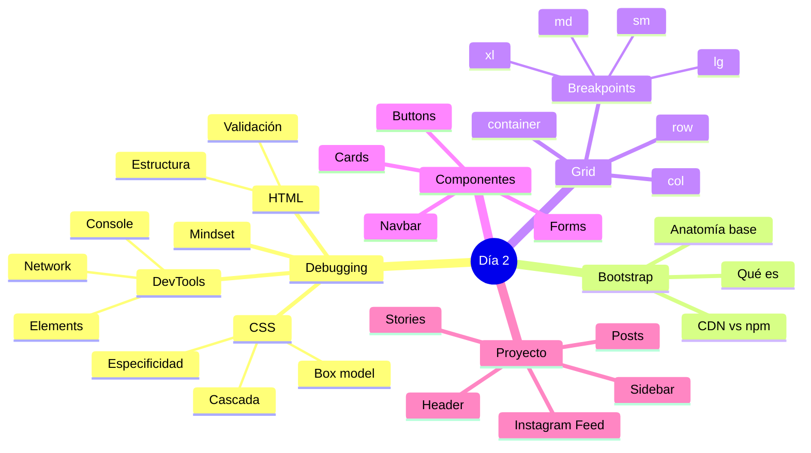

🇪🇸 **Español** | [🇬🇧 English](README.en.md)

# 📋 Día 2: Bootstrap

## 📚 Contexto

Hoy aprenderás dos superpoderes que vas a usar todos los días como desarrollador: **depurar código** (encontrar y arreglar errores) y **usar un framework CSS** para construir interfaces atractivas en una fracción del tiempo.

Bootstrap es el framework CSS más popular del mundo. Saber Bootstrap te permite prototipar landings, dashboards y feeds en horas, no en días.

---

## 🎯 Objetivos del día

Al terminar este día deberías poder:

- Explicar qué es debugging y aplicar un método para depurar HTML y CSS con DevTools
- Entender qué es un framework CSS y por qué Bootstrap es útil
- Incluir Bootstrap en una página vía CDN o npm
- Usar el sistema de grid (`container`, `row`, `col-*`) con sus breakpoints
- Componer páginas usando componentes (navbar, cards, buttons, forms) y utilidades
- Construir un feed estilo Instagram completo con Bootstrap

---

## 🗺️ Mapa Mental: Bootstrap + Debugging



---

## 🗂️ Estructura del día

```text
day_02/
├── README.md
├── step0-debugging/
│   └── README.md          # Debugging: qué es, mindset, HTML, CSS, DevTools
├── step1-bootstrap-intro/
│   └── README.md          # Qué es Bootstrap, CDN vs npm, anatomía de página
├── step2-grid-y-componentes/
│   └── README.md          # Grid system, breakpoints y componentes clave
└── step3-proyecto-instagram-feed/
    └── README.md          # Walkthrough: feed estilo Instagram con Bootstrap
```

---

## 🧭 Orden sugerido de estudio

1. `step0-debugging` — Aprende a investigar errores antes de aprender herramientas nuevas
2. `step1-bootstrap-intro` — Conoce el framework y cómo añadirlo a un proyecto
3. `step2-grid-y-componentes` — Domina el grid y los componentes más usados
4. `step3-proyecto-instagram-feed` — Aplica todo construyendo un feed real

---

## 🎯 Recursos del syllabus

- **READ** – [What is debugging and how to debug code](https://4geeks.com/syllabus/spain-fs-pt-129/read/what-is-debugging-code)
- **READ** – [Debugging HTML Code](https://4geeks.com/syllabus/spain-fs-pt-129/read/debugging-html-code)
- **READ** – [Debugging CSS Code](https://4geeks.com/syllabus/spain-fs-pt-129/read/debugging-css-code)
- **READ** – [Bootstrap Tutorial: Learn Bootstrap 5 in 10 minutes](https://4geeks.com/syllabus/spain-fs-pt-129/read/bootstrap-tutorial-learn-bootstrap-5-in-10-minutes)
- **PRACTICE** – [Learn Bootstrap from Zero](https://4geeks.com/syllabus/spain-fs-pt-129/practice/bootstrap-exercises)
- **PROJECT** – [Instagram Photo Feed with Bootstrap](https://4geeks.com/syllabus/spain-fs-pt-129/project/instagram-feed-bootstrap)
- **ANSWER** – [Bootstrap Quiz](https://4geeks.com/syllabus/spain-fs-pt-129/answer/bootstrap-quiz)

---

## ✅ Checklist de cierre del día

- [ ] Sé qué es debugging y tengo un método para enfrentarme a un error
- [ ] Puedo inspeccionar y modificar HTML/CSS en vivo con DevTools
- [ ] Entiendo qué problema resuelve Bootstrap y cuándo usarlo
- [ ] Conozco el sistema de grid de Bootstrap (`container`, `row`, `col-*`) y sus breakpoints
- [ ] Sé usar componentes de Bootstrap (navbar, cards, buttons, forms)
- [ ] Completé el proyecto del Instagram Feed con Bootstrap
- [ ] Aprobé el Bootstrap Quiz
