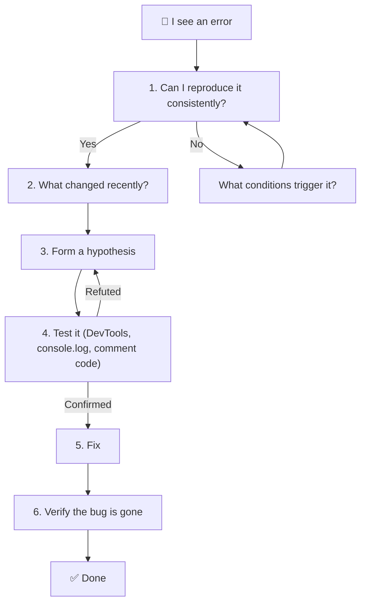
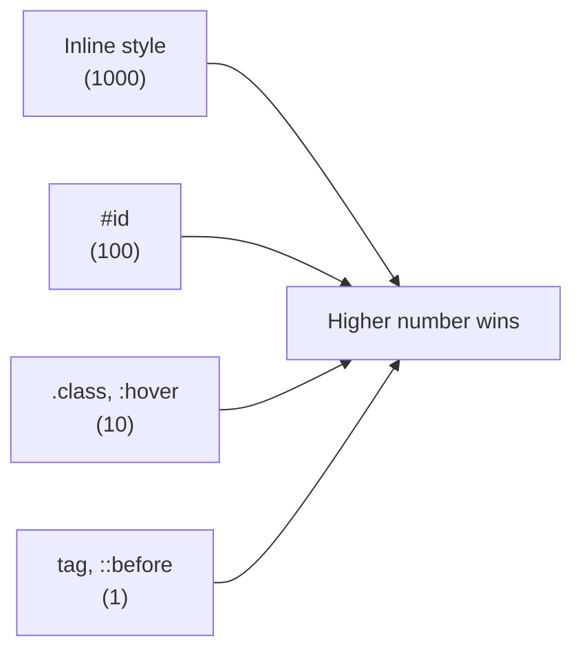
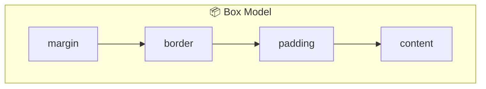

[🇪🇸 Español](README.md) | 🇬🇧 **English**

# Step 0: Debugging — Finding and Fixing Errors

## 🎯 Goal

Learn **what debugging is**, adopt a detective mindset, and master the basic tools (browser DevTools) to diagnose problems in HTML and CSS.

---

## 🤔 Why does this matter?

Programming **is not** writing code that works the first time. Programming is writing code, seeing it fail, figuring out why, fixing it, and repeating. Classic software industry studies estimate that developers spend between **30% and 50% of their time debugging**, not writing new code.

If you learn to debug well from day 2, you'll save yourself hundreds of hours of frustration throughout the bootcamp.

> 💡 **Golden rule:** *code is not magic*. If something doesn't work, there's a concrete, observable reason. Your job is to find it.

---

## 🧠 What is debugging?

**Debugging** is the process of:

1. **Reproducing** an incorrect behavior.
2. **Isolating** the cause.
3. **Fixing** the problem.
4. **Verifying** that the fix works and doesn't break anything else.

The term comes from a real 1947 incident: programmer **Grace Hopper** documented a moth stuck in a relay of the Mark II computer and taped it into her notebook with the note *"First actual case of bug being found"*. Ever since, "bug" = error, and "debug" = remove the bug.

---

## 🕵️ The detective mindset

When something doesn't work, beginners usually react with frustration (*"why doesn't this work?!"*). Experienced developers react with **curiosity** (*"interesting, what exactly is happening?"*).



### The 4 commandments of debugging

1. **Read the error message.** Sounds obvious, but many ignore it. The console tells you which file, which line, and what type of error.
2. **Change one thing at a time.** If you change 5 things and the bug disappears, you don't know which fix worked.
3. **Don't trust assumptions — trust evidence.** Inspect, measure, observe.
4. **If you've been stuck for more than 30 minutes, ask for help or take a break.** A fresh brain solves bugs.

---

## 🛠️ DevTools: your main tool

Every modern browser (Chrome, Firefox, Edge, Safari) ships with a panel called **DevTools**. Open it with `F12` or `Cmd+Opt+I` (Mac) / `Ctrl+Shift+I` (Windows/Linux).

### Tabs we'll use today

| Tab | What it's for | Example use |
|-----|---------------|-------------|
| **Elements** | View and edit live HTML and CSS | Change a color without touching the file |
| **Console** | See JS errors and run code | Spot an `Uncaught ReferenceError` |
| **Network** | See which files the page loads | Check if Bootstrap downloaded correctly |
| **Sources** | Set breakpoints in JavaScript | Pause execution line by line |
| **Application** | Inspect cookies, localStorage | Clear a saved session |

---

## 🧱 Debugging HTML

The most common HTML errors:

### 1. Tags not closed or wrongly nested

```html
<!-- ❌ Bad: unclosed <p> -->
<div>
  <p>Hello world
</div>

<!-- ❌ Bad: incorrect nesting -->
<p><div>content</div></p>

<!-- ✅ Good -->
<div>
  <p>Hello world</p>
</div>
```

### 2. Attributes without quotes or misspelled

```html
<!-- ❌ Bad -->


<!-- ✅ Good -->

```

### 3. Duplicate IDs

An `id` must be unique in the entire page. If you repeat it, CSS and JS will behave strangely.

```html
<!-- ❌ Bad -->
<div id="header">...</div>
<div id="header">...</div>

<!-- ✅ Good: use class for repetition -->
<div class="header">...</div>
<div class="header">...</div>
```

### Workflow for debugging HTML

1. **Open DevTools → Elements.** Check that the *rendered* HTML matches what you wrote. Sometimes the browser "fixes" your unclosed HTML and that reveals the problem.
2. **Use the W3C validator** (validator.w3.org) to catch structural errors.
3. **Inspect missing elements:** if you don't see an element on the page, look for it in Elements. If it's not there either, it's not being rendered (HTML or JS problem).

> 💡 **In your project:** if an image doesn't appear, the first thing to do is open Elements, find the ``, and check the `src` attribute. Is the path correct? Does the file exist?

---

## 🎨 Debugging CSS

CSS is famous for being "weird". The most common problems:

### 1. The rule isn't applying

Possible causes:
- **The selector doesn't target the element you think it does.** Inspect the element in Elements; the Styles panel shows you which rules apply and which are crossed out (because a more specific rule overrides them).
- **There's a typo** in the class name or property (`colorr: red;`).
- **The CSS file didn't load.** Check the Network tab and look for your `.css`: does it return 200 or 404?

### 2. Specificity conflicts

When two rules clash, the **more specific** one wins.



```css
/* Specificity 1 (tag only) */
p { color: blue; }

/* Specificity 10 (class) — beats the tag */
.alert { color: red; }

/* Specificity 100 (id) — beats the class */
#main { color: green; }

/* !important overrides almost everything — use as a last resort! */
p { color: orange !important; }
```

### 3. The box model

Every element is a box with `content`, `padding`, `border`, and `margin`. If dimensions don't add up, open Elements → Computed and look at the box model diagram.



### 4. `display`, `position`, and `flex`/`grid`

- If an element "doesn't move", check its `display`. A `<span>` is `inline` by default and won't accept `width`/`height`.
- If you want to center something, `margin: auto` only works with `display: block` and a defined `width`.

### Workflow for debugging CSS

1. **Inspect the element** (right click → Inspect).
2. **Look at the Styles panel:** read top to bottom — rules higher up win. Crossed-out properties were overridden.
3. **Look at the Computed panel:** it shows the *final* value the browser is applying.
4. **Edit live:** double click any value in the Styles panel to test it without touching your file. This is the most useful DevTools feature.

> 💡 **In your project:** when something doesn't look right, don't edit your CSS file blindly. First test the change in DevTools → once it works, copy it back to your file.

---

## 🧪 DevTools shortcuts that save you time

| Action | Shortcut |
|--------|----------|
| Open DevTools | `F12` or `Cmd/Ctrl + Shift + I` |
| Inspect element | `Cmd/Ctrl + Shift + C` and click |
| Search in the DOM | `Cmd/Ctrl + F` inside Elements |
| Toggle responsive mode | `Cmd/Ctrl + Shift + M` |
| Reload without cache | `Cmd/Ctrl + Shift + R` |

---

## 🧠 Question to reflect on

<details>
<summary>Your button should be green but renders blue. What steps do you take to diagnose it in under 2 minutes?</summary>

1. **Right click → Inspect** on the button.
2. In the **Styles** panel, find the `background-color` property (or `color` if it's the text). Is it crossed out? If yes, a more specific rule is winning.
3. Switch to the **Computed** panel and look at the *actual* value being applied. Click the arrow to see which rule it comes from.
4. If the rule comes from Bootstrap or another file, you know your CSS has lower specificity. Fixes: raise your selector's specificity, move your CSS *after* Bootstrap, or use a more specific class.
5. Edit the value live in DevTools to confirm your hypothesis before touching the file.

The key point: **you didn't touch your CSS file until you had a verified hypothesis**.

</details>

---

## ✅ Step checklist

- [ ] I can open DevTools and recognize the Elements, Console, and Network tabs
- [ ] I can inspect an element and read its Styles / Computed panel
- [ ] I know what CSS specificity is and how it's calculated
- [ ] I know the 3 most common HTML errors (tags, attributes, duplicate IDs)
- [ ] I have a personal 4-5 step workflow for facing a bug
