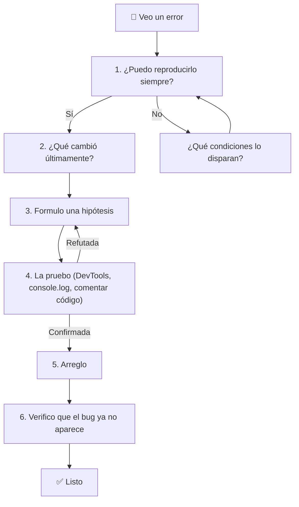
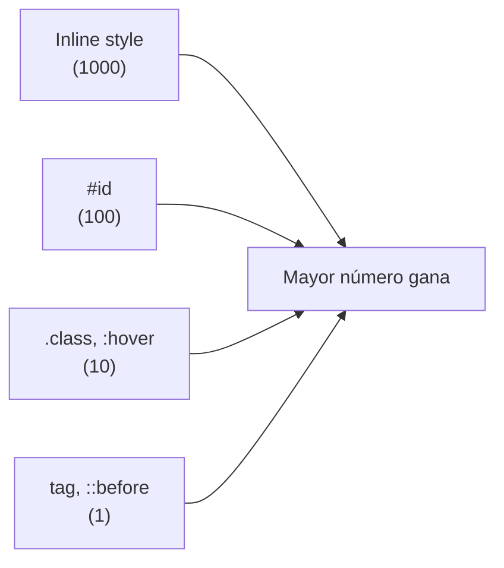
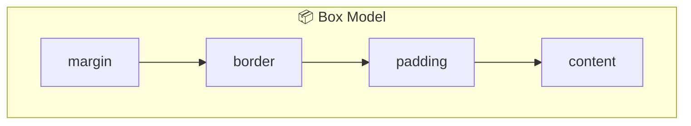

🇪🇸 **Español** | [🇬🇧 English](README.en.md)

# Step 0: Debugging — Encontrar y arreglar errores

## 🎯 Objetivo

Aprender **qué es debugging**, adoptar un mindset de detective y dominar las herramientas básicas (DevTools del navegador) para diagnosticar problemas en HTML y CSS.

---

## 🤔 ¿Por qué importa esto?

Programar **no es** escribir código que funciona a la primera. Programar es escribir código, ver que no funciona, descubrir por qué, arreglarlo y repetir. Estudios clásicos de la industria del software estiman que los desarrolladores pasan entre el **30% y el 50% de su tiempo depurando**, no escribiendo código nuevo.

Si aprendes a depurar bien desde el día 2, vas a ahorrar cientos de horas de frustración a lo largo del bootcamp.

> 💡 **Regla de oro:** *el código no es magia*. Si algo no funciona, hay una razón concreta y observable. Tu trabajo es encontrarla.

---

## 🧠 ¿Qué es debugging?

**Debugging** es el proceso de:

1. **Reproducir** un comportamiento incorrecto.
2. **Aislar** la causa.
3. **Corregir** el problema.
4. **Verificar** que la corrección funciona y no rompe nada más.

El término viene de un caso real de 1947: la programadora **Grace Hopper** documentó una polilla atascada en un relé del computador Mark II y la pegó en su cuaderno con la nota *"First actual case of bug being found"*. Desde entonces, "bug" = error, y "debug" = quitar el bug.

---

## 🕵️ El mindset del detective

Cuando algo no funciona, los principiantes suelen reaccionar con frustración (*"¿por qué no funciona?!"*). Los desarrolladores experimentados reaccionan con **curiosidad** (*"interesante, ¿qué está pasando exactamente?"*).



### Los 4 mandamientos del debugging

1. **Lee el mensaje de error.** Suena obvio, pero muchos lo ignoran. La consola te dice qué archivo, qué línea y qué tipo de error.
2. **Cambia una sola cosa a la vez.** Si cambias 5 cosas y el bug desaparece, no sabes cuál lo arregló.
3. **No confíes en la suposición — confía en la evidencia.** Inspecciona, mide, observa.
4. **Si llevas más de 30 minutos atascado, pide ayuda o tómate un descanso.** El cerebro fresco resuelve bugs.

---

## 🛠️ DevTools: tu herramienta principal

Todos los navegadores modernos (Chrome, Firefox, Edge, Safari) traen un panel llamado **DevTools**. Lo abres con `F12` o `Cmd+Opt+I` (Mac) / `Ctrl+Shift+I` (Windows/Linux).

### Pestañas que vamos a usar hoy

| Pestaña | Para qué sirve | Ejemplo de uso |
|---------|----------------|----------------|
| **Elements** | Ver y editar el HTML y CSS en vivo | Cambiar un color sin tocar el archivo |
| **Console** | Ver errores de JS y ejecutar código | Detectar `Uncaught ReferenceError` |
| **Network** | Ver qué archivos carga la página | Comprobar si Bootstrap se descargó |
| **Sources** | Poner breakpoints en JavaScript | Pausar la ejecución línea a línea |
| **Application** | Inspeccionar cookies, localStorage | Borrar sesión guardada |

---

## 🧱 Debugging de HTML

Los errores de HTML más comunes:

### 1. Etiquetas mal cerradas o anidadas

```html
<!-- ❌ Mal: <p> sin cerrar -->
<div>
  <p>Hola mundo
</div>

<!-- ❌ Mal: anidación incorrecta -->
<p><div>contenido</div></p>

<!-- ✅ Bien -->
<div>
  <p>Hola mundo</p>
</div>
```

### 2. Atributos sin comillas o mal escritos

```html
<!-- ❌ Mal -->


<!-- ✅ Bien -->

```

### 3. IDs duplicados

Un `id` debe ser único en toda la página. Si lo repites, el CSS y el JS van a comportarse raro.

```html
<!-- ❌ Mal -->
<div id="header">...</div>
<div id="header">...</div>

<!-- ✅ Bien: usa class para repeticiones -->
<div class="header">...</div>
<div class="header">...</div>
```

### Workflow para depurar HTML

1. **Abre DevTools → Elements.** Verifica que el HTML *renderizado* coincide con el que escribiste. A veces el navegador "arregla" tu HTML mal cerrado y eso revela el problema.
2. **Usa el validador del W3C** (validator.w3.org) para detectar errores estructurales.
3. **Inspecciona elementos faltantes:** si no ves un elemento en la página, búscalo en Elements. Si tampoco está ahí, no se está renderizando (problema de HTML o de JS).

> 💡 **En tu proyecto:** si una imagen no aparece, lo primero es abrir Elements, encontrar el `` y mirar el atributo `src`. ¿La ruta es correcta? ¿El archivo existe?

---

## 🎨 Debugging de CSS

CSS es famoso por ser "raro". Los problemas más comunes:

### 1. La regla no se aplica

Causas posibles:
- **El selector no apunta al elemento que crees.** Inspecciona el elemento en Elements; el panel Styles te dice qué reglas se le aplican y cuáles están tachadas (porque otra regla más específica las sobrescribe).
- **Hay un typo** en el nombre de la clase o propiedad (`colorr: red;`).
- **El archivo CSS no se cargó.** Mira la pestaña Network y busca tu `.css`: ¿devuelve 200 o 404?

### 2. Conflictos de especificidad

Cuando dos reglas chocan, gana la **más específica**.



```css
/* Especificidad 1 (solo tag) */
p { color: blue; }

/* Especificidad 10 (clase) — gana sobre el tag */
.alert { color: red; }

/* Especificidad 100 (id) — gana sobre la clase */
#main { color: green; }

/* ¡!important sobrescribe casi todo — úsalo como último recurso! */
p { color: orange !important; }
```

### 3. El box model

Cada elemento es una caja con `content`, `padding`, `border` y `margin`. Si las dimensiones no cuadran, abre Elements → Computed y mira el diagrama del box model.



### 4. `display`, `position` y `flex`/`grid`

- Si un elemento "no se mueve", revisa su `display`. Un `<span>` es `inline` por defecto y no acepta `width`/`height`.
- Si quieres centrar algo, `margin: auto` solo funciona con `display: block` y `width` definido.

### Workflow para depurar CSS

1. **Inspecciona el elemento** (click derecho → Inspect).
2. **Mira el panel Styles:** lee de arriba abajo, las reglas más arriba ganan. Las propiedades tachadas fueron sobrescritas.
3. **Mira el panel Computed:** te muestra el valor *final* que el navegador está aplicando.
4. **Edita en vivo:** haz doble click en cualquier valor del panel Styles para probarlo sin tocar tu archivo. Esto es lo más útil de DevTools.

> 💡 **En tu proyecto:** cuando algo no se ve como esperas, no edites tu archivo CSS a ciegas. Primero prueba el cambio en DevTools → cuando funcione, cópialo a tu archivo.

---

## 🧪 Atajos de DevTools que te ahorran tiempo

| Acción | Atajo |
|--------|-------|
| Abrir DevTools | `F12` o `Cmd/Ctrl + Shift + I` |
| Inspeccionar elemento | `Cmd/Ctrl + Shift + C` y click |
| Buscar en el DOM | `Cmd/Ctrl + F` dentro de Elements |
| Toggle modo responsive | `Cmd/Ctrl + Shift + M` |
| Recargar sin caché | `Cmd/Ctrl + Shift + R` |

---

## 🧠 Pregunta para reflexionar

<details>
<summary>Tu botón debería ser verde, pero se ve azul. ¿Qué pasos sigues para diagnosticarlo en menos de 2 minutos?</summary>

1. **Click derecho → Inspect** sobre el botón.
2. En el panel **Styles**, busca la propiedad `background-color` (o `color` si es el texto). ¿Está tachada? Si sí, hay otra regla más específica ganando.
3. Pasa al panel **Computed** y mira el valor *real* que se aplica. Haz click en la flecha para ver de qué regla viene.
4. Si la regla viene de Bootstrap o de otro archivo, sabes que tu CSS tiene menor especificidad. Soluciones: subir la especificidad de tu selector, mover tu CSS *después* de Bootstrap, o usar una clase más específica.
5. Edita el valor en vivo en DevTools para confirmar tu hipótesis antes de tocar el archivo.

Lo importante: **no tocaste tu archivo CSS hasta tener una hipótesis verificada**.

</details>

---

## ✅ Checklist de este step

- [ ] Sé abrir DevTools y reconozco las pestañas Elements, Console, Network
- [ ] Puedo inspeccionar un elemento y leer su panel Styles / Computed
- [ ] Sé qué es la especificidad CSS y cómo se calcula
- [ ] Conozco los 3 errores HTML más comunes (etiquetas, atributos, IDs duplicados)
- [ ] Tengo un workflow personal de 4-5 pasos para enfrentarme a un bug
