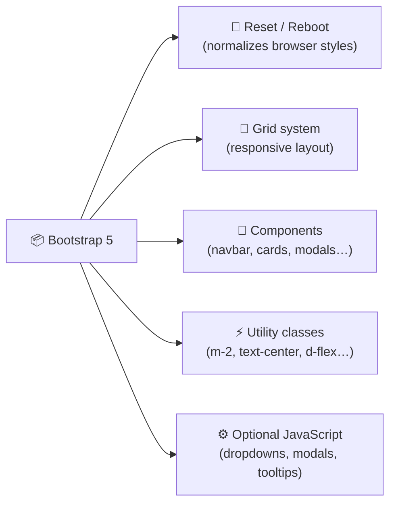
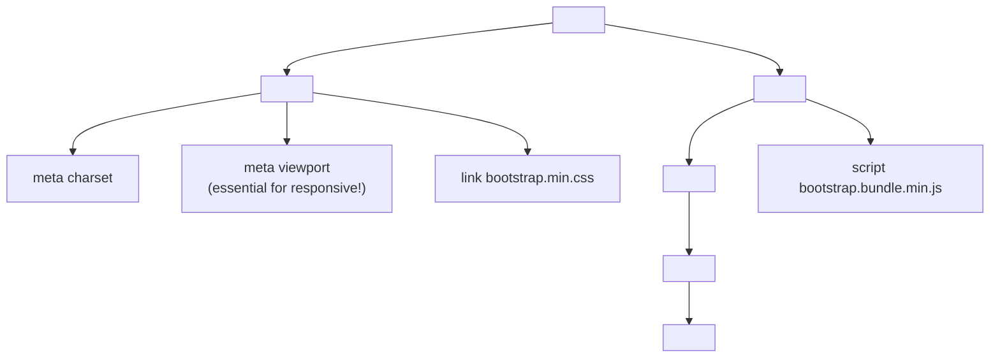

[🇪🇸 Español](README.md) | 🇬🇧 **English**

# Step 1: Introduction to Bootstrap

## 🎯 Goal

Understand **what Bootstrap is**, why it's used, how to add it to a project (CDN vs npm), and know the **minimal anatomy** of a working Bootstrap page.

---

## 🤔 Why does this matter?

Imagine you have to build a page with a responsive navbar, nice buttons, accessible forms, and a grid that works on mobile, tablet, and desktop. If you do it from scratch with raw CSS, it takes **days**. With Bootstrap, it takes **hours**.

Bootstrap is a **CSS framework**: a library of pre-designed styles and components you can use by adding classes to your HTML. It was created by two Twitter developers in 2011, and today millions of sites use it — from startups to Fortune 500 companies.

> 💡 **Key idea:** a framework doesn't write the page for you. It gives you **ready-made pieces** that you assemble. Your job is still to decide the design and structure.

---

## 🧩 What does Bootstrap give you?



1. **Reset (Reboot):** normalizes browsers' default styles so your page looks the same in Chrome, Firefox, and Safari.
2. **Grid system:** a 12-column layout with responsive breakpoints.
3. **Pre-designed components:** navbars, cards, modals, dropdowns, alerts, forms…
4. **Utility classes:** tiny classes that apply a single CSS property (`mt-3` = `margin-top: 1rem`).
5. **Optional JavaScript:** behavior for dropdowns, modals, carousels, etc.

---

## ⚖️ When to use Bootstrap (and when not to)

| Situation | Bootstrap? |
|-----------|------------|
| Quick prototype or MVP | ✅ Perfect |
| Standard corporate landing | ✅ Very useful |
| Educational / bootcamp project | ✅ Speeds up learning |
| Highly custom, unique design | ⚠️ You may fight against it |
| Product where weight (KB) is critical | ❌ Better custom CSS or Tailwind with purge |
| You want to learn CSS from scratch | ❌ Learn CSS first, then Bootstrap |

### Bootstrap vs raw CSS vs Tailwind

| Aspect | Raw CSS | Bootstrap | Tailwind |
|--------|---------|-----------|----------|
| **Learning curve** | Long (you know it all) | Short | Medium |
| **Prototyping speed** | Slow | Very fast | Very fast |
| **Ready components** | None | Many | None (utilities only) |
| **Customization** | Total | Medium | High |
| **CSS size** | Minimal | ~25 KB (gzip) | Variable (purge) |
| **"Unique" look** | Yes | Typical "Bootstrap look" | Yes (whatever you design) |

---

## 🚀 How to include Bootstrap

There are two main ways: **CDN** (fast, ideal to start) and **npm** (for projects with a build system).

### Option A: CDN (recommended for today)

Just add two lines to your HTML — one for CSS, one for JS. **You install nothing.**

```html
<!doctype html>
<html lang="en">
  <head>
    <meta charset="utf-8">
    <meta name="viewport" content="width=device-width, initial-scale=1">
    <title>My first Bootstrap page</title>

    <!-- ✅ Bootstrap CSS -->
    <link
      href="https://cdn.jsdelivr.net/npm/bootstrap@5.3.3/dist/css/bootstrap.min.css"
      rel="stylesheet">
  </head>
  <body>
    <h1 class="text-primary text-center mt-5">Hello Bootstrap!</h1>

    <!-- ✅ Bootstrap JS (includes Popper) — at the end of body -->
    <script
      src="https://cdn.jsdelivr.net/npm/bootstrap@5.3.3/dist/js/bootstrap.bundle.min.js">
    </script>
  </body>
</html>
```

**CDN advantages:**
- Zero configuration.
- The browser can cache the file across sites.

**Disadvantages:**
- You need an internet connection the first time.
- You can't customize Sass variables.

### Option B: npm (for more serious projects)

```bash
npm install bootstrap@5.3.3
```

Then, in your JS entry file (for example `src/main.js`):

```js
import 'bootstrap/dist/css/bootstrap.min.css';
import 'bootstrap/dist/js/bootstrap.bundle.min.js';
```

**Advantages:**
- You can customize Bootstrap's Sass variables.
- The build system (Vite, Webpack, etc.) optimizes the CSS.

> 💡 **In your project:** for today's Instagram feed use CDN — faster, no tooling distractions.

---

## 🧬 Minimal anatomy of a Bootstrap page

Every Bootstrap page has this base structure:



### The 3 lines you should NEVER forget

```html
<!-- 1️⃣ DOCTYPE: declares HTML5 -->
<!doctype html>

<!-- 2️⃣ Viewport: makes the page responsive on mobile -->
<meta name="viewport" content="width=device-width, initial-scale=1">

<!-- 3️⃣ Bootstrap CSS -->
<link rel="stylesheet" href="https://cdn.jsdelivr.net/npm/bootstrap@5.3.3/dist/css/bootstrap.min.css">
```

**Without the `viewport` meta tag**, your site will look zoomed-out on mobile. It's the #1 beginner mistake.

---

## 🧪 Your first "Hello Bootstrap"

Create an `index.html` file with this:

```html
<!doctype html>
<html lang="en">
  <head>
    <meta charset="utf-8">
    <meta name="viewport" content="width=device-width, initial-scale=1">
    <title>Hello Bootstrap</title>
    <link
      href="https://cdn.jsdelivr.net/npm/bootstrap@5.3.3/dist/css/bootstrap.min.css"
      rel="stylesheet">
  </head>
  <body>
    <div class="container py-5">
      <h1 class="display-4 text-primary">Hello, Bootstrap!</h1>
      <p class="lead">This is a page with Bootstrap's typography and colors.</p>
      <button class="btn btn-success btn-lg">I'm a pretty button</button>
      <button class="btn btn-outline-danger btn-lg">Me too</button>
    </div>
  </body>
</html>
```

Open it in the browser and you should see: clean typography, a blue title, a large paragraph, and two styled buttons. Without writing a single line of CSS.

> 💡 **In your project:** this pattern (DOCTYPE + viewport + CDN link + `<div class="container">`) is the skeleton you'll start using in every exercise.

---

## 🧠 Question to reflect on

<details>
<summary>If Bootstrap gives you everything for free, why keep learning raw CSS?</summary>

Because Bootstrap **is CSS under the hood**. When something doesn't work or you want to customize a component, you need to understand:

- **The box model** to tweak padding/margin of a Bootstrap component.
- **Cascade and specificity** to override a Bootstrap style with your own CSS.
- **Flexbox and Grid** because Bootstrap's grid system is built on Flexbox.
- **Selectors** to target an element inside a component without breaking it.

Bootstrap is an **accelerator**, not a replacement. Developers who only know Bootstrap end up trapped when a designer asks for something "off-template". Those who understand CSS and also know Bootstrap are unstoppable.

</details>

---

## ✅ Step checklist

- [ ] I can explain in one sentence what a CSS framework is
- [ ] I can include Bootstrap via CDN in an HTML page
- [ ] I know the difference between CDN and npm and when to use each
- [ ] I know why the `viewport` meta tag is essential
- [ ] I've built my first working "Hello Bootstrap" page in the browser
