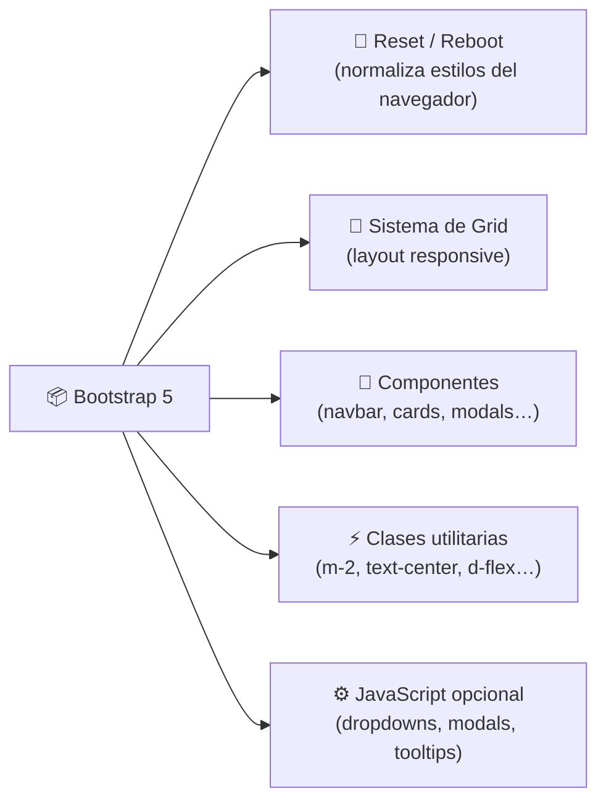
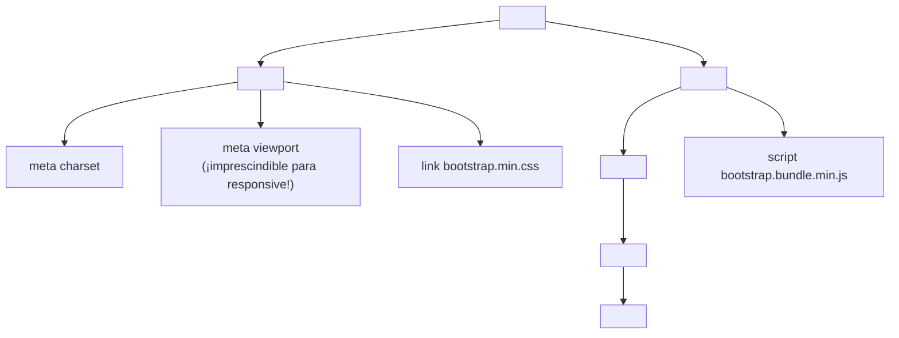

🇪🇸 **Español** | [🇬🇧 English](README.en.md)

# Step 1: Introducción a Bootstrap

## 🎯 Objetivo

Entender **qué es Bootstrap**, por qué se usa, cómo añadirlo a un proyecto (CDN vs npm) y conocer la **anatomía mínima** de una página Bootstrap funcional.

---

## 🤔 ¿Por qué importa esto?

Imagina que tienes que construir una página con un navbar responsive, botones bonitos, formularios accesibles y un grid que funcione en móvil, tablet y desktop. Si lo haces desde cero con CSS puro, te lleva **días**. Con Bootstrap, te lleva **horas**.

Bootstrap es un **framework CSS**: una librería de estilos y componentes pre-diseñados que puedes usar añadiendo clases a tu HTML. Fue creado por dos desarrolladores de Twitter en 2011 y hoy lo usan millones de sitios — desde startups hasta empresas Fortune 500.

> 💡 **Idea clave:** un framework no escribe la página por ti. Te da **piezas listas** que ensamblas. Tu trabajo sigue siendo decidir el diseño y la estructura.

---

## 🧩 ¿Qué te da Bootstrap?



1. **Reset (Reboot):** normaliza los estilos por defecto de los navegadores para que tu página se vea igual en Chrome, Firefox y Safari.
2. **Sistema de Grid:** un layout de 12 columnas con breakpoints responsive.
3. **Componentes pre-diseñados:** navbars, cards, modals, dropdowns, alerts, formularios…
4. **Clases utilitarias:** clases mini que aplican una sola propiedad CSS (`mt-3` = `margin-top: 1rem`).
5. **JavaScript opcional:** comportamiento para dropdowns, modals, carousels, etc.

---

## ⚖️ ¿Cuándo usar Bootstrap (y cuándo no)?

| Situación | ¿Bootstrap? |
|-----------|-------------|
| Prototipo rápido o MVP | ✅ Perfecto |
| Landing corporativa estándar | ✅ Muy útil |
| Proyecto educativo / bootcamp | ✅ Acelera el aprendizaje |
| Diseño muy personalizado y único | ⚠️ Puedes terminar peleando contra él |
| Producto donde el peso (KB) es crítico | ❌ Mejor CSS a medida o Tailwind con purge |
| Quieres aprender CSS desde cero | ❌ Aprende CSS primero, luego Bootstrap |

### Bootstrap vs CSS puro vs Tailwind

| Aspecto | CSS puro | Bootstrap | Tailwind |
|---------|----------|-----------|----------|
| **Curva de aprendizaje** | Larga (sabes todo) | Corta | Media |
| **Velocidad de prototipado** | Lenta | Muy rápida | Muy rápida |
| **Componentes listos** | Ninguno | Muchos | Ninguno (solo utilidades) |
| **Personalización** | Total | Media | Alta |
| **Tamaño del CSS** | Mínimo | ~25 KB (gzip) | Variable (purge) |
| **Apariencia "única"** | Sí | "Look Bootstrap" típico | Sí (lo que diseñes) |

---

## 🚀 Cómo incluir Bootstrap

Hay dos formas principales: **CDN** (rápido, ideal para empezar) y **npm** (para proyectos con build system).

### Opción A: CDN (recomendado para hoy)

Solo añades dos líneas en tu HTML — una para el CSS, otra para el JS. **No instalas nada.**

```html
<!doctype html>
<html lang="es">
  <head>
    <meta charset="utf-8">
    <meta name="viewport" content="width=device-width, initial-scale=1">
    <title>Mi primera página con Bootstrap</title>

    <!-- ✅ CSS de Bootstrap -->
    <link
      href="https://cdn.jsdelivr.net/npm/bootstrap@5.3.3/dist/css/bootstrap.min.css"
      rel="stylesheet">
  </head>
  <body>
    <h1 class="text-primary text-center mt-5">¡Hola Bootstrap!</h1>

    <!-- ✅ JS de Bootstrap (incluye Popper) — al final del body -->
    <script
      src="https://cdn.jsdelivr.net/npm/bootstrap@5.3.3/dist/js/bootstrap.bundle.min.js">
    </script>
  </body>
</html>
```

**Ventajas del CDN:**
- Cero configuración.
- El navegador puede cachear el archivo entre sitios.

**Desventajas:**
- Necesitas conexión a internet la primera vez.
- No puedes personalizar variables de Sass.

### Opción B: npm (para proyectos más serios)

```bash
npm install bootstrap@5.3.3
```

Luego, en tu archivo de entrada JS (por ejemplo `src/main.js`):

```js
import 'bootstrap/dist/css/bootstrap.min.css';
import 'bootstrap/dist/js/bootstrap.bundle.min.js';
```

**Ventajas:**
- Puedes personalizar las variables de Sass de Bootstrap.
- El build system (Vite, Webpack, etc.) optimiza el CSS.

> 💡 **En tu proyecto:** para el feed de Instagram de hoy usa CDN — más rápido y sin distracciones de tooling.

---

## 🧬 Anatomía mínima de una página Bootstrap

Toda página Bootstrap tiene esta estructura básica:



### Las 3 líneas que NUNCA debes olvidar

```html
<!-- 1️⃣ DOCTYPE: indica HTML5 -->
<!doctype html>

<!-- 2️⃣ Viewport: hace que la página sea responsive en móvil -->
<meta name="viewport" content="width=device-width, initial-scale=1">

<!-- 3️⃣ CSS de Bootstrap -->
<link rel="stylesheet" href="https://cdn.jsdelivr.net/npm/bootstrap@5.3.3/dist/css/bootstrap.min.css">
```

**Sin el `viewport` meta tag**, tu sitio se verá zoom-out en móvil. Es el error #1 de principiantes.

---

## 🧪 Tu primer "Hola Bootstrap"

Crea un archivo `index.html` con esto:

```html
<!doctype html>
<html lang="es">
  <head>
    <meta charset="utf-8">
    <meta name="viewport" content="width=device-width, initial-scale=1">
    <title>Hola Bootstrap</title>
    <link
      href="https://cdn.jsdelivr.net/npm/bootstrap@5.3.3/dist/css/bootstrap.min.css"
      rel="stylesheet">
  </head>
  <body>
    <div class="container py-5">
      <h1 class="display-4 text-primary">¡Hola, Bootstrap!</h1>
      <p class="lead">Esto es una página con tipografía y colores de Bootstrap.</p>
      <button class="btn btn-success btn-lg">Soy un botón bonito</button>
      <button class="btn btn-outline-danger btn-lg">Yo también</button>
    </div>
  </body>
</html>
```

Si lo abres en el navegador deberías ver: tipografía limpia, un título azul, un párrafo grande, y dos botones con estilo. Sin escribir una sola línea de CSS.

> 💡 **En tu proyecto:** este patrón (DOCTYPE + viewport + link al CDN + `<div class="container">`) es el esqueleto que vas a empezar a usar en todos los ejercicios.

---

## 🧠 Pregunta para reflexionar

<details>
<summary>Si Bootstrap te da todo gratis, ¿por qué seguir aprendiendo CSS puro?</summary>

Porque Bootstrap **es CSS por debajo**. Cuando algo no funciona o quieres personalizar un componente, necesitas entender:

- **El box model** para ajustar padding/margin de un componente Bootstrap.
- **La cascada y especificidad** para sobrescribir un estilo de Bootstrap con tu propio CSS.
- **Flexbox y Grid** porque el sistema de grid de Bootstrap se basa en Flexbox.
- **Selectores** para apuntar a un elemento dentro de un componente sin romperlo.

Bootstrap es un **acelerador**, no un sustituto. Los desarrolladores que solo saben Bootstrap acaban atrapados cuando un diseñador les pide algo "fuera de plantilla". Los que entienden CSS y además saben Bootstrap son imparables.

</details>

---

## ✅ Checklist de este step

- [ ] Puedo explicar en una frase qué es un framework CSS
- [ ] Sé incluir Bootstrap por CDN en una página HTML
- [ ] Conozco la diferencia entre CDN y npm y cuándo usar cada uno
- [ ] Sé por qué el meta `viewport` es imprescindible
- [ ] He creado mi primera página "Hola Bootstrap" funcionando en el navegador
