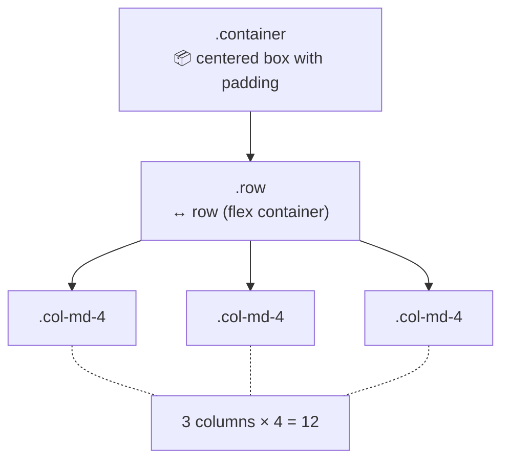
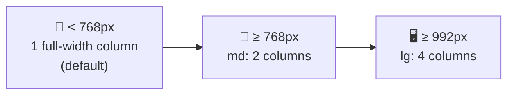

[🇪🇸 Español](README.md) | 🇬🇧 **English**

# Step 2: Grid System and Components

## 🎯 Goal

Master the **Bootstrap grid system** (`container`, `row`, `col-*`) with its **responsive breakpoints**, and learn to use the most common components: **navbar**, **cards**, **buttons**, and **forms**.

---

## 🤔 Why does this matter?

90% of the value you'll get from Bootstrap day-to-day comes from two things:

1. **The grid system** — so your layout works automatically on any screen.
2. **The components** — so you don't reinvent the wheel for navbars, cards, and forms.

If you master these, you can build professional interfaces in an afternoon. If you don't, you'll get frustrated fighting classes that "almost" work.

---

## 📐 The Grid System

Bootstrap uses a **12-column grid** that divides the available width. There are 3 pieces:



### The 3 pieces

| Class | Role | Basic rules |
|-------|------|-------------|
| `.container` | Outer centered box with max-width | Always wraps a `.row` |
| `.row` | Horizontal row (a flex container) | Always inside a `.container`; always contains `.col-*` |
| `.col-*` | Column that takes N of 12 units | Always inside a `.row` |

### Your first grid

```html
<div class="container">
  <div class="row">
    <div class="col-md-4">Column 1</div>
    <div class="col-md-4">Column 2</div>
    <div class="col-md-4">Column 3</div>
  </div>
</div>
```

Three equal columns (4 + 4 + 4 = 12). On mobile they stack; on medium and larger screens they sit in a row.

### `container` vs `container-fluid`

- `.container` → fixed max-width per breakpoint (centered).
- `.container-fluid` → always fills 100% of the width.

---

## 📱 Responsive breakpoints

Bootstrap defines 6 breakpoints. The idea: you define column widths **per screen size**.

| Prefix | Min size | Typical device |
|--------|----------|----------------|
| `col-*` | < 576px | Mobile (xs — the default) |
| `col-sm-*` | ≥ 576px | Large mobile |
| `col-md-*` | ≥ 768px | Tablet |
| `col-lg-*` | ≥ 992px | Desktop |
| `col-xl-*` | ≥ 1200px | Large desktop |
| `col-xxl-*` | ≥ 1400px | Very large screens |

### Mobile-first: how it works



If you put several prefixes on a single column, Bootstrap applies each rule from the matching size **upward**:

```html
<div class="col-12 col-md-6 col-lg-3">
  <!--
    📱 Mobile (< 768px): takes all 12 columns (full width)
    📲 Tablet (≥ 768px): takes 6 of 12 (half row)
    🖥️ Desktop (≥ 992px): takes 3 of 12 (a quarter)
  -->
</div>
```

> 💡 **In your project:** always think first about how it looks on mobile. Start with `col-12` and add `col-md-*` / `col-lg-*` for larger screens.

### Grid spacing utilities

- `g-3` (gutters): space between columns inside a row.
- `gx-3`: horizontal gutter only.
- `gy-3`: vertical gutter only.

```html
<div class="row g-3">
  <div class="col-md-6">Item</div>
  <div class="col-md-6">Item</div>
</div>
```

---

## 🧱 Essential components

Bootstrap has dozens of components; today we cover the 4 you'll use **all the time**.

### 1. Navbar (navigation bar)

A responsive navbar with logo, links, and mobile menu button:

```html
<nav class="navbar navbar-expand-lg bg-light">
  <div class="container">
    <a class="navbar-brand" href="#">MyApp</a>

    <!-- "Hamburger" button for mobile -->
    <button class="navbar-toggler" type="button"
            data-bs-toggle="collapse" data-bs-target="#mainNav">
      <span class="navbar-toggler-icon"></span>
    </button>

    <div class="collapse navbar-collapse" id="mainNav">
      <ul class="navbar-nav ms-auto">
        <li class="nav-item"><a class="nav-link" href="#">Home</a></li>
        <li class="nav-item"><a class="nav-link" href="#">About</a></li>
        <li class="nav-item"><a class="nav-link" href="#">Contact</a></li>
      </ul>
    </div>
  </div>
</nav>
```

Keys:
- `navbar-expand-lg` → expands at `lg` or larger; below that shows the hamburger.
- `navbar-brand` → the logo / name.
- `ms-auto` → pushes the links to the right (margin-start auto).

### 2. Cards

A very versatile component — ideal for posts, products, profiles…

```html
<div class="card" style="width: 18rem;">
  
  <div class="card-body">
    <h5 class="card-title">Card title</h5>
    <p class="card-text">A short description of the content.</p>
    <a href="#" class="btn btn-primary">See more</a>
  </div>
</div>
```

Main parts:

| Class | What for |
|-------|----------|
| `.card` | Main container |
| `.card-img-top` | Top image |
| `.card-body` | Body with padding |
| `.card-title` | Title inside the body |
| `.card-text` | Body paragraph |
| `.card-header` / `.card-footer` | Optional header / footer |

### 3. Buttons

```html
<!-- Solid buttons -->
<button class="btn btn-primary">Primary</button>
<button class="btn btn-success">Success</button>
<button class="btn btn-danger">Danger</button>

<!-- Outline buttons -->
<button class="btn btn-outline-primary">Outline</button>

<!-- Sizes -->
<button class="btn btn-primary btn-sm">Small</button>
<button class="btn btn-primary btn-lg">Large</button>

<!-- Full-width button -->
<button class="btn btn-primary w-100">Full width</button>
```

Available colors: `primary`, `secondary`, `success`, `danger`, `warning`, `info`, `light`, `dark`.

### 4. Forms

```html
<form>
  <div class="mb-3">
    <label for="email" class="form-label">Email</label>
    <input type="email" class="form-control" id="email" placeholder="you@email.com">
    <div class="form-text">We'll never share your email.</div>
  </div>

  <div class="mb-3">
    <label for="pwd" class="form-label">Password</label>
    <input type="password" class="form-control" id="pwd">
  </div>

  <div class="form-check mb-3">
    <input class="form-check-input" type="checkbox" id="remember">
    <label class="form-check-label" for="remember">Remember me</label>
  </div>

  <button type="submit" class="btn btn-primary">Log in</button>
</form>
```

Important pattern: every field is wrapped in `<div class="mb-3">` (margin-bottom). The `<label>` with its `for` attribute pointing to the input's `id` is **key for accessibility**.

---

## ⚡ Must-know utility classes

Bootstrap includes hundreds of "utility classes" — tiny classes that apply a single property. These are the ones you'll use constantly:

| Prefix | What it does | Example |
|--------|--------------|---------|
| `m-*`, `mt-*`, `mb-*`, `mx-*`, `my-*` | Margin | `mt-3` = `margin-top: 1rem` |
| `p-*`, `pt-*`, `pb-*`, `px-*`, `py-*` | Padding | `p-4` = `padding: 1.5rem` |
| `text-center`, `text-start`, `text-end` | Text alignment | `text-center` |
| `text-primary`, `text-muted` | Text color | `text-danger` |
| `bg-primary`, `bg-light` | Background color | `bg-light` |
| `d-flex`, `d-none`, `d-block` | Display | `d-flex` |
| `justify-content-*` | Horizontal alignment in flex | `justify-content-between` |
| `align-items-*` | Vertical alignment in flex | `align-items-center` |
| `w-*`, `h-*` | Width / height in % | `w-100` = 100% width |
| `rounded`, `rounded-circle` | Border radius | `rounded-circle` |

The numeric value (`0`, `1`, `2`, `3`, `4`, `5`) in margins and paddings maps to multiples of `0.25rem` (`0`, `0.25`, `0.5`, `1`, `1.5`, `3` rem).

> 💡 **In your project:** combine utilities to avoid writing custom CSS. For example, instead of creating a `.my-card` class, you can write `<div class="card shadow-sm rounded p-3">`.

---

## 🧠 Question to reflect on

<details>
<summary>You want an image gallery: 1 column on mobile, 2 on tablet, 4 on desktop. How do you write it in a single line of Bootstrap?</summary>

```html
<div class="row g-3">
  <div class="col-12 col-md-6 col-lg-3">Image 1</div>
  <div class="col-12 col-md-6 col-lg-3">Image 2</div>
  <div class="col-12 col-md-6 col-lg-3">Image 3</div>
  <div class="col-12 col-md-6 col-lg-3">Image 4</div>
</div>
```

The keys:
- `col-12` → mobile: fills the whole row (1 column).
- `col-md-6` → tablet (≥768px): half a row each (2 columns).
- `col-lg-3` → desktop (≥992px): a quarter each (4 columns).
- `g-3` → spacing between items.

This is **mobile-first** in action: the default is mobile and you add rules going up.

</details>

---

## ✅ Step checklist

- [ ] I understand the 12-column grid and the `container` / `row` / `col` trinity
- [ ] I know the breakpoints (sm, md, lg, xl, xxl) and the mobile-first approach
- [ ] I can build a responsive navbar with a hamburger menu
- [ ] I can create a card with image, title, text, and button
- [ ] I can handle buttons, basic forms, and at least 10 utility classes
