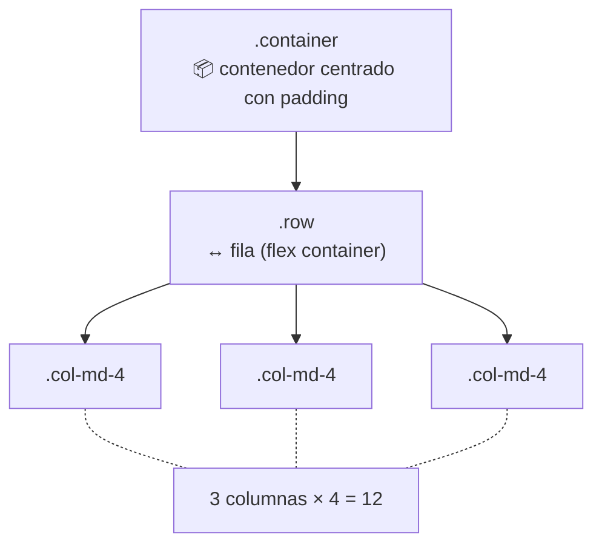
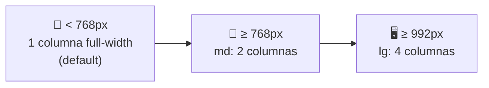

🇪🇸 **Español** | [🇬🇧 English](README.en.md)

# Step 2: Grid System y Componentes

## 🎯 Objetivo

Dominar el **sistema de grid de Bootstrap** (`container`, `row`, `col-*`) con sus **breakpoints responsive**, y aprender a usar los componentes más comunes: **navbar**, **cards**, **buttons** y **forms**.

---

## 🤔 ¿Por qué importa esto?

El 90% del valor que vas a sacar de Bootstrap en tu día a día viene de dos cosas:

1. **El grid system** — para que tu layout funcione automáticamente en cualquier pantalla.
2. **Los componentes** — para no reinventar la rueda con navbars, cards y formularios.

Si dominas esto, puedes construir interfaces profesionales en una tarde. Si no lo dominas, te vas a frustrar peleando con clases que "casi" funcionan.

---

## 📐 El sistema de Grid

Bootstrap usa un **grid de 12 columnas** que se reparte el ancho disponible. Tienes 3 piezas:



### Las 3 piezas

| Clase | Rol | Reglas básicas |
|-------|-----|----------------|
| `.container` | Caja exterior centrada con max-width | Siempre envuelve a `.row` |
| `.row` | Fila horizontal (es un flex container) | Siempre va dentro de un `.container`; siempre contiene `.col-*` |
| `.col-*` | Columna que ocupa N de 12 unidades | Siempre va dentro de una `.row` |

### Tu primer grid

```html
<div class="container">
  <div class="row">
    <div class="col-md-4">Columna 1</div>
    <div class="col-md-4">Columna 2</div>
    <div class="col-md-4">Columna 3</div>
  </div>
</div>
```

Tres columnas iguales (4 + 4 + 4 = 12). En móvil se apilan; en pantallas medianas y mayores van en fila.

### `container` vs `container-fluid`

- `.container` → max-width fijo según breakpoint (centrado).
- `.container-fluid` → ocupa el 100% del ancho siempre.

---

## 📱 Breakpoints responsive

Bootstrap define 6 breakpoints. La idea es: defines el ancho de tus columnas **por tamaño de pantalla**.

| Prefijo | Tamaño mínimo | Dispositivo típico |
|---------|---------------|---------------------|
| `col-*` | < 576px | Móvil (xs — el default) |
| `col-sm-*` | ≥ 576px | Móvil grande |
| `col-md-*` | ≥ 768px | Tablet |
| `col-lg-*` | ≥ 992px | Desktop |
| `col-xl-*` | ≥ 1200px | Desktop grande |
| `col-xxl-*` | ≥ 1400px | Pantallas grandes |

### Mobile-first: cómo funciona



Si pones varios prefijos en una sola columna, Bootstrap aplica cada regla a partir del tamaño correspondiente **hacia arriba**:

```html
<div class="col-12 col-md-6 col-lg-3">
  <!--
    📱 Móvil (< 768px): ocupa las 12 columnas (full width)
    📲 Tablet (≥ 768px): ocupa 6 de 12 (media fila)
    🖥️ Desktop (≥ 992px): ocupa 3 de 12 (un cuarto)
  -->
</div>
```

> 💡 **En tu proyecto:** piensa siempre primero cómo se ve en móvil. Empieza con `col-12` y añade `col-md-*` / `col-lg-*` para pantallas mayores.

### Utilidades de espaciado del grid

- `g-3` (gutters): espacio entre columnas dentro de una row.
- `gx-3`: solo gutter horizontal.
- `gy-3`: solo gutter vertical.

```html
<div class="row g-3">
  <div class="col-md-6">Item</div>
  <div class="col-md-6">Item</div>
</div>
```

---

## 🧱 Componentes esenciales

Bootstrap tiene decenas de componentes; hoy vemos los 4 que vas a usar **siempre**.

### 1. Navbar (barra de navegación)

Una navbar responsive con logo, links y botón de menú móvil:

```html
<nav class="navbar navbar-expand-lg bg-light">
  <div class="container">
    <a class="navbar-brand" href="#">MiApp</a>

    <!-- Botón "hamburguesa" para móvil -->
    <button class="navbar-toggler" type="button"
            data-bs-toggle="collapse" data-bs-target="#mainNav">
      <span class="navbar-toggler-icon"></span>
    </button>

    <div class="collapse navbar-collapse" id="mainNav">
      <ul class="navbar-nav ms-auto">
        <li class="nav-item"><a class="nav-link" href="#">Inicio</a></li>
        <li class="nav-item"><a class="nav-link" href="#">Sobre nosotros</a></li>
        <li class="nav-item"><a class="nav-link" href="#">Contacto</a></li>
      </ul>
    </div>
  </div>
</nav>
```

Claves:
- `navbar-expand-lg` → en pantallas `lg` o mayores se expande; en menores muestra hamburguesa.
- `navbar-brand` → el logo / nombre.
- `ms-auto` → empuja los links hacia la derecha (margin-start auto).

### 2. Cards (tarjetas)

Un componente muy versátil — ideal para posts, productos, perfiles…

```html
<div class="card" style="width: 18rem;">
  
  <div class="card-body">
    <h5 class="card-title">Título de la card</h5>
    <p class="card-text">Una descripción corta del contenido.</p>
    <a href="#" class="btn btn-primary">Ver más</a>
  </div>
</div>
```

Partes principales:

| Clase | Para qué |
|-------|----------|
| `.card` | Contenedor principal |
| `.card-img-top` | Imagen superior |
| `.card-body` | Cuerpo con padding |
| `.card-title` | Título dentro del cuerpo |
| `.card-text` | Párrafo del cuerpo |
| `.card-header` / `.card-footer` | Encabezado / pie opcional |

### 3. Buttons

```html
<!-- Botones sólidos -->
<button class="btn btn-primary">Primary</button>
<button class="btn btn-success">Success</button>
<button class="btn btn-danger">Danger</button>

<!-- Botones outline -->
<button class="btn btn-outline-primary">Outline</button>

<!-- Tamaños -->
<button class="btn btn-primary btn-sm">Pequeño</button>
<button class="btn btn-primary btn-lg">Grande</button>

<!-- Botón ancho completo -->
<button class="btn btn-primary w-100">Full width</button>
```

Colores disponibles: `primary`, `secondary`, `success`, `danger`, `warning`, `info`, `light`, `dark`.

### 4. Forms

```html
<form>
  <div class="mb-3">
    <label for="email" class="form-label">Email</label>
    <input type="email" class="form-control" id="email" placeholder="tu@email.com">
    <div class="form-text">Nunca compartiremos tu email.</div>
  </div>

  <div class="mb-3">
    <label for="pwd" class="form-label">Contraseña</label>
    <input type="password" class="form-control" id="pwd">
  </div>

  <div class="form-check mb-3">
    <input class="form-check-input" type="checkbox" id="remember">
    <label class="form-check-label" for="remember">Recuérdame</label>
  </div>

  <button type="submit" class="btn btn-primary">Entrar</button>
</form>
```

Patrón importante: cada campo va envuelto en `<div class="mb-3">` (margin-bottom). El `<label>` con su atributo `for` apuntando al `id` del input es **clave para accesibilidad**.

---

## ⚡ Clases utilitarias imprescindibles

Bootstrap incluye cientos de "utility classes" — clases mini que aplican una sola propiedad. Estas son las que vas a usar todo el rato:

| Prefijo | Qué hace | Ejemplo |
|---------|----------|---------|
| `m-*`, `mt-*`, `mb-*`, `mx-*`, `my-*` | Margin | `mt-3` = `margin-top: 1rem` |
| `p-*`, `pt-*`, `pb-*`, `px-*`, `py-*` | Padding | `p-4` = `padding: 1.5rem` |
| `text-center`, `text-start`, `text-end` | Alineación de texto | `text-center` |
| `text-primary`, `text-muted` | Color de texto | `text-danger` |
| `bg-primary`, `bg-light` | Color de fondo | `bg-light` |
| `d-flex`, `d-none`, `d-block` | Display | `d-flex` |
| `justify-content-*` | Alineación horizontal en flex | `justify-content-between` |
| `align-items-*` | Alineación vertical en flex | `align-items-center` |
| `w-*`, `h-*` | Ancho / alto en % | `w-100` = 100% width |
| `rounded`, `rounded-circle` | Border radius | `rounded-circle` |

El valor numérico (`0`, `1`, `2`, `3`, `4`, `5`) en márgenes y paddings equivale a múltiplos de `0.25rem` (`0`, `0.25`, `0.5`, `1`, `1.5`, `3` rem).

> 💡 **En tu proyecto:** combina utilidades para evitar escribir CSS personalizado. Por ejemplo, en lugar de crear una clase `.my-card`, puedes hacer `<div class="card shadow-sm rounded p-3">`.

---

## 🧠 Pregunta para reflexionar

<details>
<summary>Quieres una galería de imágenes: 1 columna en móvil, 2 en tablet, 4 en desktop. ¿Cómo lo escribes en una sola línea de Bootstrap?</summary>

```html
<div class="row g-3">
  <div class="col-12 col-md-6 col-lg-3">Imagen 1</div>
  <div class="col-12 col-md-6 col-lg-3">Imagen 2</div>
  <div class="col-12 col-md-6 col-lg-3">Imagen 3</div>
  <div class="col-12 col-md-6 col-lg-3">Imagen 4</div>
</div>
```

Las claves:
- `col-12` → móvil: ocupa toda la fila (1 columna).
- `col-md-6` → tablet (≥768px): media fila cada una (2 columnas).
- `col-lg-3` → desktop (≥992px): un cuarto cada una (4 columnas).
- `g-3` → espacio entre items.

Esto es **mobile-first** en acción: el default es móvil y vas añadiendo reglas hacia arriba.

</details>

---

## ✅ Checklist de este step

- [ ] Entiendo el grid de 12 columnas y la trinidad `container` / `row` / `col`
- [ ] Conozco los breakpoints (sm, md, lg, xl, xxl) y el enfoque mobile-first
- [ ] Sé construir una navbar responsive con menú hamburguesa
- [ ] Sé crear una card con imagen, título, texto y botón
- [ ] Manejo botones, formularios básicos y al menos 10 utility classes
