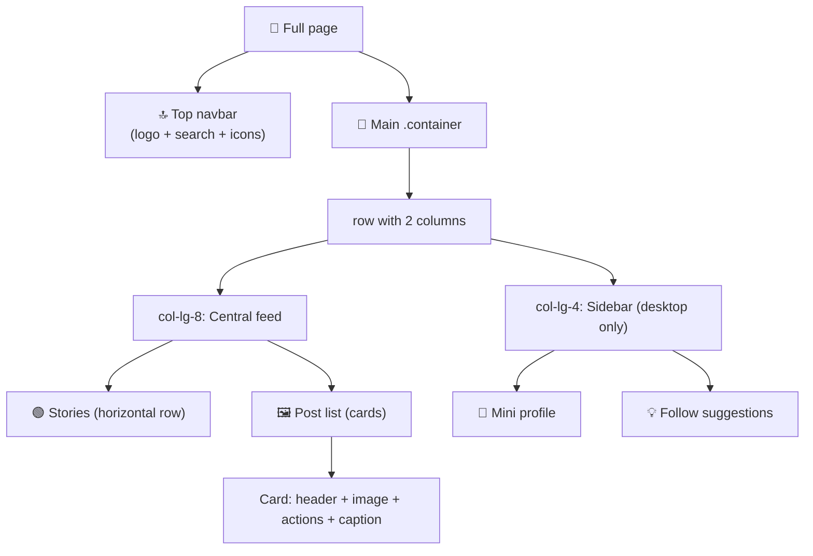

[🇪🇸 Español](README.md) | 🇬🇧 **English**

# Step 3: Project — Instagram Photo Feed with Bootstrap

## 🎯 Goal

Apply everything you've learned (grid, breakpoints, navbar, cards, utilities) by building a complete, responsive **Instagram-style feed** without writing a single line of custom CSS.

---

## 🤔 Why does this matter?

This project isn't decoration — it's the proof that **you can assemble Bootstrap**. An Instagram feed has almost every pattern you'll use for the rest of the bootcamp:

- Top navbar with logo and actions.
- Multi-column layout (feed + sidebar) that collapses on mobile.
- Cards with image, header, footer, and actions.
- Typography, spacing, and visual hierarchy through utilities.

If you finish this project, you're ready to build any landing page or feed you're asked for at work.

---

## 🗺️ Feed anatomy



---

## 🧱 Step 1: Base structure

Create `index.html` with the skeleton and Bootstrap via CDN:

```html
<!doctype html>
<html lang="en">
  <head>
    <meta charset="utf-8">
    <meta name="viewport" content="width=device-width, initial-scale=1">
    <title>Instagram Feed</title>
    <link
      href="https://cdn.jsdelivr.net/npm/bootstrap@5.3.3/dist/css/bootstrap.min.css"
      rel="stylesheet">
    <link
      href="https://cdn.jsdelivr.net/npm/bootstrap-icons@1.11.3/font/bootstrap-icons.css"
      rel="stylesheet">
  </head>
  <body class="bg-light">
    <!-- 1) Top navbar -->
    <!-- 2) Container with Feed + Sidebar -->

    <script
      src="https://cdn.jsdelivr.net/npm/bootstrap@5.3.3/dist/js/bootstrap.bundle.min.js">
    </script>
  </body>
</html>
```

We also include **Bootstrap Icons** (a free icon pack) for hearts, messages, and so on.

---

## 🔝 Step 2: Top navbar

A simple navbar with logo on the left, search bar in the middle, and icons on the right:

```html
<nav class="navbar navbar-expand-md bg-white border-bottom sticky-top">
  <div class="container">
    <a class="navbar-brand fw-bold fst-italic" href="#">Instagram</a>

    <form class="d-none d-md-flex mx-auto" role="search">
      <input class="form-control bg-light" type="search" placeholder="Search">
    </form>

    <div class="d-flex gap-3 fs-4">
      <a href="#" class="text-dark"><i class="bi bi-house"></i></a>
      <a href="#" class="text-dark"><i class="bi bi-chat"></i></a>
      <a href="#" class="text-dark"><i class="bi bi-plus-square"></i></a>
      <a href="#" class="text-dark"><i class="bi bi-heart"></i></a>
      <a href="#" class="text-dark"><i class="bi bi-person-circle"></i></a>
    </div>
  </div>
</nav>
```

Keys used:
- `sticky-top` → the navbar stays pinned to the top when scrolling.
- `border-bottom` → subtle line beneath.
- `d-none d-md-flex` → the search bar only shows on medium screens or larger.
- `gap-3 fs-4` → spacing between icons and large font size.

---

## 📐 Step 3: Main layout (Feed + Sidebar)

Inside `<body>`, right after the navbar:

```html
<main class="container my-4">
  <div class="row g-4 justify-content-center">

    <!-- 🟢 Central column: feed -->
    <section class="col-12 col-lg-7">
      <!-- Stories and posts go here -->
    </section>

    <!-- 👤 Side column: desktop only -->
    <aside class="col-lg-4 d-none d-lg-block">
      <!-- Profile and suggestions -->
    </aside>

  </div>
</main>
```

Keys:
- `col-12 col-lg-7` → the feed takes the full screen on mobile, 7 columns (of 12) on desktop.
- `col-lg-4 d-none d-lg-block` → the sidebar **only appears** on `lg` or larger screens.
- `justify-content-center` → centers the columns when the total doesn't reach 12.

---

## 🟢 Step 4: Stories (horizontal row)

Inside the feed section:

```html
<div class="card mb-4 p-3">
  <div class="d-flex gap-3 overflow-auto">
    <div class="text-center" style="min-width: 70px;">
      <div class="rounded-circle border border-3 border-danger p-1 mb-1">
        
      </div>
      <small class="text-muted">ana_dev</small>
    </div>
    <div class="text-center" style="min-width: 70px;">
      <div class="rounded-circle border border-3 border-danger p-1 mb-1">
        
      </div>
      <small class="text-muted">carlos.js</small>
    </div>
    <!-- Repeat N times for more stories -->
  </div>
</div>
```

Keys:
- `d-flex gap-3 overflow-auto` → horizontal row with scroll when items don't fit.
- `rounded-circle border border-3 border-danger` → the typical gradient ring (simplified in red).

---

## 🖼️ Step 5: Posts (cards with image)

Each post is a card. The pattern:

```html
<article class="card mb-4">

  <!-- Post header -->
  <div class="card-header bg-white d-flex align-items-center gap-2 border-0">
    
    <strong>ana_dev</strong>
    <small class="text-muted ms-auto">Madrid, Spain</small>
  </div>

  <!-- Post image -->
  

  <!-- Actions -->
  <div class="card-body">
    <div class="d-flex gap-3 fs-4 mb-2">
      <a href="#" class="text-dark"><i class="bi bi-heart"></i></a>
      <a href="#" class="text-dark"><i class="bi bi-chat"></i></a>
      <a href="#" class="text-dark"><i class="bi bi-send"></i></a>
      <a href="#" class="text-dark ms-auto"><i class="bi bi-bookmark"></i></a>
    </div>

    <p class="mb-1"><strong>1,234 likes</strong></p>
    <p class="mb-1">
      <strong>ana_dev</strong>
      My first page with Bootstrap! 🎉 #100DaysOfCode
    </p>
    <small class="text-muted">2 hours ago</small>
  </div>
</article>
```

Repeat this `<article>` 3-4 times with different images (use `picsum.photos/600/600?random=N` for random images).

> 💡 **In your project:** keep the structure of each post consistent (header → image → actions → caption). That will make your life easier when you later generate posts dynamically with JavaScript or React.

---

## 👤 Step 6: Sidebar (profile + suggestions)

Inside `<aside>`:

```html
<!-- User mini profile -->
<div class="d-flex align-items-center gap-3 mb-4">
  
  <div>
    <strong>my_username</strong>
    <div class="text-muted">My Name</div>
  </div>
  <a href="#" class="ms-auto small">Switch</a>
</div>

<!-- Follow suggestions -->
<div class="d-flex justify-content-between mb-3">
  <strong class="text-muted">Suggestions for you</strong>
  <a href="#" class="small text-dark">See all</a>
</div>

<ul class="list-unstyled">
  <li class="d-flex align-items-center gap-3 mb-3">
    
    <div>
      <strong class="d-block">dev_jane</strong>
      <small class="text-muted">Follows you</small>
    </div>
    <button class="btn btn-link btn-sm ms-auto p-0">Follow</button>
  </li>
  <!-- Repeat for more suggestions -->
</ul>
```

Keys:
- `list-unstyled` → removes list bullets.
- `ms-auto` → pushes "Follow" / "Switch" to the end.
- `btn-link` → button styled as a link (blue, no background).

---

## 🧪 Step 7: Responsive verification

Before calling the project done, open DevTools (`F12`) → responsive mode (`Cmd/Ctrl + Shift + M`) and test 3 sizes:

| Size | What should happen |
|------|--------------------|
| **Mobile (375px)** | Feed only, no sidebar. Stories with horizontal scroll. Navbar without search bar. |
| **Tablet (768px)** | Feed only, no sidebar. Search bar appears in the navbar. |
| **Desktop (1200px)** | Feed + sidebar visible side by side. |

If any of these fail, review your `col-*` classes and the `d-none d-lg-block` rules.

---

## 🧠 Question to reflect on

<details>
<summary>The feed looks fine on your screen, but on a small screen the navbar icons overlap with the logo. How do you fix it with Bootstrap, without writing CSS?</summary>

You have several options, all with utilities:

1. **Hide secondary items on mobile:** add `d-none d-md-flex` to some icons so they only appear on tablet or larger. For example, keep only Home, Messages, and Profile on mobile.

2. **Shrink size on mobile:** use `fs-5 fs-md-4` instead of `fs-4` to have slightly smaller icons on mobile.

3. **Switch to a hamburger:** if you want more "real Instagram" behavior, change the navbar to `navbar-expand-md` and move the icons inside the `collapse`, just like in step 2.

4. **Adjust gap:** change `gap-3` to `gap-2 gap-md-3` to reduce spacing on mobile.

The key point: **you don't write CSS**. You chain responsive utilities (`d-none d-md-flex`, `gap-2 gap-md-3`, etc.) until the problem goes away. Always inspect with DevTools in responsive mode to verify.

</details>

---

## ✅ Step checklist

- [ ] My feed has a navbar, central column, and sidebar (on desktop)
- [ ] Stories appear in a horizontal row with scroll
- [ ] Each post is a `card` with header, image, actions, and caption
- [ ] On mobile the sidebar disappears and the feed takes the full width
- [ ] I didn't write any custom CSS — only Bootstrap classes
- [ ] I verified in DevTools that it looks good on mobile, tablet, and desktop
