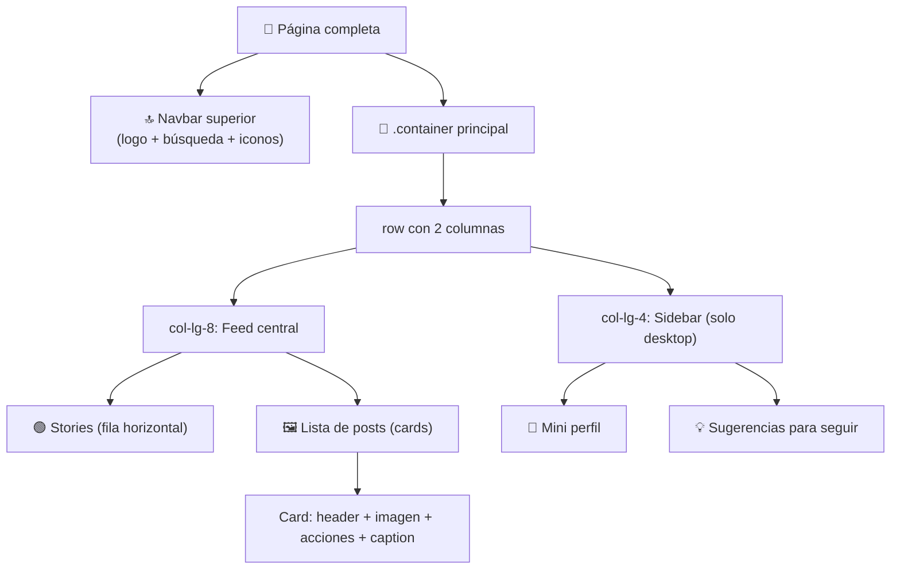

🇪🇸 **Español** | [🇬🇧 English](README.en.md)

# Step 3: Proyecto — Instagram Photo Feed con Bootstrap

## 🎯 Objetivo

Aplicar todo lo aprendido (grid, breakpoints, navbar, cards, utilidades) construyendo un **feed estilo Instagram** completo, responsive y sin escribir una sola línea de CSS personalizado.

---

## 🤔 ¿Por qué importa esto?

Este proyecto no es decoración — es la prueba de que **sabes ensamblar Bootstrap**. Un feed de Instagram tiene casi todos los patrones que vas a usar el resto del bootcamp:

- Navbar superior con logo y acciones.
- Layout multicolumna (feed + sidebar) que colapsa en móvil.
- Tarjetas con imagen, encabezado, footer y acciones.
- Tipografía, espaciado y jerarquía visual con utilidades.

Si terminas este proyecto, estás listo para construir cualquier landing o feed que te pidan en el trabajo.

---

## 🗺️ Anatomía del feed



---

## 🧱 Paso 1: Estructura base

Crea `index.html` con el esqueleto y Bootstrap por CDN:

```html
<!doctype html>
<html lang="es">
  <head>
    <meta charset="utf-8">
    <meta name="viewport" content="width=device-width, initial-scale=1">
    <title>Instagram Feed</title>
    <link
      href="https://cdn.jsdelivr.net/npm/bootstrap@5.3.3/dist/css/bootstrap.min.css"
      rel="stylesheet">
    <link
      href="https://cdn.jsdelivr.net/npm/bootstrap-icons@1.11.3/font/bootstrap-icons.css"
      rel="stylesheet">
  </head>
  <body class="bg-light">
    <!-- 1) Navbar superior -->
    <!-- 2) Container con Feed + Sidebar -->

    <script
      src="https://cdn.jsdelivr.net/npm/bootstrap@5.3.3/dist/js/bootstrap.bundle.min.js">
    </script>
  </body>
</html>
```

Añadimos también **Bootstrap Icons** (un paquete de iconos gratis) para los corazones, mensajes y demás.

---

## 🔝 Paso 2: Navbar superior

Una navbar simple con logo a la izquierda, barra de búsqueda en el centro e iconos a la derecha:

```html
<nav class="navbar navbar-expand-md bg-white border-bottom sticky-top">
  <div class="container">
    <a class="navbar-brand fw-bold fst-italic" href="#">Instagram</a>

    <form class="d-none d-md-flex mx-auto" role="search">
      <input class="form-control bg-light" type="search" placeholder="Buscar">
    </form>

    <div class="d-flex gap-3 fs-4">
      <a href="#" class="text-dark"><i class="bi bi-house"></i></a>
      <a href="#" class="text-dark"><i class="bi bi-chat"></i></a>
      <a href="#" class="text-dark"><i class="bi bi-plus-square"></i></a>
      <a href="#" class="text-dark"><i class="bi bi-heart"></i></a>
      <a href="#" class="text-dark"><i class="bi bi-person-circle"></i></a>
    </div>
  </div>
</nav>
```

Claves usadas:
- `sticky-top` → la navbar se queda pegada arriba al hacer scroll.
- `border-bottom` → línea sutil debajo.
- `d-none d-md-flex` → la barra de búsqueda solo aparece en pantallas medianas o mayores.
- `gap-3 fs-4` → espacio entre iconos y tamaño de fuente grande.

---

## 📐 Paso 3: Layout principal (Feed + Sidebar)

Dentro del `<body>`, justo debajo de la navbar:

```html
<main class="container my-4">
  <div class="row g-4 justify-content-center">

    <!-- 🟢 Columna central: feed -->
    <section class="col-12 col-lg-7">
      <!-- Stories y posts van aquí -->
    </section>

    <!-- 👤 Columna lateral: solo desktop -->
    <aside class="col-lg-4 d-none d-lg-block">
      <!-- Perfil y sugerencias -->
    </aside>

  </div>
</main>
```

Claves:
- `col-12 col-lg-7` → el feed ocupa toda la pantalla en móvil, 7 columnas (de 12) en desktop.
- `col-lg-4 d-none d-lg-block` → el sidebar **solo se muestra** en pantallas `lg` o mayores.
- `justify-content-center` → centra las columnas si la suma no llega a 12.

---

## 🟢 Paso 4: Stories (fila horizontal)

Dentro de la sección del feed:

```html
<div class="card mb-4 p-3">
  <div class="d-flex gap-3 overflow-auto">
    <div class="text-center" style="min-width: 70px;">
      <div class="rounded-circle border border-3 border-danger p-1 mb-1">
        
      </div>
      <small class="text-muted">ana_dev</small>
    </div>
    <div class="text-center" style="min-width: 70px;">
      <div class="rounded-circle border border-3 border-danger p-1 mb-1">
        
      </div>
      <small class="text-muted">carlos.js</small>
    </div>
    <!-- Repite N veces para más stories -->
  </div>
</div>
```

Claves:
- `d-flex gap-3 overflow-auto` → fila horizontal con scroll cuando no caben.
- `rounded-circle border border-3 border-danger` → el típico anillo de gradiente (simplificado en rojo).

---

## 🖼️ Paso 5: Posts (cards con imagen)

Cada post es una card. Aquí el patrón:

```html
<article class="card mb-4">

  <!-- Header del post -->
  <div class="card-header bg-white d-flex align-items-center gap-2 border-0">
    
    <strong>ana_dev</strong>
    <small class="text-muted ms-auto">Madrid, España</small>
  </div>

  <!-- Imagen del post -->
  

  <!-- Acciones -->
  <div class="card-body">
    <div class="d-flex gap-3 fs-4 mb-2">
      <a href="#" class="text-dark"><i class="bi bi-heart"></i></a>
      <a href="#" class="text-dark"><i class="bi bi-chat"></i></a>
      <a href="#" class="text-dark"><i class="bi bi-send"></i></a>
      <a href="#" class="text-dark ms-auto"><i class="bi bi-bookmark"></i></a>
    </div>

    <p class="mb-1"><strong>1.234 Me gusta</strong></p>
    <p class="mb-1">
      <strong>ana_dev</strong>
      ¡Mi primera página con Bootstrap! 🎉 #100DaysOfCode
    </p>
    <small class="text-muted">Hace 2 horas</small>
  </div>
</article>
```

Repite este `<article>` 3-4 veces con distintas imágenes (usa `picsum.photos/600/600?random=N` para imágenes random).

> 💡 **En tu proyecto:** mantén consistente la estructura de cada post (header → imagen → acciones → caption). Eso te facilitará la vida cuando en el futuro generes posts dinámicamente con JavaScript o React.

---

## 👤 Paso 6: Sidebar (perfil + sugerencias)

Dentro de `<aside>`:

```html
<!-- Mini perfil del usuario -->
<div class="d-flex align-items-center gap-3 mb-4">
  
  <div>
    <strong>mi_usuario</strong>
    <div class="text-muted">Mi Nombre</div>
  </div>
  <a href="#" class="ms-auto small">Cambiar</a>
</div>

<!-- Sugerencias para seguir -->
<div class="d-flex justify-content-between mb-3">
  <strong class="text-muted">Sugerencias para ti</strong>
  <a href="#" class="small text-dark">Ver todo</a>
</div>

<ul class="list-unstyled">
  <li class="d-flex align-items-center gap-3 mb-3">
    
    <div>
      <strong class="d-block">dev_jane</strong>
      <small class="text-muted">Te sigue</small>
    </div>
    <button class="btn btn-link btn-sm ms-auto p-0">Seguir</button>
  </li>
  <!-- Repite para más sugerencias -->
</ul>
```

Claves:
- `list-unstyled` → quita los puntos de la lista.
- `ms-auto` → empuja "Seguir" / "Cambiar" al final.
- `btn-link` → botón con estilo de link (azul, sin fondo).

---

## 🧪 Paso 7: Verificación responsive

Antes de dar el proyecto por terminado, abre DevTools (`F12`) → modo responsive (`Cmd/Ctrl + Shift + M`) y prueba 3 tamaños:

| Tamaño | Qué debe pasar |
|--------|----------------|
| **Móvil (375px)** | Solo feed, sin sidebar. Stories con scroll horizontal. Navbar sin barra de búsqueda. |
| **Tablet (768px)** | Solo feed, sin sidebar. Aparece barra de búsqueda en la navbar. |
| **Desktop (1200px)** | Feed + sidebar visibles lado a lado. |

Si alguno falla, repasa los `col-*` y los `d-none d-lg-block`.

---

## 🧠 Pregunta para reflexionar

<details>
<summary>El feed funciona bien en tu pantalla, pero en una pantalla pequeña los iconos de la navbar se solapan con el logo. ¿Cómo lo arreglas con Bootstrap, sin escribir CSS?</summary>

Tienes varias opciones, todas con utilidades:

1. **Ocultar elementos secundarios en móvil:** añade `d-none d-md-flex` a algunos iconos para que solo aparezcan en tablet o más grande. Por ejemplo, deja solo Home, Mensajes y Perfil en móvil.

2. **Reducir tamaño en móvil:** usa `fs-5 fs-md-4` en lugar de `fs-4` para tener iconos un poco más pequeños en móvil.

3. **Cambiar a una hamburguesa:** si quieres un comportamiento más "Instagram real", convierte la navbar en `navbar-expand-md` y mete los iconos dentro del `collapse`, igual que en step 2.

4. **Ajustar gap:** cambia `gap-3` por `gap-2 gap-md-3` para reducir el espacio en móvil.

Lo importante: **no escribes CSS**. Encadenas utilidades responsive (`d-none d-md-flex`, `gap-2 gap-md-3`, etc.) hasta que el problema desaparezca. Inspecciona siempre con DevTools en modo responsive para verificar.

</details>

---

## ✅ Checklist de este step

- [ ] Mi feed tiene navbar, columna central y sidebar (en desktop)
- [ ] Los stories aparecen en una fila horizontal con scroll
- [ ] Cada post es una `card` con header, imagen, acciones y caption
- [ ] En móvil el sidebar desaparece y el feed ocupa el ancho completo
- [ ] No escribí CSS personalizado — solo clases de Bootstrap
- [ ] Verifiqué en DevTools que se ve bien en móvil, tablet y desktop
