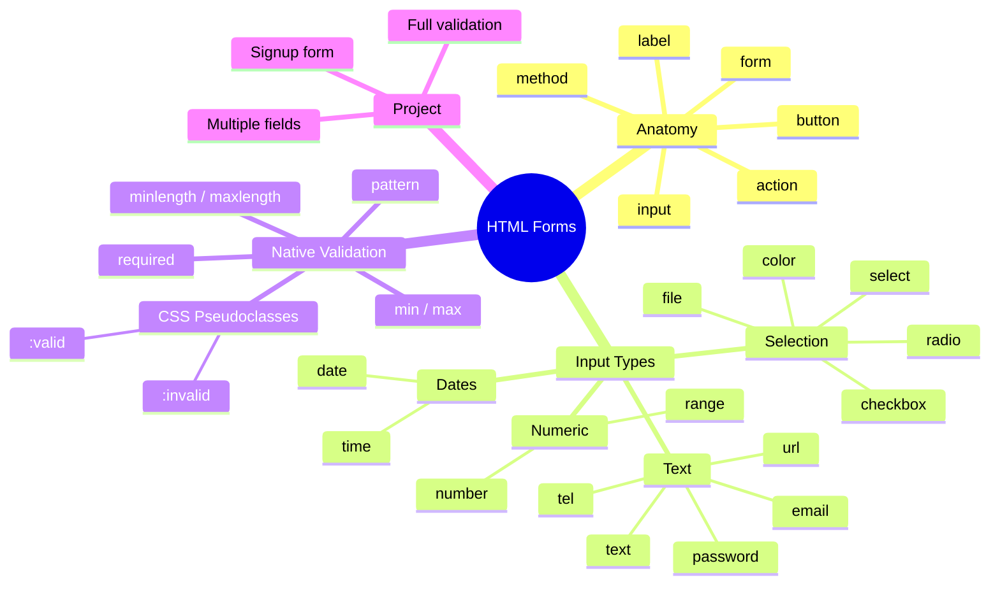

[🇪🇸 Español](README.md) | 🇬🇧 **English**

# 📋 Day 3: HTML Forms

## 📚 Context

Forms are the **data entry point** of every web application: signups, logins, searches, comments, payments… everything goes through a form. Before learning JavaScript or React, you need to master the HTML foundation that holds all that interaction together.

In this day you'll build your first professional form step by step: understanding what happens when the user clicks "Submit", what `<input>` types exist, and how the browser validates data **before** your code is even involved.

---

## 🎯 Goals for the day

By the end of this day you should be able to:

- Explain what a `<form>` does and what happens when you click Submit
- Tell the difference between the `action` and `method` attributes
- Pick the correct `<input>` type for each piece of data you ask for
- Use `<textarea>`, `<select>`, and `<option>` correctly
- Apply HTML5 native validation (`required`, `pattern`, `min`, `max`, etc.)
- Build a complete, validated signup form

---

## 🗺️ Mind Map: HTML Forms



---

## 🗂️ Structure of the day

```text
day_03/
├── README.md
├── step0-anatomia-formulario/
│   └── README.md          # Anatomy of an HTML form
├── step1-tipos-de-input/
│   └── README.md          # Input types, textarea, and select
├── step2-validacion-nativa/
│   └── README.md          # Native HTML5 validation
└── step3-proyecto-formulario-registro/
    └── README.md          # Project: signup form
```

---

## 🧭 Suggested study order

1. `step0-anatomia-formulario` — Understand what a form is and how submission works
2. `step1-tipos-de-input` — Learn every type of input field available
3. `step2-validacion-nativa` — Validate data without writing any JavaScript
4. `step3-proyecto-formulario-registro` — Build a complete signup form

---

## 🎯 Syllabus resources

- **READ** – [Understanding HTML Input HTML Text Area and Forms](https://4geeks.com/syllabus/spain-fs-pt-129/read/html-input-html-textarea)
- **PRACTICE** – [Learn how to use and interact with HTML Forms](https://4geeks.com/syllabus/spain-fs-pt-129/practice/forms-exercises)
- **PROJECT** – [Create a HTML5 form](https://4geeks.com/syllabus/spain-fs-pt-129/project/html5-form)

---

## ✅ End-of-day checklist

- [ ] I know what `<form>` does and what `action` and `method` are for
- [ ] I know the most common `<input>` types (text, email, password, number, date, checkbox, radio, file)
- [ ] I can use `<textarea>`, `<select>`, and `<option>`
- [ ] I understand the `required`, `pattern`, `min`, `max`, `minlength`, `maxlength` attributes
- [ ] I can link a `<label>` to an `<input>` using `for` and `id`
- [ ] I can style valid and invalid fields with `:valid` and `:invalid`
- [ ] I built a complete, validated signup form
