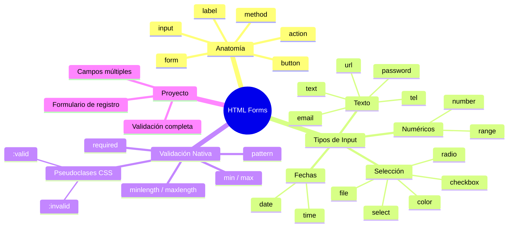

🇪🇸 **Español** | [🇬🇧 English](README.en.md)

# 📋 Día 3: Formularios HTML

## 📚 Contexto

Los formularios son la **puerta de entrada de datos** de cualquier aplicación web: registros, logins, búsquedas, comentarios, pagos… todo pasa por un formulario. Antes de aprender JavaScript o React, necesitas dominar la base HTML que sostiene toda esa interacción.

En este día vas a construir tu primer formulario profesional paso a paso: entendiendo qué pasa cuando el usuario pulsa "Enviar", qué tipos de `<input>` existen y cómo el navegador valida los datos **antes** de que tu código siquiera se entere.

---

## 🎯 Objetivos del día

Al terminar este día deberías poder:

- Explicar qué hace un `<form>` y qué pasa al pulsar "Submit"
- Diferenciar entre los atributos `action` y `method`
- Elegir el tipo de `<input>` correcto para cada dato que pides
- Usar `<textarea>`, `<select>` y `<option>` correctamente
- Aplicar validación nativa HTML5 (`required`, `pattern`, `min`, `max`, etc.)
- Construir un formulario de registro completo y validado

---

## 🗺️ Mapa Mental: Formularios HTML



---

## 🗂️ Estructura del día

```text
day_03/
├── README.md
├── step0-anatomia-formulario/
│   └── README.md          # Anatomía de un formulario HTML
├── step1-tipos-de-input/
│   └── README.md          # Tipos de input, textarea y select
├── step2-validacion-nativa/
│   └── README.md          # Validación nativa con HTML5
└── step3-proyecto-formulario-registro/
    └── README.md          # Proyecto: formulario de registro
```

---

## 🧭 Orden sugerido de estudio

1. `step0-anatomia-formulario` — Entender qué es un formulario y cómo funciona el envío
2. `step1-tipos-de-input` — Conocer todos los tipos de campos disponibles
3. `step2-validacion-nativa` — Validar datos sin necesidad de JavaScript
4. `step3-proyecto-formulario-registro` — Construir un formulario de registro completo

---

## 🎯 Recursos del syllabus

- **READ** – [Understanding HTML Input HTML Text Area and Forms](https://4geeks.com/syllabus/spain-fs-pt-129/read/html-input-html-textarea)
- **PRACTICE** – [Learn how to use and interact with HTML Forms](https://4geeks.com/syllabus/spain-fs-pt-129/practice/forms-exercises)
- **PROJECT** – [Create a HTML5 form](https://4geeks.com/syllabus/spain-fs-pt-129/project/html5-form)

---

## ✅ Checklist de cierre del día

- [ ] Sé qué hace `<form>` y para qué sirven `action` y `method`
- [ ] Conozco los tipos de `<input>` más comunes (text, email, password, number, date, checkbox, radio, file)
- [ ] Sé usar `<textarea>`, `<select>` y `<option>`
- [ ] Entiendo los atributos `required`, `pattern`, `min`, `max`, `minlength`, `maxlength`
- [ ] Sé enlazar `<label>` con `<input>` usando `for` y `id`
- [ ] Puedo estilar campos válidos e inválidos con `:valid` y `:invalid`
- [ ] He construido un formulario de registro completo y validado
