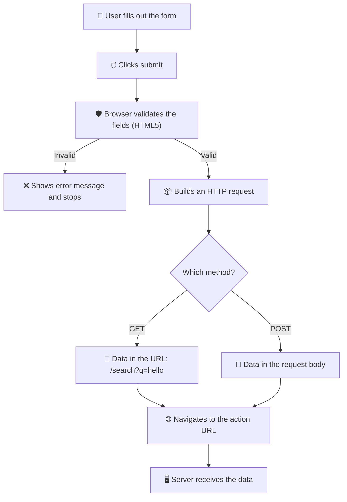
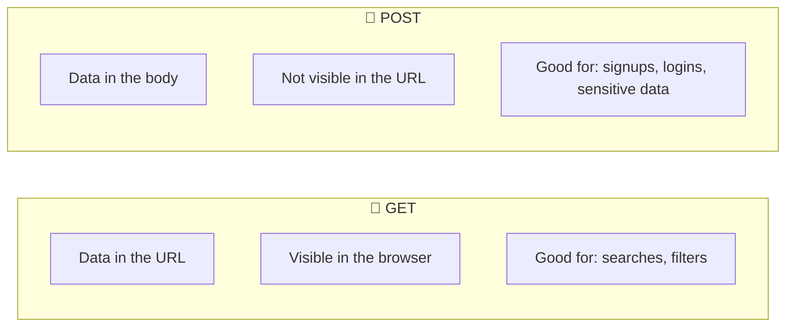

[🇪🇸 Español](README.md) | 🇬🇧 **English**

# Step 0: Anatomy of an HTML Form

## 🎯 Goal

Understand **what pieces make up an HTML form**, how they connect to each other, and what exactly happens when the user clicks the "Submit" button.

---

## 🤔 Why does this matter?

Every web app you know — Instagram, Gmail, your bank — depends on forms. Without forms there are no signups, no logins, no searches, no comments. If you really understand the **anatomy** of an HTML form, learning React, Flask, or any framework afterwards becomes much easier, because they all end up rendering this same thing in the browser.

On top of that, a badly built form is one of the most common sources of bugs and accessibility issues: fields without a `label`, buttons that don't submit, data that gets lost… all of that is avoidable once you know the basics.

---

## 🧩 The basic pieces

A minimal HTML form has four elements:

```html
<form action="/signup" method="POST">
  <label for="name">Name:</label>
  <input type="text" id="name" name="name" />

  <button type="submit">Submit</button>
</form>
```

| Element | What is it for? |
|---------|-----------------|
| `<form>` | The container. Defines where the data is sent and how. |
| `<label>` | The descriptive text associated with a field. |
| `<input>` | The field where the user types or selects something. |
| `<button>` | The button that triggers the form submission. |

---

## 🔄 What happens when the user clicks "Submit"?



The browser automatically does three things:

1. **Collects** the values of every field that has a `name` attribute.
2. **Validates** the fields according to HTML5 attributes (`required`, `type`, `pattern`…).
3. **Sends** the data to the URL specified in `action` using the `method`.

---

## 📨 The `action` attribute: where does the data go?

```html
<form action="/api/users" method="POST">
```

- If you **omit** `action`, the form is submitted to the **same URL** as the current page.
- It can be a relative path (`/api/users`) or absolute (`https://my-api.com/users`).
- In modern apps with React or Vue you usually **don't** use `action`: you intercept submission with JavaScript and make the API call yourself. But understanding the default behavior is essential.

---

## 🔧 The `method` attribute: how does the data travel?

The two values you'll see almost always are **GET** and **POST**.



| Aspect | GET | POST |
|--------|-----|------|
| **Where data goes** | In the URL (query string) | In the request body |
| **Visible** | Yes, anyone can see it | Not directly |
| **Max size** | Limited (~2000 characters) | Much larger |
| **Cacheable** | Yes | No |
| **Idempotent** | Yes (safe to repeat) | No (can create duplicates) |
| **Typical use cases** | Search, filters | Signups, logins, contact forms |

> 💡 **Quick rule:** if the data is going to **change something** on the server (create, update, delete) or is **sensitive** (passwords), use `POST`. If you only want to **read or filter** information, use `GET`.

---

## 🏷️ `<label>` and `<input>`: why they must go together

A `<label>` properly connected to its `<input>` has three huge advantages:

1. **Usability**: the user can click the text and the field focuses automatically.
2. **Accessibility**: screen readers announce the `label` when the user lands on the field.
3. **Visual validation**: many browsers highlight the `label` when the field is invalid.

There are two correct ways to connect them:

```html
<!-- Way 1: with for + id (the most common) -->
<label for="email">Email:</label>
<input type="email" id="email" name="email" />

<!-- Way 2: wrapping the input inside the label -->
<label>
  Email:
  <input type="email" name="email" />
</label>
```

> 💡 **In your project:** always use way 1 (`for` + `id`) — it's more flexible for CSS styling and makes the label-field relationship explicit, even if you later rearrange the HTML.

---

## 🔑 The `name` attribute: the most important (and most forgotten)

If an `<input>` has **no `name`**, its data is **not sent**. That simple.

```html
<!-- ❌ This field is not submitted -->
<input type="text" id="user" />

<!-- ✅ This one is -->
<input type="text" id="user" name="user" />
```

The `name` is the **key** the server will use to identify the value. If your server expects a `user` field, your `<input>` must have `name="user"`.

---

## 🔘 Button types inside a form

```html
<button type="submit">Submit</button>   <!-- Submits the form -->
<button type="reset">Reset</button>     <!-- Clears every field -->
<button type="button">Cancel</button>   <!-- Does nothing on its own -->
```

> ⚠️ **Watch out:** if you don't set `type`, a button **defaults to `submit`**. That means a "Cancel" button without `type="button"` can end up submitting your form by accident.

---

## 🧠 Question to reflect on

<details>
<summary>Why do you think the browser performs HTML5 validation before sending the data, instead of waiting for the server's response?</summary>

For three main reasons:

1. **Speed**: catching errors in the browser is instant; waiting for the server means a network round-trip that can take seconds.
2. **Resource saving**: if the data is obviously invalid (an email with no `@`, a required field empty), there's no point burning server capacity on it.
3. **Better user experience**: the user sees the error right next to the field, not after a full-page reload.

But **careful!** Browser validation is only a first line of defense: a malicious user can bypass it easily. That's why you **always** have to re-validate on the server.

</details>

---

## ✅ Step checklist

- [ ] I know what `<form>` does and what happens when I click "Submit"
- [ ] I understand the difference between `action` and `method`
- [ ] I know when to use GET vs POST
- [ ] I connect every `<label>` with its `<input>` using `for` and `id`
- [ ] I remember to put `name` on every `<input>` I want to submit
