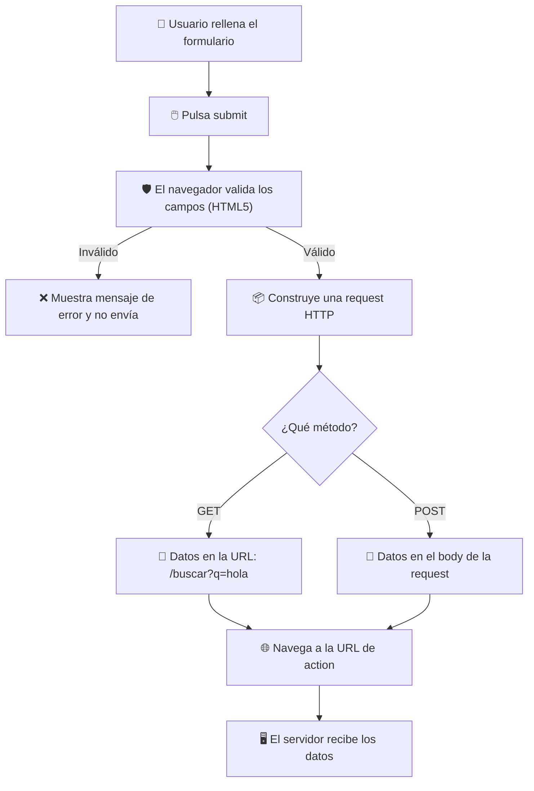
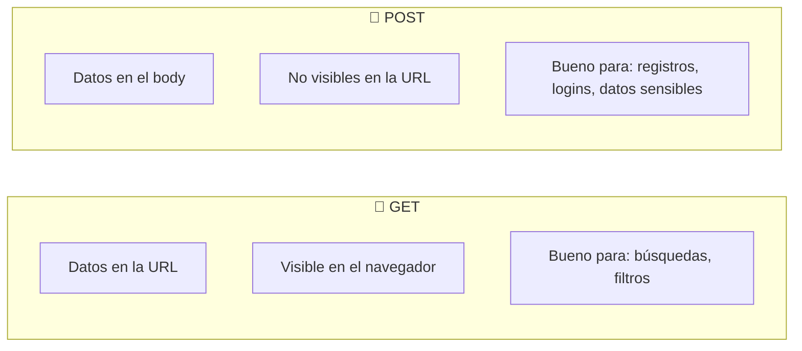

🇪🇸 **Español** | [🇬🇧 English](README.en.md)

# Step 0: Anatomía de un Formulario HTML

## 🎯 Objetivo

Entender **qué piezas componen un formulario HTML**, cómo se conectan entre sí, y qué pasa exactamente cuando el usuario pulsa el botón de "Enviar".

---

## 🤔 ¿Por qué importa esto?

Cualquier aplicación web que conozcas — Instagram, Gmail, tu banco — depende de formularios. Sin formularios no hay registros, no hay logins, no hay búsquedas, no hay comentarios. Si entiendes bien la **anatomía** de un formulario HTML, después aprender React, Flask o cualquier framework será mucho más fácil, porque todos terminan generando esto mismo en el navegador.

Además, un formulario mal construido es una de las causas más frecuentes de bugs y problemas de accesibilidad: campos sin `label`, botones que no envían, datos que se pierden… todo eso se evita conociendo la base.

---

## 🧩 Las piezas básicas

Un formulario HTML mínimo tiene cuatro elementos:

```html
<form action="/registro" method="POST">
  <label for="nombre">Nombre:</label>
  <input type="text" id="nombre" name="nombre" />

  <button type="submit">Enviar</button>
</form>
```

| Elemento | ¿Para qué sirve? |
|----------|------------------|
| `<form>` | El contenedor. Define a dónde se envían los datos y cómo. |
| `<label>` | El texto descriptivo asociado a un campo. |
| `<input>` | El campo donde el usuario escribe o selecciona algo. |
| `<button>` | El botón que dispara el envío del formulario. |

---

## 🔄 ¿Qué pasa cuando el usuario pulsa "Enviar"?



El navegador hace tres cosas automáticamente:

1. **Recolecta** los valores de todos los campos que tengan atributo `name`.
2. **Valida** los campos según los atributos HTML5 (`required`, `type`, `pattern`…).
3. **Envía** los datos a la URL indicada en `action` usando el método de `method`.

---

## 📨 El atributo `action`: ¿a dónde van los datos?

```html
<form action="/api/usuarios" method="POST">
```

- Si **omites** `action`, el formulario se envía a la **misma URL** donde está la página actual.
- Puede ser una ruta relativa (`/api/usuarios`) o absoluta (`https://mi-api.com/usuarios`).
- En aplicaciones modernas con React o Vue, normalmente **no** usas `action`: interceptas el envío con JavaScript y haces tú la llamada a la API. Pero entender qué hace por defecto es fundamental.

---

## 🔧 El atributo `method`: ¿cómo van los datos?

Los dos valores que vas a ver casi siempre son **GET** y **POST**.



| Aspecto | GET | POST |
|---------|-----|------|
| **Dónde van los datos** | En la URL (query string) | En el body de la request |
| **Visibles** | Sí, cualquiera los ve | No directamente |
| **Tamaño máximo** | Limitado (~2000 caracteres) | Mucho mayor |
| **Cacheable** | Sí | No |
| **Idempotente** | Sí (puedes repetirlo) | No (puede crear duplicados) |
| **Casos típicos** | Buscadores, filtros | Registros, logins, formularios de contacto |

> 💡 **Regla rápida:** si los datos van a **modificar algo** en el servidor (crear, actualizar, borrar) o son **sensibles** (contraseñas), usa `POST`. Si solo vas a **leer o filtrar** información, usa `GET`.

---

## 🏷️ `<label>` e `<input>`: por qué deben ir juntos

Un `<label>` bien conectado a su `<input>` tiene tres ventajas enormes:

1. **Usabilidad**: el usuario puede hacer click en el texto y el campo se enfoca solo.
2. **Accesibilidad**: los lectores de pantalla anuncian el `label` cuando el usuario llega al campo.
3. **Validación visual**: muchos navegadores destacan el `label` cuando el campo es inválido.

Hay dos formas correctas de conectarlos:

```html
<!-- Forma 1: con for + id (la más común) -->
<label for="email">Email:</label>
<input type="email" id="email" name="email" />

<!-- Forma 2: envolviendo el input dentro del label -->
<label>
  Email:
  <input type="email" name="email" />
</label>
```

> 💡 **En tu proyecto:** usa siempre la forma 1 (`for` + `id`) — es más flexible para estilar con CSS y deja claro qué label corresponde a qué campo, incluso si más adelante reordenas el HTML.

---

## 🔑 El atributo `name`: el más importante (y el más olvidado)

Si un `<input>` **no tiene `name`**, sus datos **no se envían**. Es así de simple.

```html
<!-- ❌ Este campo no se envía -->
<input type="text" id="usuario" />

<!-- ✅ Este sí -->
<input type="text" id="usuario" name="usuario" />
```

El `name` es la **clave** que el servidor usará para identificar el dato. Si en el servidor esperas un campo `usuario`, el `<input>` debe tener `name="usuario"`.

---

## 🔘 Tipos de botón dentro de un formulario

```html
<button type="submit">Enviar</button>   <!-- Envía el formulario -->
<button type="reset">Limpiar</button>   <!-- Borra todos los campos -->
<button type="button">Cancelar</button> <!-- No hace nada por sí solo -->
```

> ⚠️ **Cuidado:** si no pones `type`, el botón **por defecto es `submit`**. Eso significa que un botón "Cancelar" sin `type="button"` puede acabar enviando tu formulario sin querer.

---

## 🧠 Pregunta para reflexionar

<details>
<summary>¿Por qué crees que el navegador realiza la validación HTML5 antes de enviar, en lugar de esperar a la respuesta del servidor?</summary>

Por tres razones principales:

1. **Velocidad**: detectar errores en el navegador es instantáneo; esperar al servidor implica una ida y vuelta de red que puede tardar segundos.
2. **Ahorro de recursos**: si el dato es claramente inválido (un email sin `@`, un campo obligatorio vacío), no tiene sentido gastar capacidad del servidor procesándolo.
3. **Mejor experiencia de usuario**: el usuario ve el error justo al lado del campo, no después de recargar toda la página.

Pero **¡atención!** La validación del navegador es solo una primera línea de defensa: un usuario malintencionado puede saltársela fácilmente. Por eso **siempre** hay que volver a validar en el servidor.

</details>

---

## ✅ Checklist de este step

- [ ] Sé qué hace `<form>` y qué pasa al pulsar "Submit"
- [ ] Entiendo la diferencia entre `action` y `method`
- [ ] Sé cuándo usar GET y cuándo POST
- [ ] Conecto cada `<label>` con su `<input>` usando `for` y `id`
- [ ] Recuerdo poner `name` en cada `<input>` que quiero enviar
