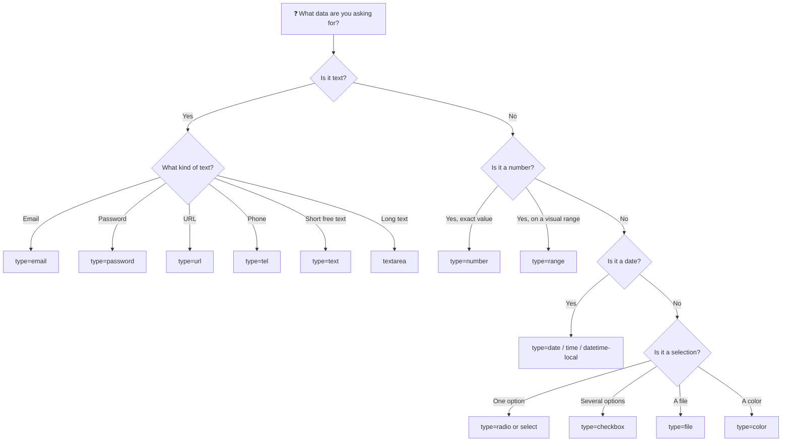

[🇪🇸 Español](README.md) | 🇬🇧 **English**

# Step 1: Input Types, Textarea, and Select

## 🎯 Goal

Know **every useful `<input>` type** in HTML5, learn **when to use each one**, and master the two other essential fields: `<textarea>` and `<select>`.

---

## 🤔 Why does this matter?

Many beginner developers use `<input type="text">` for everything. It works, sure — but it's a mistake. HTML5 gives you a dozen field types for free that:

- Trigger **specific keyboards** on mobile (numeric, email, phone).
- Provide **free native validation** (no emails without `@`, numbers out of range, etc.).
- Show **rich UIs**: date pickers, color pickers, sliders…
- Improve **accessibility**: the browser understands what you're asking and tells the user.

Picking the right type is the difference between an amateur form and a professional one.

---

## 🌳 Decision tree: which `<input>` should I use?



---

## 📝 Text inputs

```html
<input type="text" name="user" placeholder="Your username" />
<input type="email" name="email" placeholder="you@email.com" />
<input type="password" name="password" placeholder="••••••••" />
<input type="url" name="website" placeholder="https://yoursite.com" />
<input type="tel" name="phone" placeholder="+1 555 000 000" />
```

| Type | When to use | Extra benefit |
|------|-------------|---------------|
| `text` | Free single-line text | The most generic |
| `email` | Email addresses | Validates the format `something@something.something` |
| `password` | Passwords | Hides characters with `••••` |
| `url` | Links to websites | Validates the format `https://...` |
| `tel` | Phone numbers | Opens the numeric keyboard on mobile |

> 💡 **In your project:** using `type="email"` instead of `type="text"` for the email field **takes zero extra effort** and dramatically improves the mobile experience. There's no excuse not to do it.

---

## 🔢 Numeric inputs

```html
<!-- For an exact value: age, quantity, price -->
<input type="number" name="age" min="18" max="100" step="1" />

<!-- For a visual value: volume, brightness, satisfaction -->
<input type="range" name="volume" min="0" max="100" value="50" />
```

- `type="number"` shows tiny arrows to go up/down and only accepts numbers.
- `type="range"` shows a visual **slider** — perfect when the exact value matters less than the feeling of "more" or "less".
- The `min`, `max`, and `step` attributes give you fine control:
  - `min="0" max="100"` → allowed range
  - `step="0.5"` → the increment size

---

## 📅 Date and time inputs

```html
<input type="date" name="birthday" />         <!-- 2026-06-06 -->
<input type="time" name="hour" />             <!-- 14:30 -->
<input type="datetime-local" name="meeting" /><!-- 2026-06-06T14:30 -->
<input type="month" name="month" />           <!-- 2026-06 -->
<input type="week" name="week" />             <!-- 2026-W23 -->
```

Each one opens a native visual picker from the browser. **You don't have to build a calendar yourself.**

> 💡 **In your project:** if you ask for a date of birth, use `type="date"` with `max="2008-06-06"` (today's date minus 18 years, for example) to natively prevent underage signups.

---

## ☑️ Selection: checkbox vs radio

The difference is simple:

- **Checkbox**: **multiple** can be selected at once. They're independent.
- **Radio**: only **one** can be selected within the group. Mutually exclusive.

```html
<!-- Checkbox: user picks several -->
<label><input type="checkbox" name="hobbies" value="reading" /> Reading</label>
<label><input type="checkbox" name="hobbies" value="movies" /> Movies</label>
<label><input type="checkbox" name="hobbies" value="sports" /> Sports</label>

<!-- Radio: user picks only one -->
<label><input type="radio" name="gender" value="m" /> Male</label>
<label><input type="radio" name="gender" value="f" /> Female</label>
<label><input type="radio" name="gender" value="x" /> Prefer not to say</label>
```

> ⚠️ **Key trick:** for a group of radios to behave as a group, **they must all share the same `name`**. That attribute is what ties them together.

---

## 📁 Other useful types

```html
<input type="file" name="avatar" accept="image/*" />
<input type="color" name="favorite_color" value="#3498db" />
<input type="search" name="q" placeholder="Search..." />
<input type="hidden" name="csrf_token" value="abc123" />
```

| Type | What for |
|------|----------|
| `file` | Upload files. `accept` filters the types: `image/*`, `.pdf`, etc. |
| `color` | Visual color picker |
| `search` | Like `text`, but the browser may add an X to clear it |
| `hidden` | Invisible field to send technical data (tokens, IDs) |

---

## 📄 `<textarea>`: for long text

When you need multi-line text (a comment, a bio, a message), `<input>` isn't enough. Use `<textarea>`:

```html
<label for="bio">Tell us about yourself:</label>
<textarea
  id="bio"
  name="bio"
  rows="5"
  cols="40"
  placeholder="Write here..."
></textarea>
```

- `rows` → visible height in text lines.
- `cols` → visible width in characters (though it's better controlled with CSS today).
- The initial value does **not** go in a `value` attribute: it goes **between the opening and closing tags**.

---

## 🔽 `<select>` and `<option>`: the dropdown

When there are many options (countries, languages, categories), a group of radios would be endless. Use a `<select>`:

```html
<label for="country">Country:</label>
<select id="country" name="country">
  <option value="">-- Pick one --</option>
  <option value="es">Spain</option>
  <option value="mx">Mexico</option>
  <option value="ar">Argentina</option>
  <option value="co">Colombia</option>
</select>
```

If you want to allow **multiple selections**, add the `multiple` attribute (the user picks them with Ctrl/Cmd + click):

```html
<select name="languages" multiple size="4">
  <option value="es">Spanish</option>
  <option value="en">English</option>
  <option value="fr">French</option>
</select>
```

To group options, use `<optgroup>`:

```html
<select name="course">
  <optgroup label="Frontend">
    <option>HTML</option>
    <option>CSS</option>
  </optgroup>
  <optgroup label="Backend">
    <option>Python</option>
    <option>Node.js</option>
  </optgroup>
</select>
```

> 💡 **In your project:** a good rule of thumb is: **fewer than 5 options → radios** (all visible, fast decision); **5 or more → select** (keeps the screen clean).

---

## 📊 Quick reference table

| You want to ask for… | Use | Example |
|----------------------|-----|---------|
| First name, last name | `text` | `<input type="text">` |
| Email | `email` | `<input type="email">` |
| Password | `password` | `<input type="password">` |
| Phone | `tel` | `<input type="tel">` |
| Website | `url` | `<input type="url">` |
| Age, quantity | `number` | `<input type="number" min="0">` |
| Volume, satisfaction | `range` | `<input type="range" min="1" max="5">` |
| Date of birth | `date` | `<input type="date">` |
| A time | `time` | `<input type="time">` |
| Accept terms | `checkbox` (single) | `<input type="checkbox">` |
| Multiple interests | `checkbox` (multiple) | `<input type="checkbox" name="x[]">` |
| Pick 1 from short list | `radio` | `<input type="radio">` |
| Pick 1 from long list | `select` | `<select><option>` |
| Upload photo/document | `file` | `<input type="file">` |
| Pick a color | `color` | `<input type="color">` |
| Comment, bio | `textarea` | `<textarea>` |

---

## 🧠 Question to reflect on

<details>
<summary>What would happen if you used <code>type="text"</code> for everything, even for emails or numbers?</summary>

It would work, but you'd lose key advantages:

1. **On mobile**, the keyboard would always be alphabetic — the user would have to switch manually to numeric to enter their age or phone.
2. **No native validation**: someone could submit "not an email" in the email field and the browser would accept it without complaint.
3. **Assistive tools and screen readers** wouldn't know what kind of data you're asking for, hurting accessibility.
4. **Browser autocomplete** would work worse: it wouldn't know that field is a saved email.

In other words: your form would work, but it would be **much slower and more frustrating to fill in**, especially on mobile. And since over 60% of web traffic today is mobile, it shows.

</details>

---

## ✅ Step checklist

- [ ] I know the text `<input>` types: `text`, `email`, `password`, `url`, `tel`
- [ ] I know when to use `number` vs `range`
- [ ] I master the date inputs: `date`, `time`, `datetime-local`
- [ ] I understand the difference between `checkbox` and `radio`
- [ ] I can use `<textarea>` for long text
- [ ] I can build a `<select>` with `<option>` and `<optgroup>`
