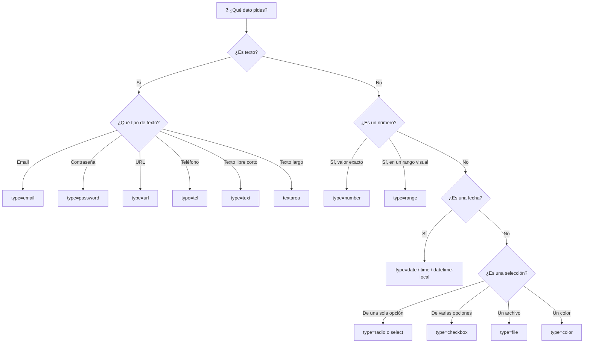

🇪🇸 **Español** | [🇬🇧 English](README.en.md)

# Step 1: Tipos de Input, Textarea y Select

## 🎯 Objetivo

Conocer **todos los tipos de `<input>` útiles** de HTML5, saber **cuándo usar cada uno**, y dominar los otros dos campos imprescindibles: `<textarea>` y `<select>`.

---

## 🤔 ¿Por qué importa esto?

Muchos desarrolladores principiantes usan `<input type="text">` para todo. Funciona, sí — pero es un error. HTML5 te regala una docena de tipos de campo que:

- Activan **teclados específicos** en móvil (numérico, email, teléfono).
- Aportan **validación nativa gratis** (no aceptan emails sin `@`, números fuera de rango, etc.).
- Muestran **interfaces ricas**: selectores de fecha, de color, sliders…
- Mejoran la **accesibilidad**: el navegador entiende qué pides y se lo dice al usuario.

Elegir el tipo correcto es la diferencia entre un formulario amateur y uno profesional.

---

## 🌳 Árbol de decisión: ¿qué `<input>` usar?



---

## 📝 Inputs de texto

```html
<input type="text" name="usuario" placeholder="Tu nombre de usuario" />
<input type="email" name="email" placeholder="tu@email.com" />
<input type="password" name="clave" placeholder="••••••••" />
<input type="url" name="web" placeholder="https://tusitio.com" />
<input type="tel" name="telefono" placeholder="+34 600 000 000" />
```

| Tipo | ¿Cuándo usarlo? | Beneficio extra |
|------|-----------------|-----------------|
| `text` | Texto libre de una sola línea | El más genérico |
| `email` | Direcciones de correo | Valida el formato `algo@algo.algo` |
| `password` | Contraseñas | Oculta los caracteres con `••••` |
| `url` | Enlaces a sitios web | Valida el formato `https://...` |
| `tel` | Números de teléfono | En móvil abre el teclado numérico |

> 💡 **En tu proyecto:** usar `type="email"` en lugar de `type="text"` para el campo de email **no requiere ningún esfuerzo extra** y mejora drásticamente la experiencia en móvil. No hay excusa para no hacerlo.

---

## 🔢 Inputs numéricos

```html
<!-- Para un valor exacto: edad, cantidad, precio -->
<input type="number" name="edad" min="18" max="100" step="1" />

<!-- Para un valor visual: volumen, brillo, satisfacción -->
<input type="range" name="volumen" min="0" max="100" value="50" />
```

- `type="number"` muestra unas flechitas para subir/bajar y solo acepta números.
- `type="range"` muestra un **slider** visual — ideal cuando el valor exacto no importa tanto como la sensación de "más" o "menos".
- Los atributos `min`, `max` y `step` te dan control fino:
  - `min="0" max="100"` → rango permitido
  - `step="0.5"` → de cuánto en cuánto avanza

---

## 📅 Inputs de fecha y hora

```html
<input type="date" name="cumple" />           <!-- 2026-06-06 -->
<input type="time" name="hora" />             <!-- 14:30 -->
<input type="datetime-local" name="cita" />   <!-- 2026-06-06T14:30 -->
<input type="month" name="mes" />             <!-- 2026-06 -->
<input type="week" name="semana" />           <!-- 2026-W23 -->
```

Cada uno abre un selector visual nativo del navegador. **No tienes que construir un calendario tú mismo.**

> 💡 **En tu proyecto:** si pides una fecha de nacimiento, usa `type="date"` con `max="2008-06-06"` (la fecha de hoy menos 18 años, por ejemplo) para impedir nativamente que se registren menores de edad.

---

## ☑️ Selección: checkbox y radio

La diferencia es simple:

- **Checkbox**: puede haber **varios seleccionados** a la vez. Independientes entre sí.
- **Radio**: solo **uno seleccionado** dentro del grupo. Mutuamente excluyentes.

```html
<!-- Checkbox: el usuario elige varios -->
<label><input type="checkbox" name="hobbies" value="leer" /> Leer</label>
<label><input type="checkbox" name="hobbies" value="cine" /> Cine</label>
<label><input type="checkbox" name="hobbies" value="deporte" /> Deporte</label>

<!-- Radio: el usuario elige uno solo -->
<label><input type="radio" name="genero" value="m" /> Masculino</label>
<label><input type="radio" name="genero" value="f" /> Femenino</label>
<label><input type="radio" name="genero" value="x" /> Prefiero no decirlo</label>
```

> ⚠️ **Truco clave:** para que un grupo de radios funcione como grupo, **todos deben compartir el mismo `name`**. Es ese atributo el que los conecta entre sí.

---

## 📁 Otros tipos útiles

```html
<input type="file" name="avatar" accept="image/*" />
<input type="color" name="color_favorito" value="#3498db" />
<input type="search" name="q" placeholder="Buscar..." />
<input type="hidden" name="csrf_token" value="abc123" />
```

| Tipo | Para qué |
|------|----------|
| `file` | Subir archivos. `accept` filtra qué tipos: `image/*`, `.pdf`, etc. |
| `color` | Selector de color visual |
| `search` | Como `text`, pero el navegador puede añadir una X para limpiar |
| `hidden` | Campo invisible para enviar datos técnicos (tokens, IDs) |

---

## 📄 `<textarea>`: para texto largo

Cuando necesitas texto de varias líneas (un comentario, una biografía, un mensaje), `<input>` no sirve. Usa `<textarea>`:

```html
<label for="biografia">Cuéntanos sobre ti:</label>
<textarea
  id="biografia"
  name="biografia"
  rows="5"
  cols="40"
  placeholder="Escribe aquí..."
></textarea>
```

- `rows` → altura visible en líneas de texto.
- `cols` → ancho visible en caracteres (aunque hoy se controla mejor con CSS).
- El valor inicial **no** va en un atributo `value`: va **entre las etiquetas de apertura y cierre**.

---

## 🔽 `<select>` y `<option>`: el desplegable

Cuando hay muchas opciones (países, idiomas, categorías), un grupo de radios sería interminable. Usa un `<select>`:

```html
<label for="pais">País:</label>
<select id="pais" name="pais">
  <option value="">-- Elige uno --</option>
  <option value="es">España</option>
  <option value="mx">México</option>
  <option value="ar">Argentina</option>
  <option value="co">Colombia</option>
</select>
```

Si quieres permitir **varias selecciones**, añade el atributo `multiple` (el usuario las elige con Ctrl/Cmd + click):

```html
<select name="idiomas" multiple size="4">
  <option value="es">Español</option>
  <option value="en">Inglés</option>
  <option value="fr">Francés</option>
</select>
```

Para agrupar opciones, usa `<optgroup>`:

```html
<select name="curso">
  <optgroup label="Frontend">
    <option>HTML</option>
    <option>CSS</option>
  </optgroup>
  <optgroup label="Backend">
    <option>Python</option>
    <option>Node.js</option>
  </optgroup>
</select>
```

> 💡 **En tu proyecto:** una buena regla es: **menos de 5 opciones → radios** (todas visibles, decisión rápida); **5 o más → select** (no satura la pantalla).

---

## 📊 Tabla de referencia rápida

| Quieres pedir… | Usa | Ejemplo |
|----------------|-----|---------|
| Nombre, apellido | `text` | `<input type="text">` |
| Email | `email` | `<input type="email">` |
| Contraseña | `password` | `<input type="password">` |
| Teléfono | `tel` | `<input type="tel">` |
| Sitio web | `url` | `<input type="url">` |
| Edad, cantidad | `number` | `<input type="number" min="0">` |
| Volumen, satisfacción | `range` | `<input type="range" min="1" max="5">` |
| Fecha de nacimiento | `date` | `<input type="date">` |
| Una hora | `time` | `<input type="time">` |
| Aceptar términos | `checkbox` (1 solo) | `<input type="checkbox">` |
| Varios intereses | `checkbox` (varios) | `<input type="checkbox" name="x[]">` |
| Elegir 1 de varias opciones cortas | `radio` | `<input type="radio">` |
| Elegir 1 de muchas opciones | `select` | `<select><option>` |
| Subir foto/documento | `file` | `<input type="file">` |
| Elegir un color | `color` | `<input type="color">` |
| Comentario, biografía | `textarea` | `<textarea>` |

---

## 🧠 Pregunta para reflexionar

<details>
<summary>¿Qué pasaría si usaras siempre <code>type="text"</code> para todo, incluso para emails o números?</summary>

Funcionaría, pero perderías ventajas importantes:

1. **En móvil**, el teclado siempre sería el alfabético — el usuario tendría que cambiar al numérico manualmente para escribir su edad o teléfono.
2. **No habría validación nativa**: alguien podría enviar "no soy un email" en el campo de email y el navegador lo aceptaría sin protestar.
3. **Los asistentes y lectores de pantalla** no sabrían qué tipo de dato pides, empeorando la accesibilidad.
4. **El autocompletado del navegador** funcionaría peor: no sabría que ese campo es un email guardado.

Es decir: tu formulario funcionaría, pero sería **mucho más lento y frustrante de rellenar**, especialmente en móvil. Y como hoy más del 60% del tráfico web es móvil, es un error que se nota.

</details>

---

## ✅ Checklist de este step

- [ ] Conozco los `<input>` de texto: `text`, `email`, `password`, `url`, `tel`
- [ ] Sé cuándo usar `number` y cuándo `range`
- [ ] Domino los inputs de fecha: `date`, `time`, `datetime-local`
- [ ] Entiendo la diferencia entre `checkbox` y `radio`
- [ ] Sé usar `<textarea>` para texto largo
- [ ] Sé crear un `<select>` con `<option>` y `<optgroup>`
