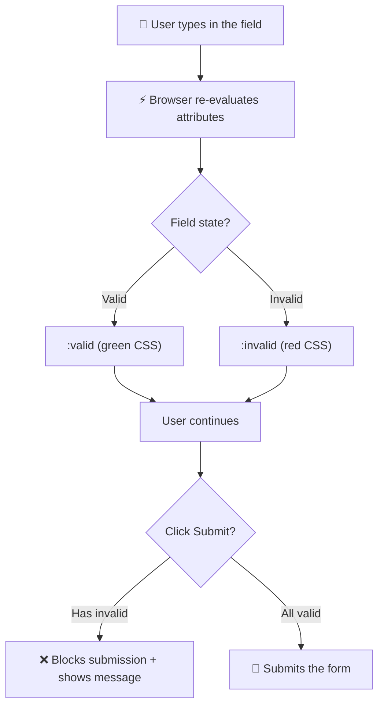

[🇪🇸 Español](README.md) | 🇬🇧 **English**

# Step 2: Native HTML5 Validation

## 🎯 Goal

Learn to **validate forms without writing a single line of JavaScript**, using only HTML5 attributes and CSS pseudoclasses. Understand when this is enough and when you need more.

---

## 🤔 Why does this matter?

Before HTML5, validating a form required **dozens of lines of JavaScript**: looping over each field, checking formats with regex, showing error messages, blocking submission…

Today the browser gives you all of that **for free** with a handful of attributes. Knowing them lets you skip a ton of code, make your form faster, and give the user feedback instantly.

A heads-up: native validation does **not replace** server validation (anyone can bypass it), but it's your **first line of defense** and the one that offers the best user experience.

---

## 🔄 Validation lifecycle



---

## 🧱 Essential validation attributes

### `required`: mandatory

```html
<input type="text" name="name" required />
```

If the field is empty, the browser blocks submission and shows a message asking the user to fill it in.

### `type`: validates the format based on type

```html
<input type="email" required />     <!-- Must contain @ and a domain -->
<input type="url" required />       <!-- Must start with http:// or https:// -->
<input type="number" required />    <!-- Must be a number -->
```

This is the **easiest** form of validation: just change the `type` and the browser does the work.

### `min` and `max`: value range

```html
<!-- Age between 18 and 99 -->
<input type="number" name="age" min="18" max="99" />

<!-- Date after today -->
<input type="date" name="booking" min="2026-06-06" />
```

### `minlength` and `maxlength`: text length

```html
<!-- Password between 8 and 32 characters -->
<input type="password" name="password" minlength="8" maxlength="32" />

<!-- Bio max 500 characters -->
<textarea name="bio" maxlength="500"></textarea>
```

### `pattern`: regular expression validation

When the built-in types aren't enough, you can require a custom pattern:

```html
<!-- Only letters and spaces, between 2 and 50 characters -->
<input type="text" name="name" pattern="[A-Za-zÁ-ú\s]{2,50}" />

<!-- US ZIP code: 5 digits -->
<input type="text" name="zip" pattern="[0-9]{5}" />

<!-- Username: letters, numbers, and underscores -->
<input type="text" name="user" pattern="[a-zA-Z0-9_]{3,20}" />
```

> 💡 **Tip:** combine `pattern` with `title` so the browser can explain to the user what's expected:
>
> ```html
> <input type="text" pattern="[0-9]{5}" title="Must be a 5-digit ZIP code" />
> ```

---

## 📊 Reference table: validation attributes

| Attribute | What for | Example | Applies to |
|-----------|----------|---------|------------|
| `required` | Mandatory field | `required` | Almost all |
| `type` | Validates format | `type="email"` | `input` |
| `min` / `max` | Value range | `min="0" max="100"` | `number`, `date`, `range` |
| `minlength` / `maxlength` | Text length | `minlength="8"` | `text`, `password`, `textarea` |
| `pattern` | Regular expression | `pattern="[0-9]{5}"` | `text`, `tel`, `url`, `email`, `password`, `search` |
| `step` | Increment step | `step="0.5"` | `number`, `range`, `date` |

---

## 🎨 Styling valid and invalid fields with CSS

HTML5 adds two **pseudoclasses** that activate automatically based on the field state:

```css
input:valid {
  border: 2px solid #2ecc71;   /* Green when valid */
}

input:invalid {
  border: 2px solid #e74c3c;   /* Red when invalid */
}
```

> ⚠️ **Watch out:** these pseudoclasses apply **from the very first moment**. A `required` field the user hasn't touched yet will already show red. To avoid that, combine it with `:placeholder-shown` or use the more modern `:user-invalid` pseudoclass:

```css
/* Only fields the user has actually tried to fill go red */
input:user-invalid {
  border: 2px solid #e74c3c;
}
```

---

## 💬 Custom validation messages

By default the browser shows messages like "Please fill out this field". You can customize them with minimal JavaScript:

```html
<input
  type="email"
  required
  oninvalid="this.setCustomValidity('Please enter a valid email')"
  oninput="this.setCustomValidity('')"
/>
```

- `oninvalid` fires when the field is invalid on submission attempt.
- `oninput` resets the message as soon as the user fixes the value.

> 💡 **In your project:** the default messages work fine, but if you want a more professional or localized experience, override them with `setCustomValidity`.

---

## 🚫 What if I want to **disable** validation?

Sometimes you need the browser **not** to validate (for example, a "Save draft" button that allows half-filled fields):

```html
<form novalidate>
  <!-- The browser validates nothing -->
</form>

<!-- Or just for a specific button: -->
<button type="submit" formnovalidate>Save draft</button>
```

---

## ⚠️ What native validation does NOT do

| ❌ Does NOT do | Why |
|---------------|-----|
| Validate on the server | It only runs in the browser; an attacker can bypass it |
| Check against a database | "This email is already taken" requires going to the server |
| Complex cross-field validations | "If you picked 'Other', the text field is required" needs JS |
| Check real password strength | `pattern` checks format, not real entropy |

> 💡 **In your project:** use it as a **fast first line of defense**, but never as the **only defense**. Real validation always lives on the server.

---

## 🧠 Question to reflect on

<details>
<summary>If native validation can be bypassed easily, why bother using it at all?</summary>

For three reasons that add value even if it's not "secure":

1. **Instant user experience**: the user sees the error without waiting for the server response. This is critical on mobile or slow connections.
2. **Reduces server load**: 99% of real users aren't malicious. If you filter out obvious errors in the browser, the server processes fewer invalid requests.
3. **Documents your rules in the HTML**: any developer looking at your form immediately understands what each field expects, without having to dig through code somewhere else.

Server validation is what **protects you**; browser validation is what **helps you sell** a great experience. Both are necessary.

</details>

---

## ✅ Step checklist

- [ ] I can use `required`, `min`, `max`, `minlength`, `maxlength`, `pattern`
- [ ] I understand how `type` automatically validates emails, URLs, and numbers
- [ ] I can style fields with `:valid` and `:invalid`
- [ ] I know `setCustomValidity` for custom messages
- [ ] I understand that native validation does NOT replace server validation
