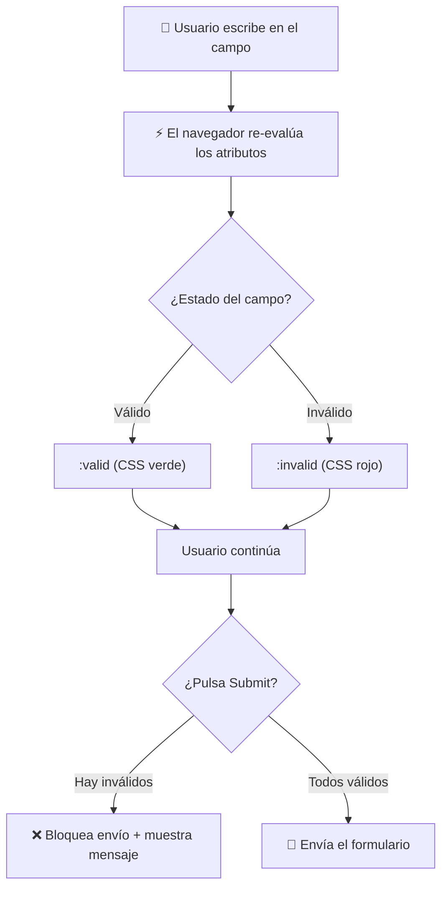

🇪🇸 **Español** | [🇬🇧 English](README.en.md)

# Step 2: Validación Nativa con HTML5

## 🎯 Objetivo

Aprender a **validar formularios sin escribir una sola línea de JavaScript**, usando solo atributos HTML5 y pseudoclases CSS. Entender cuándo basta con esto y cuándo necesitas algo más.

---

## 🤔 ¿Por qué importa esto?

Antes de HTML5, validar un formulario requería **decenas de líneas de JavaScript**: recorrer cada campo, comprobar formatos con regex, mostrar mensajes de error, evitar el envío…

Hoy, el navegador te regala todo eso **gratis** con un puñado de atributos. Conociéndolos puedes evitar un montón de código, mejorar la velocidad de tu formulario y dar feedback al usuario al instante.

Ojo: la validación nativa **no sustituye** la validación en el servidor (cualquiera puede saltársela), pero es tu **primera línea de defensa** y la que mejor experiencia ofrece al usuario.

---

## 🔄 Ciclo de vida de la validación



---

## 🧱 Los atributos de validación esenciales

### `required`: obligatorio

```html
<input type="text" name="nombre" required />
```

Si el campo está vacío, el navegador bloquea el envío y muestra un mensaje pidiendo que se rellene.

### `type`: valida el formato según el tipo

```html
<input type="email" required />     <!-- Debe contener @ y un dominio -->
<input type="url" required />       <!-- Debe empezar por http:// o https:// -->
<input type="number" required />    <!-- Debe ser un número -->
```

Es la forma de validación **más fácil**: solo cambias el `type` y el navegador hace el trabajo.

### `min` y `max`: rango de valores

```html
<!-- Edad entre 18 y 99 -->
<input type="number" name="edad" min="18" max="99" />

<!-- Fecha posterior a hoy -->
<input type="date" name="reserva" min="2026-06-06" />
```

### `minlength` y `maxlength`: longitud del texto

```html
<!-- Contraseña de entre 8 y 32 caracteres -->
<input type="password" name="clave" minlength="8" maxlength="32" />

<!-- Bio máximo 500 caracteres -->
<textarea name="bio" maxlength="500"></textarea>
```

### `pattern`: validación con expresión regular

Cuando los tipos predefinidos no te bastan, puedes exigir un patrón personalizado:

```html
<!-- Solo letras y espacios, entre 2 y 50 caracteres -->
<input type="text" name="nombre" pattern="[A-Za-zÁ-ú\s]{2,50}" />

<!-- Código postal español: 5 dígitos -->
<input type="text" name="cp" pattern="[0-9]{5}" />

<!-- Username: letras, números y guiones bajos -->
<input type="text" name="user" pattern="[a-zA-Z0-9_]{3,20}" />
```

> 💡 **Truco:** combina `pattern` con `title` para que el navegador explique al usuario qué se espera:
>
> ```html
> <input type="text" pattern="[0-9]{5}" title="Debe ser un código postal de 5 dígitos" />
> ```

---

## 📊 Tabla de referencia: atributos de validación

| Atributo | Para qué | Ejemplo | Aplica a |
|----------|----------|---------|----------|
| `required` | Campo obligatorio | `required` | Casi todos |
| `type` | Valida el formato | `type="email"` | `input` |
| `min` / `max` | Rango de valor | `min="0" max="100"` | `number`, `date`, `range` |
| `minlength` / `maxlength` | Longitud del texto | `minlength="8"` | `text`, `password`, `textarea` |
| `pattern` | Expresión regular | `pattern="[0-9]{5}"` | `text`, `tel`, `url`, `email`, `password`, `search` |
| `step` | Paso del incremento | `step="0.5"` | `number`, `range`, `date` |

---

## 🎨 Estilar campos válidos e inválidos con CSS

HTML5 añade dos **pseudoclases** que se activan automáticamente según el estado del campo:

```css
input:valid {
  border: 2px solid #2ecc71;   /* Verde si es válido */
}

input:invalid {
  border: 2px solid #e74c3c;   /* Rojo si es inválido */
}
```

> ⚠️ **Cuidado:** estas pseudoclases se aplican **desde el primer momento**. Un campo `required` que el usuario aún no ha tocado aparecerá rojo. Para evitarlo, combínalo con `:placeholder-shown` o con la pseudoclase `:user-invalid` (más moderna):

```css
/* Solo se ven en rojo los campos que el usuario ya intentó rellenar */
input:user-invalid {
  border: 2px solid #e74c3c;
}
```

---

## 💬 Mensajes de validación personalizados

Por defecto, el navegador muestra mensajes como "Please fill out this field". Puedes personalizarlos con JavaScript mínimo:

```html
<input
  type="email"
  required
  oninvalid="this.setCustomValidity('Por favor, introduce un email válido')"
  oninput="this.setCustomValidity('')"
/>
```

- `oninvalid` se dispara cuando el campo es inválido al intentar enviar.
- `oninput` resetea el mensaje cuando el usuario corrige el valor.

> 💡 **En tu proyecto:** los mensajes por defecto son funcionales, pero si quieres dar una experiencia más profesional o traducida, sobrescríbelos con `setCustomValidity`.

---

## 🚫 ¿Y si quiero **desactivar** la validación?

A veces necesitas que el navegador **no** valide (por ejemplo, para un botón "Guardar borrador" que permite campos a medias):

```html
<form novalidate>
  <!-- El navegador no valida nada -->
</form>

<!-- O solo para un botón concreto: -->
<button type="submit" formnovalidate>Guardar borrador</button>
```

---

## ⚠️ Lo que la validación nativa NO hace

| ❌ NO hace | Por qué |
|-----------|---------|
| Validar en el servidor | Solo corre en el navegador; un atacante la puede saltar |
| Comprobar contra una base de datos | "Este email ya está registrado" requiere ir al servidor |
| Validaciones cruzadas complejas | "Si elegiste 'Otro', el campo de texto es obligatorio" necesita JS |
| Comprobar fuerza real de una contraseña | `pattern` valida el formato, no la entropía real |

> 💡 **En tu proyecto:** úsala como **primera línea de defensa rápida**, pero nunca como **única defensa**. La validación de verdad siempre vive en el servidor.

---

## 🧠 Pregunta para reflexionar

<details>
<summary>Si la validación nativa puede ser saltada fácilmente, ¿por qué molestarse en usarla?</summary>

Por tres razones que aportan valor incluso aunque no sea "segura":

1. **Experiencia de usuario instantánea**: el usuario ve el error sin esperar la respuesta del servidor. Esto es crítico en móvil o con conexión lenta.
2. **Reduce carga del servidor**: el 99% de los usuarios reales no son maliciosos. Si filtras los errores obvios en el navegador, el servidor procesa menos peticiones inválidas.
3. **Documenta tus reglas en el HTML**: cualquier desarrollador que mire tu formulario entiende inmediatamente qué espera cada campo, sin tener que buscar la lógica en otro archivo.

La validación de servidor es la que **te protege**; la validación del navegador es la que **te ayuda a vender** una buena experiencia. Las dos son necesarias.

</details>

---

## ✅ Checklist de este step

- [ ] Sé usar `required`, `min`, `max`, `minlength`, `maxlength`, `pattern`
- [ ] Entiendo cómo `type` valida automáticamente emails, URLs y números
- [ ] Sé estilar campos con `:valid` e `:invalid`
- [ ] Conozco `setCustomValidity` para mensajes personalizados
- [ ] Entiendo que la validación nativa NO sustituye la validación del servidor
