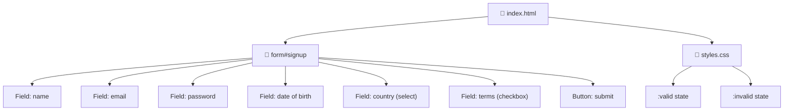

[🇪🇸 Español](README.md) | 🇬🇧 **English**

# Step 3: Project — Signup Form

## 🎯 Goal

Apply **everything you learned** in the previous steps to build a **real signup form**, with multiple field types, full native validation, basic styling, and a polished user experience.

---

## 🤔 Why does this matter?

A signup form is **the first point of contact** between a user and your app. If it works poorly, users leave. If it works well, half of your UX job is already done.

On top of that, almost **every project you'll build** in this bootcamp will have a signup. Mastering this pattern will save you hours on every future project — frontend and backend.

---

## 📋 Form requirements

We'll build a form with these fields:

| Field | Type | Validations |
|-------|------|-------------|
| Full name | `text` | Required, 2-50 chars, letters only |
| Email | `email` | Required, valid format |
| Password | `password` | Required, minimum 8 characters |
| Date of birth | `date` | Required, must be 18+ |
| Country | `select` | Required |
| Accept terms | `checkbox` | Required |

---

## 🗺️ Project structure



---

## 🏗️ Step 1: HTML base structure

Start with a clean HTML5 skeleton and an empty `<form>`:

```html
<!DOCTYPE html>
<html lang="en">
  <head>
    <meta charset="UTF-8" />
    <title>Sign up</title>
    <link rel="stylesheet" href="styles.css" />
  </head>
  <body>
    <main>
      <h1>Create your account</h1>
      <form id="signup" action="/api/signup" method="POST">
        <!-- Fields go here -->
        <button type="submit">Create account</button>
      </form>
    </main>
  </body>
</html>
```

What you've done already:
- Used `lang="en"` for accessibility.
- Set `action` and `method="POST"` (step 0).
- Made the button's `type="submit"` explicit.

---

## 🧱 Step 2: Name field

```html
<div class="field">
  <label for="name">Full name:</label>
  <input
    type="text"
    id="name"
    name="name"
    required
    minlength="2"
    maxlength="50"
    pattern="[A-Za-zÁ-úñÑ\s]+"
    title="Letters and spaces only, between 2 and 50 characters"
    placeholder="Maria Garcia"
    autocomplete="name"
  />
</div>
```

Decisions applied:
- `type="text"` because it's free text.
- `pattern` filters out numbers and symbols.
- `title` explains what's expected (better UX and accessibility).
- `autocomplete="name"` lets the browser autofill.

---

## 📧 Step 3: Email field

```html
<div class="field">
  <label for="email">Email:</label>
  <input
    type="email"
    id="email"
    name="email"
    required
    placeholder="you@email.com"
    autocomplete="email"
  />
</div>
```

`type="email"` already validates the format — you don't need `pattern`.

---

## 🔒 Step 4: Password field

```html
<div class="field">
  <label for="password">Password:</label>
  <input
    type="password"
    id="password"
    name="password"
    required
    minlength="8"
    maxlength="64"
    autocomplete="new-password"
  />
  <small>Minimum 8 characters</small>
</div>
```

- `autocomplete="new-password"` tells the browser "don't autofill with a saved password" and usually triggers the secure password generator.
- The `<small>` helps the user know the requirement **before** making a mistake.

---

## 📅 Step 5: Date of birth (blocking minors)

To block signups from anyone under 18, we set the max date to "today minus 18 years":

```html
<div class="field">
  <label for="birth">Date of birth:</label>
  <input
    type="date"
    id="birth"
    name="birth"
    required
    max="2008-06-06"
  />
  <small>You must be 18 or older</small>
</div>
```

> 💡 **In your project:** the `max` value can be generated dynamically with JavaScript on page load, so it's always "today − 18 years" without having to update the HTML.

---

## 🌍 Step 6: Country (select)

```html
<div class="field">
  <label for="country">Country:</label>
  <select id="country" name="country" required>
    <option value="">-- Select your country --</option>
    <option value="es">Spain</option>
    <option value="mx">Mexico</option>
    <option value="ar">Argentina</option>
    <option value="co">Colombia</option>
    <option value="cl">Chile</option>
    <option value="pe">Peru</option>
  </select>
</div>
```

> ⚠️ **Trick:** the first `<option>` has `value=""`. Because the field is `required`, an empty value counts as "not selected" and the browser blocks submission. This forces the user to pick a real one.

---

## ✅ Step 7: Accept terms

```html
<div class="field field-checkbox">
  <label>
    <input type="checkbox" name="terms" required />
    I accept the <a href="/terms">terms and conditions</a>
  </label>
</div>
```

A single `checkbox` with `required` forces the user to check it before submitting.

---

## 🎨 Step 8: Minimal CSS styling

A sober CSS that gives visual validation feedback:

```css
body {
  font-family: system-ui, sans-serif;
  max-width: 480px;
  margin: 2rem auto;
  padding: 1rem;
}

.field {
  margin-bottom: 1rem;
  display: flex;
  flex-direction: column;
}

.field label {
  font-weight: 600;
  margin-bottom: 0.25rem;
}

.field input,
.field select {
  padding: 0.5rem;
  border: 2px solid #ccc;
  border-radius: 4px;
  font-size: 1rem;
}

/* Valid state: only after the user has interacted */
input:user-valid,
select:user-valid {
  border-color: #2ecc71;
}

/* Invalid state: only after interaction */
input:user-invalid,
select:user-invalid {
  border-color: #e74c3c;
}

.field small {
  color: #666;
  font-size: 0.85rem;
  margin-top: 0.25rem;
}

button[type="submit"] {
  background: #3498db;
  color: white;
  border: 0;
  padding: 0.75rem 1.5rem;
  font-size: 1rem;
  border-radius: 4px;
  cursor: pointer;
  width: 100%;
}

button[type="submit"]:hover {
  background: #2980b9;
}
```

---

## 🧪 Step 9: Test the form

Open the HTML in the browser and try:

1. ✅ Submit the empty form → every required field should show an error.
2. ✅ Type "123" in the name → must reject (doesn't match `pattern`).
3. ✅ Type "notAnEmail" → must reject.
4. ✅ Use a 5-character password → must reject.
5. ✅ Set date of birth to 2020 → must reject.
6. ✅ Leave country unselected → must reject.
7. ✅ Don't accept terms → must reject.
8. ✅ Fill everything in correctly → must submit.

> 💡 **In your project:** open the Network tab in DevTools before clicking submit. You'll see the request that would be generated — the method (`POST`), the URL (`/api/signup`), and the body data. This will help you understand what your backend will expect to receive when that day arrives.

---

## 🚀 Next steps (with JavaScript / React)

Once you learn JavaScript you'll be able to:

- Intercept the submission with `event.preventDefault()` and validate/send yourself with `fetch`.
- Show custom error messages below each field.
- Do cross-field validation (e.g. "the password must match the confirmation").
- Show a real-time password strength indicator.

But with plain HTML5 you already have a **functional, accessible, validated form with good UX**.

---

## 🧠 Question to reflect on

<details>
<summary>Why did we add <code>autocomplete</code> to some fields? Is it just for convenience?</summary>

Not just for convenience — there are three solid reasons:

1. **Speed**: filling out a form manually on mobile is slow and error-prone. With `autocomplete`, the browser or password manager does the work in one tap.
2. **Accessibility**: for users with motor or cognitive disabilities, typing each field is a real barrier. `autocomplete` removes it.
3. **Security**: using `autocomplete="new-password"` triggers the secure password generators built into browsers. Result: the user ends up with a stronger password than one they would have come up with.

Skipping `autocomplete` because "I don't feel like thinking about it" is one of those small things that separate an amateur form from a professional one.

</details>

---

## ✅ Step checklist

- [ ] I built a `<form>` with 6 different fields
- [ ] I used the right `<input>` type for each piece of data
- [ ] I applied `required`, `pattern`, `minlength`, `min`, `max` where needed
- [ ] I connected each `<label>` with its `<input>` using `for` and `id`
- [ ] I added basic styles using `:user-valid` and `:user-invalid`
- [ ] I manually tested each validation case
