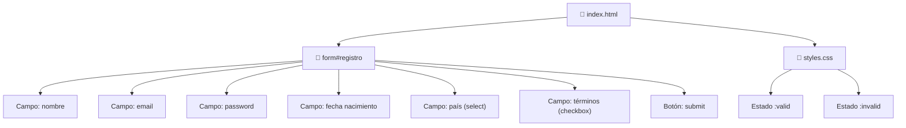

🇪🇸 **Español** | [🇬🇧 English](README.en.md)

# Step 3: Proyecto — Formulario de Registro

## 🎯 Objetivo

Aplicar **todo lo aprendido** en los steps anteriores para construir un **formulario de registro real**, con varios tipos de campo, validación nativa completa, estilado básico y experiencia de usuario cuidada.

---

## 🤔 ¿Por qué importa esto?

Un formulario de registro es **el primer punto de contacto** entre un usuario y tu aplicación. Si funciona mal, los usuarios se van. Si funciona bien, ya tienes la mitad del trabajo de UX hecho.

Además, casi **cualquier proyecto que harás** en este bootcamp tendrá un registro. Dominar este patrón te ahorrará horas en todos los proyectos futuros — frontend y backend.

---

## 📋 Requisitos del formulario

Vamos a construir un formulario con estos campos:

| Campo | Tipo | Validaciones |
|-------|------|--------------|
| Nombre completo | `text` | Obligatorio, 2-50 caracteres, solo letras |
| Email | `email` | Obligatorio, formato válido |
| Contraseña | `password` | Obligatoria, mínimo 8 caracteres |
| Fecha de nacimiento | `date` | Obligatoria, mayor de 18 años |
| País | `select` | Obligatorio |
| Acepto términos | `checkbox` | Obligatorio |

---

## 🗺️ Estructura del proyecto



---

## 🏗️ Paso 1: Estructura base del HTML

Empieza con un esqueleto HTML5 limpio y un `<form>` vacío:

```html
<!DOCTYPE html>
<html lang="es">
  <head>
    <meta charset="UTF-8" />
    <title>Registro</title>
    <link rel="stylesheet" href="styles.css" />
  </head>
  <body>
    <main>
      <h1>Crea tu cuenta</h1>
      <form id="registro" action="/api/registro" method="POST">
        <!-- Los campos van aquí -->
        <button type="submit">Crear cuenta</button>
      </form>
    </main>
  </body>
</html>
```

Lo que has hecho ya:
- Usaste `lang="es"` para accesibilidad.
- Definiste `action` y `method="POST"` (paso 0).
- Pusiste el botón con `type="submit"` explícito.

---

## 🧱 Paso 2: Campo de nombre

```html
<div class="campo">
  <label for="nombre">Nombre completo:</label>
  <input
    type="text"
    id="nombre"
    name="nombre"
    required
    minlength="2"
    maxlength="50"
    pattern="[A-Za-zÁ-úñÑ\s]+"
    title="Solo letras y espacios, entre 2 y 50 caracteres"
    placeholder="María García"
    autocomplete="name"
  />
</div>
```

Decisiones aplicadas:
- `type="text"` porque es texto libre.
- `pattern` filtra números y símbolos.
- `title` explica qué se espera (mejora UX y accesibilidad).
- `autocomplete="name"` permite al navegador autorrellenar.

---

## 📧 Paso 3: Campo de email

```html
<div class="campo">
  <label for="email">Email:</label>
  <input
    type="email"
    id="email"
    name="email"
    required
    placeholder="tu@email.com"
    autocomplete="email"
  />
</div>
```

`type="email"` ya valida el formato — no necesitas `pattern`.

---

## 🔒 Paso 4: Campo de contraseña

```html
<div class="campo">
  <label for="password">Contraseña:</label>
  <input
    type="password"
    id="password"
    name="password"
    required
    minlength="8"
    maxlength="64"
    autocomplete="new-password"
  />
  <small>Mínimo 8 caracteres</small>
</div>
```

- `autocomplete="new-password"` le dice al navegador "no autorrellenes con una contraseña ya guardada" y suele activar el generador de contraseñas seguras.
- El `<small>` ayuda al usuario a saber el requisito **antes** de equivocarse.

---

## 📅 Paso 5: Fecha de nacimiento (con bloqueo de menores)

Para impedir registros de menores de 18 años, calculamos la fecha máxima como "hoy menos 18 años":

```html
<div class="campo">
  <label for="nacimiento">Fecha de nacimiento:</label>
  <input
    type="date"
    id="nacimiento"
    name="nacimiento"
    required
    max="2008-06-06"
  />
  <small>Debes ser mayor de 18 años</small>
</div>
```

> 💡 **En tu proyecto:** el valor de `max` puede generarse dinámicamente con JavaScript al cargar la página, para que siempre sea "hoy − 18 años" sin tener que actualizar el HTML.

---

## 🌍 Paso 6: País (select)

```html
<div class="campo">
  <label for="pais">País:</label>
  <select id="pais" name="pais" required>
    <option value="">-- Selecciona tu país --</option>
    <option value="es">España</option>
    <option value="mx">México</option>
    <option value="ar">Argentina</option>
    <option value="co">Colombia</option>
    <option value="cl">Chile</option>
    <option value="pe">Perú</option>
  </select>
</div>
```

> ⚠️ **Truco:** la primera `<option>` tiene `value=""`. Como el campo es `required`, un valor vacío cuenta como "no seleccionado" y el navegador bloquea el envío. Esto fuerza al usuario a elegir uno real.

---

## ✅ Paso 7: Aceptar términos

```html
<div class="campo campo-checkbox">
  <label>
    <input type="checkbox" name="terminos" required />
    Acepto los <a href="/terminos">términos y condiciones</a>
  </label>
</div>
```

Un único `checkbox` con `required` obliga al usuario a marcarlo para poder enviar.

---

## 🎨 Paso 8: Estilado mínimo con CSS

Un CSS sobrio que da feedback visual de validación:

```css
body {
  font-family: system-ui, sans-serif;
  max-width: 480px;
  margin: 2rem auto;
  padding: 1rem;
}

.campo {
  margin-bottom: 1rem;
  display: flex;
  flex-direction: column;
}

.campo label {
  font-weight: 600;
  margin-bottom: 0.25rem;
}

.campo input,
.campo select {
  padding: 0.5rem;
  border: 2px solid #ccc;
  border-radius: 4px;
  font-size: 1rem;
}

/* Estado válido: solo después de que el usuario haya interactuado */
input:user-valid,
select:user-valid {
  border-color: #2ecc71;
}

/* Estado inválido: solo tras interacción */
input:user-invalid,
select:user-invalid {
  border-color: #e74c3c;
}

.campo small {
  color: #666;
  font-size: 0.85rem;
  margin-top: 0.25rem;
}

button[type="submit"] {
  background: #3498db;
  color: white;
  border: 0;
  padding: 0.75rem 1.5rem;
  font-size: 1rem;
  border-radius: 4px;
  cursor: pointer;
  width: 100%;
}

button[type="submit"]:hover {
  background: #2980b9;
}
```

---

## 🧪 Paso 9: Probar el formulario

Abre el HTML en el navegador y prueba:

1. ✅ Enviar el formulario vacío → todos los campos obligatorios deben mostrar error.
2. ✅ Escribir "123" en el nombre → debe rechazar (no cumple `pattern`).
3. ✅ Escribir "noEsUnEmail" → debe rechazar.
4. ✅ Poner contraseña de 5 caracteres → debe rechazar.
5. ✅ Poner fecha de nacimiento en 2020 → debe rechazar.
6. ✅ Dejar país sin elegir → debe rechazar.
7. ✅ No aceptar términos → debe rechazar.
8. ✅ Rellenar todo correctamente → debe enviar.

> 💡 **En tu proyecto:** abre la pestaña Network del DevTools antes de pulsar enviar. Verás la request que se generaría — el método (`POST`), la URL (`/api/registro`) y los datos del body. Esto te ayudará a entender qué espera recibir tu backend cuando llegue ese día.

---

## 🚀 Próximos pasos (ya con JavaScript / React)

Cuando aprendas JavaScript podrás:

- Interceptar el envío con `event.preventDefault()` y validar/enviar tú con `fetch`.
- Mostrar mensajes de error personalizados debajo de cada campo.
- Hacer validaciones cruzadas (p. ej. "la contraseña debe coincidir con la confirmación").
- Mostrar un indicador de fuerza de contraseña en tiempo real.

Pero ya con HTML5 puro tienes un formulario **funcional, accesible, validado y con buena UX**.

---

## 🧠 Pregunta para reflexionar

<details>
<summary>¿Por qué pusimos <code>autocomplete</code> en algunos campos? ¿Solo es por comodidad?</summary>

No solo por comodidad — hay tres razones de peso:

1. **Velocidad**: rellenar un formulario manualmente en móvil es lento y propenso a errores. Con `autocomplete`, el navegador o el gestor de contraseñas hacen el trabajo en un click.
2. **Accesibilidad**: para usuarios con discapacidad motora o cognitiva, escribir cada campo es una barrera real. `autocomplete` la elimina.
3. **Seguridad**: usar `autocomplete="new-password"` activa los generadores de contraseñas seguras integrados en los navegadores. Resultado: el usuario acaba con una contraseña más fuerte que si la hubiera inventado él.

Saltarse `autocomplete` por "no me apetece pensar en ello" es una de las pequeñas cosas que separa un formulario amateur de uno profesional.

</details>

---

## ✅ Checklist de este step

- [ ] Construí un `<form>` con 6 campos diferentes
- [ ] Usé el tipo de `<input>` adecuado para cada dato
- [ ] Apliqué `required`, `pattern`, `minlength`, `min`, `max` donde corresponde
- [ ] Conecté cada `<label>` con su `<input>` usando `for` y `id`
- [ ] Añadí estilos básicos con `:user-valid` y `:user-invalid`
- [ ] Probé manualmente cada caso de validación
