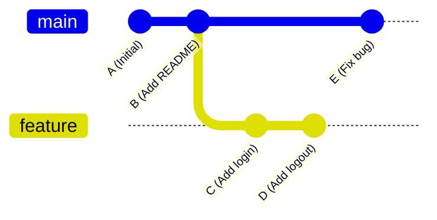
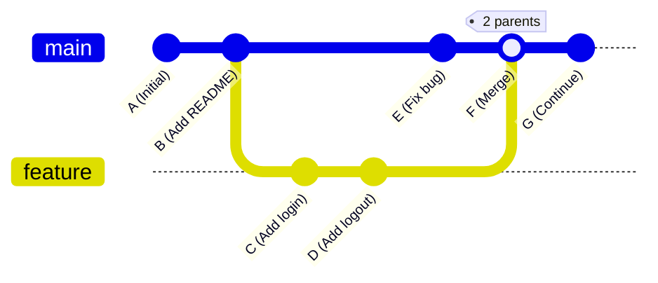
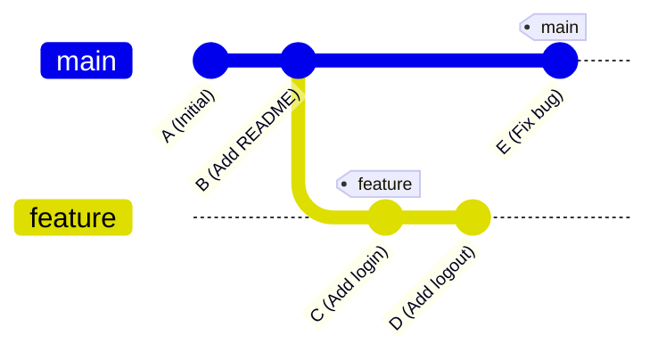
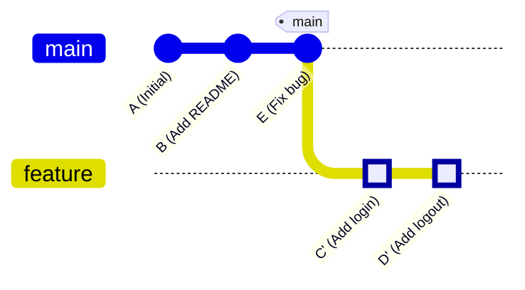
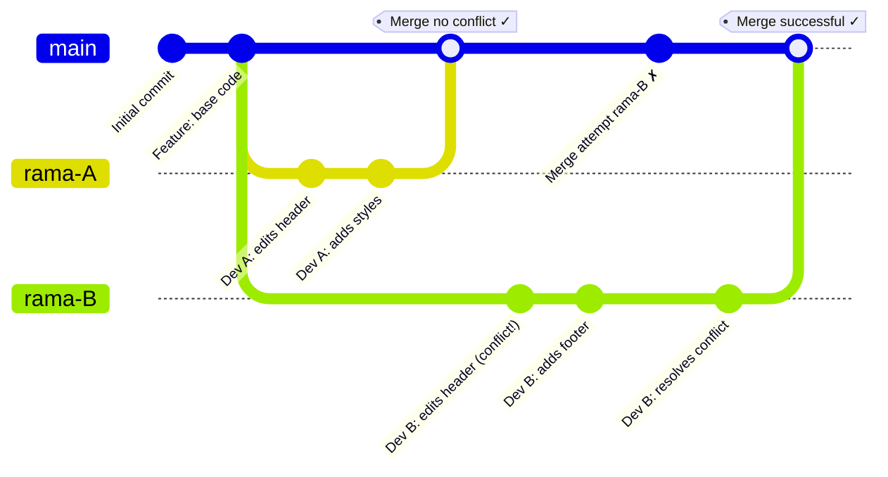

[🇪🇸 Español](README.md) | 🇬🇧 **English**

# Resolving Git Conflicts: A Complete Example

## Introduction

This document is a hands-on guide for students learning to collaborate using Git. The main goal is to **understand how and why conflicts happen** when multiple developers edit the same file, and more importantly, **how to resolve them effectively**.

Throughout this tutorial you'll find:

- A **visual diagram** showing the full flow of the process
- A **realistic timeline** with the times and specific steps two developers would follow
- **Code examples** showing exactly what a conflict looks like and how to resolve it
- **Practical commands** you'll need in real-world situations

This is a very common scenario in the professional world: two developers work on different branches, one merges first without issues, and the second has to resolve conflicts before they can integrate their code. Don't worry! Even though it might look complicated at first, resolving conflicts is a fundamental skill you'll master with practice.

## Core Concepts: Merge vs Rebase

Before we get to the full example, it's important to understand the two main ways to integrate changes in Git: **merge** and **rebase**. Both combine branches, but they do it differently.

### Git Merge

**What is it?**

`git merge` combines the changes from two branches by creating a **new merge commit**. It's like joining two paths that diverged, keeping the history of both.

**How does it work?**

When you merge, Git:

1. Finds the most recent common commit between both branches (the "common ancestor")
2. Compares the changes from both branches since that point
3. Combines the changes and creates a new commit with two "parents"

**Advantages:**

- Keeps the complete and true history of how the project evolved
- Safer and easier to understand for beginners
- Conflicts are resolved only once

#### Visual Example: Initial Situation



#### After Git Merge



**Full practical example - Commands that generate this graph:**

```bash
# 1. Create the repository and initial commits
git init
echo "Project" > README.md
git add . && git commit -m "A: Initial commit"          # Commit A
echo "# Features" >> README.md
git add . && git commit -m "B: Add README"              # Commit B

# 2. Create feature branch and make commits
git checkout -b feature
echo "login()" > auth.js
git add . && git commit -m "C: Add login"               # Commit C
echo "logout()" >> auth.js
git add . && git commit -m "D: Add logout"              # Commit D

# 3. Meanwhile, main had a change
git checkout main
echo "fix" > bugfix.js
git add . && git commit -m "E: Fix bug"                 # Commit E

# 4. MERGE: Integrate feature into main
git checkout main
git merge feature
# Git automatically creates commit F
# If there are conflicts:
#   1. Edit the conflicted files
#   2. git add resolved-file.js
#   3. git commit -m "F: Merge feature into main"

# 5. Keep working
echo "new feature" > new.js
git add . && git commit -m "G: Continue work"           # Commit G
```

**View the resulting history:**

```bash
git log --oneline --graph --all
```

**Output:**

```
*   G - Continue work
*   F - Merge feature into main (2 parents: D and E)
|\
| * D - Add logout
| * C - Add login
* | E - Fix bug
|/
* B - Add README
* A - Initial commit
```

Note how commit F has **two lines** going up ("|\\"): one toward D and one toward E.

### Git Rebase

**What is it?**

`git rebase` "rewrites" history by moving your commits so it looks like you started your work from the latest commit of the other branch. It's like saying: "I want my changes to be _after_ the changes in main".

**How does it work?**

When you rebase, Git:

1. Temporarily saves your commits
2. Updates your branch to the latest commit of the base branch
3. Applies your commits one by one on top

**Advantages:**

- Linear, cleaner history (no merge commits)
- Easier to read and follow
- Professional for open source projects

**Disadvantages:**

- Rewrites history (can be dangerous on shared branches)
- If there are conflicts, you resolve them commit by commit
- Requires more experience

#### BEFORE Git Rebase: A Situation with a Fork



**Branch state:**
- `main`: A → B → E
- `feature`: A → B → C → D (branched off from B)

**View the history with:**
```bash
git log --oneline --graph --all
```

**Output BEFORE the rebase:**
```
* E (main) - Fix bug
| * D (feature) - Add logout
| * C - Add login
|/
* B - Add README
* A - Initial commit
```

Note the **fork** (|/) - the branches diverged at commit B.

**See which commits each branch has:**
```bash
# Commits in main
git log main --oneline
# Result:
#   E - Fix bug
#   B - Add README
#   A - Initial commit

# Commits in feature
git log feature --oneline
# Result:
#   D - Add logout
#   C - Add login
#   B - Add README
#   A - Initial commit

# Which commits does feature have that main does NOT?
git log main..feature --oneline
# Result:
#   D - Add logout
#   C - Add login

# Which commits does main have that feature does NOT?
git log feature..main --oneline
# Result:
#   E - Fix bug
```

**Summary BEFORE the rebase:**
- `main` has: A, B, E (3 commits)
- `feature` has: A, B, C, D (4 commits)
- `feature` does NOT have main's commit E
- `main` does NOT have feature's commits C and D

#### AFTER Git Rebase: New Fork Starting from E



**Branch state:**
- `main`: A → B → E (unchanged)
- `feature`: A → B → E → C' → D' (forks from E, not from B)

**KEY!** There are still **TWO branches** (`main` and `feature`), forked:
- ❌ **BEFORE**: `feature` forked from B (commits: B → C → D)
- ✅ **AFTER**: `feature` forks from E (commits: E → C' → D')
- `main` points to commit E
- `feature` points to commit D'
- The difference: `feature` now includes commit E from `main`

**IMPORTANT!** The rebase **only modifies the `feature` branch**, NOT the `main` branch. It's as if you had created the `feature` branch AFTER commit E instead of after commit B.

**Full practical example - Commands that generate this graph:**

```bash
# 1. Create the repository and initial commits
git init
echo "Project" > README.md
git add . && git commit -m "A: Initial commit"          # Commit A
echo "# Features" >> README.md
git add . && git commit -m "B: Add README"              # Commit B

# 2. Create feature branch and make commits
git checkout -b feature
echo "login()" > auth.js
git add . && git commit -m "C: Add login"               # Commit C
echo "logout()" >> auth.js
git add . && git commit -m "D: Add logout"              # Commit D

# 3. Meanwhile, main had a change
git checkout main
echo "fix" > bugfix.js
git add . && git commit -m "E: Fix bug"                 # Commit E

# 4. See the state BEFORE the rebase
git log --oneline --graph --all
# Output BEFORE:
#   * E (main) - Fix bug
#   | * D (feature) - Add logout
#   | * C (feature) - Add login
#   |/
#   * B - Add README
#   * A - Initial commit

# 5. REBASE: Bring main's changes to feature and "move" C and D
git checkout feature                  # Switch to feature
git rebase main                       # Rebase feature onto main

# IMPORTANT! This command:
# - Modifies ONLY the feature branch (the one you're on)
# - Does NOT modify the main branch
# - Brings main's commits (E) into feature
# - Reapplies feature's commits (C, D) on top of E

# Internally, Git:
# 1. Temporarily saves C and D
# 2. Moves feature's pointer to where main is (commit E)
# 3. Applies C, creating C' with a new hash
# 4. Applies D, creating D' with a new hash
# 5. Updates feature's pointer to D'

# If there are conflicts while applying C:
#   - Edit and resolve the conflict
#   - git add resolved-file.js
#   - git rebase --continue
# If there are conflicts while applying D:
#   - Repeat the process
#   - git add resolved-file.js
#   - git rebase --continue

# To abort at any point:
git rebase --abort
```

**View the history AFTER the rebase:**

```bash
git log --oneline --graph --all
```

**Output AFTER the rebase:**

```
* D' (feature) - Add logout [new hash: abc123]
* C' (feature) - Add login [new hash: def456]
* E (main) - Fix bug
* B - Add README
* A - Initial commit
```

**Visual comparison of the history:**

```
BEFORE rebase:                       AFTER rebase:
(forks from B)                       (forks from E)

  * E (main)                           | * D' (feature)
  | * D (feature)                      | * C' (feature)
  | * C                                |/
  |/                                   * E (main)
  * B                                  * B
  * A                                  * A

  feature forks from B                 feature forks from E
  (does not include E)                 (includes E)
```

Note how:
- **BEFORE**: The fork (|/) is at B, `feature` does NOT include E
- **AFTER**: The fork (|/) is now at E, `feature` DOES include E
- **There are still TWO branches**, but the fork point changed from B to E
- `feature` now contains all of `main`'s changes (commit E) plus its own

**See which commits each branch has AFTER:**
```bash
# Commits in main (UNCHANGED)
git log main --oneline
# Result:
#   E - Fix bug
#   B - Add README
#   A - Initial commit

# Commits in feature (CHANGED)
git log feature --oneline
# Result:
#   D' - Add logout          [NEW HASH]
#   C' - Add login           [NEW HASH]
#   E - Fix bug              [NOW IN FEATURE!]
#   B - Add README
#   A - Initial commit

# Which commits does feature have that main does NOT?
git log main..feature --oneline
# Result:
#   D' - Add logout
#   C' - Add login

# Which commits does main have that feature does NOT?
git log feature..main --oneline
# Result:
#   (empty - feature has ALL of main's commits)
```

**Summary AFTER the rebase:**
- `main` has: A, B, E (3 commits - **unchanged**)
- `feature` has: A, B, E, C', D' (5 commits - **changed**)
- `feature` NOW has main's commit E
- `main` still does not have C' and D' (the new feature commits)

**Visualizing the branch pointers:**

```
BEFORE rebase:                      AFTER rebase:
(forks from B)                      (forks from E)

       main                                main
        ↓                                   ↓
    A → B → E                         A → B → E
         ↗                                       ↘
    A → B → C → D                         C' → D'
              ↑                                ↑
           feature                          feature

  feature forks from B                feature forks from E
  (B is the common ancestor)          (E is the common ancestor)
```

**Comparison table BEFORE vs AFTER the rebase:**

| Aspect | BEFORE rebase | AFTER rebase |
|---------|------------------|----------------------|
| **`main` branch** | A → B → E | A → B → E (unchanged) |
| **`feature` branch** | A → B → C → D | A → B → E → C' → D' |
| **Fork point** | From B | From E |
| **Structure** | Forked (\|/ at B) | Forked (\|/ at E) |
| **Total commits on `feature`** | 4 commits | 5 commits |
| **Does feature have E?** | ❌ NO | ✅ YES |
| **C and D hashes** | Originals (C, D) | New (C', D') |
| **Did main change?** | - | ❌ NO |
| **Number of branches** | 2 branches | 2 branches (both still exist) |
| **Common ancestor** | B | E |

**Hash comparison:**

| Commit | BEFORE rebase | AFTER rebase | Did it change? |
|--------|------------------|---------------------|----------|
| C | `789xyz` (feature) | `def456` (feature) | ✅ Yes - New hash |
| D | `456uvw` (feature) | `abc123` (feature) | ✅ Yes - New hash |
| E | `111aaa` (main) | `111aaa` (main) | ❌ No - Same hash |

**Key points:**

1. **There is still a fork** - they're still two separate branches
2. **The fork point changed**: from B to E
3. C' and D' are **new commits** with different hashes
4. The original commits C and D no longer exist in `feature`'s history
5. The `main` branch **was NOT modified** at all
6. `feature` now contains all of `main`'s changes (commit E) plus its own
7. Rebase does NOT create a "straight line" - it creates a **new fork from a different point**

**Analogy:**
- **BEFORE**: It's as if two roads split at city B
- **AFTER**: It's as if two roads split at city E (further along)
- They're still two different roads, they just split later now

### When to use each one?

| Situation                                       | Use       |
| ----------------------------------------------- | ---------- |
| You're a beginner                               | **Merge**  |
| Working as a team on a shared branch            | **Merge**  |
| You want to keep the complete history           | **Merge**  |
| You're working alone on your branch             | **Rebase** |
| You want a clean history before opening a PR    | **Rebase** |
| Open source project with strict guidelines      | **Rebase** |

**Golden rule**: **NEVER** rebase commits you've already shared (pushed) to a public branch where others are working!

## Workflow Diagram



## Realistic Timeline

### Day 1 - Monday (Morning)

**09:00** - Both developers start working

**Developer A:**

```bash
git checkout -b rama-A
# Works on the file index.html
```

**Developer B:**

```bash
git checkout -b rama-B
# Works on the same index.html file (without knowing!)
```

### Day 1 - Monday (Afternoon)

**16:00** - Developer A finishes first

```bash
# Developer A on rama-A
git add .
git commit -m "feat: update header with new logo"
git push origin rama-A
```

**16:30** - Developer A opens a Pull Request and it's approved

```bash
# In GitHub/GitLab: Merge rama-A → main
# main now has A's changes
```

### Day 2 - Tuesday (Morning)

**10:00** - Developer B finishes their work

```bash
# Developer B on rama-B
git add .
git commit -m "feat: improve header and add footer"
git push origin rama-B
```

**10:15** - Developer B opens a Pull Request but... CONFLICT! ⚠️

### Day 2 - Tuesday (Resolution)

**10:30** - Developer B starts resolving the conflict

```bash
# Step 1: Update local main
git checkout main
git pull origin main

# Step 2: Go back to rama-B and do a merge/rebase
git checkout rama-B
git merge main
# Git detects a conflict in index.html!
```

**10:35** - Git shows the conflict in `index.html`:

```html
<header>
  <<<<<<< HEAD (rama-B)
  <h1>My Website - Version 2.0</h1>
  
  =======
  <h1>My Refreshed Website</h1>
  
  >>>>>>> main (rama-A)
</header>
```

**10:45** - Developer B resolves it by hand:

```html
<header>
  <h1>My Refreshed Website - Version 2.0</h1>
  
</header>
```

**10:50** - Completes the merge:

```bash
git add index.html
git commit -m "fix: resolve merge conflict with rama-A"
git push origin rama-B
```

**11:00** - The Pull Request updates and can now be merged without conflicts ✓

```bash
# In GitHub/GitLab: Merge rama-B → main
```

## Full Practical Example

### Initial State: `index.html` on main

```html
<!DOCTYPE html>
<html>
  <head>
    <title>My Site</title>
  </head>
  <body>
    <header>
      <h1>My Website</h1>
      
    </header>
    <main>
      <p>Main content</p>
    </main>
  </body>
</html>
```

### Developer A's Changes (rama-A)

```html
<header>
  <h1>My Refreshed Website</h1>
  
</header>
```

### Developer B's Changes (rama-B)

```html
<header>
  <h1>My Website - Version 2.0</h1>
  
</header>
<footer>
  <p>© 2025 My Company</p>
</footer>
```

### Final File After Resolving the Conflict

```html
<!DOCTYPE html>
<html>
  <head>
    <title>My Site</title>
  </head>
  <body>
    <header>
      <!-- Combination of both changes -->
      <h1>My Refreshed Website - Version 2.0</h1>
      
    </header>
    <main>
      <p>Main content</p>
    </main>
    <footer>
      <!-- Developer B's footer is kept -->
      <p>© 2025 My Company</p>
    </footer>
  </body>
</html>
```

## Key Commands for Resolving Conflicts

```bash
# 1. See the conflict status
git status

# 2. See the conflicted files
git diff

# 3. After resolving by hand
git add resolved-file.html

# 4. Continue the merge
git commit -m "fix: resolve conflict"

# 5. If you want to abort the merge
git merge --abort

# 6. See who changed what
git log --oneline --graph --all
```

## Timeline Summary

| Time                  | Action                       |
| --------------------- | ----------------------------- |
| **2-3 hours**         | Parallel work on branches    |
| **15 min**            | First merge (no conflict)    |
| **30-45 min**         | Detect + resolve conflict     |
| **Total: ~3-4 hours** | For the whole process         |

## Tips to Avoid Conflicts

1. **Communication**: Devs should tell each other which files they're working on
2. **Pull often**: Update `main` every morning
3. **Small branches**: Merge fast, don't pile up changes
4. **Review before pushing**: `git pull origin main` before opening a PR

## Additional Resources

- [Official Git docs on merge](https://git-scm.com/docs/git-merge)
- [Atlassian: Conflict resolution tutorial](https://www.atlassian.com/git/tutorials/using-branches/merge-conflicts)
- [GitHub: Resolving conflicts](https://docs.github.com/en/pull-requests/collaborating-with-pull-requests/addressing-merge-conflicts)
