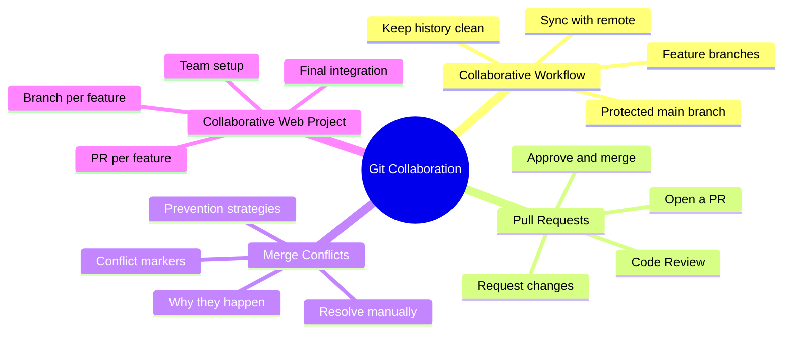

[🇪🇸 Español](README.md) | 🇬🇧 **English**

# 📋 Day 06: Building an HTML/CSS Website Collaboratively with Git and GitHub

## 📚 Context

So far you've used Git on solo projects. But in the real world **nobody codes alone**: every development team coordinates changes across multiple people touching the same files at the same time. Git and GitHub are the tools that make that coordination possible.

In this day you'll learn to **work like a professional team** on a single repository: each person on their own branch, integrating changes through Pull Requests, resolving merge conflicts, and doing code review. We'll apply it by building an HTML/CSS website together.

---

## 🎯 Goals for the day

By the end of this day you should be able to:

- Explain the `main` + feature-branches model and why it's the industry standard
- Create, review, and approve a Pull Request on GitHub
- Resolve a merge conflict without losing code
- Coordinate with your team to prevent conflicts before they happen
- Build a complete HTML/CSS website where every member contributes their part via Pull Request

---

## 🗺️ Mind Map: Collaborating with Git



---

## 🗂️ Structure of the day

```text
day_06/
├── README.md
├── step0-flujo-colaborativo/
│   └── README.md          # Why collaborate, main + branches model
├── step1-pull-requests/
│   └── README.md          # Create, review, and approve PRs
├── step2-merge-conflicts/
│   └── README.md          # Cause, resolution, and prevention of conflicts
└── step3-proyecto-web-colaborativa/
    └── README.md          # Guided project: HTML/CSS site as a team
```

---

## 🧭 Suggested study order

1. `step0-flujo-colaborativo` — Understand the model and why it matters
2. `step1-pull-requests` — Learn the central mechanism of collaboration
3. `step2-merge-conflicts` — Solve the most feared problem of teamwork
4. `step3-proyecto-web-colaborativa` — Apply everything in a real project

---

## ✅ End-of-day checklist

- [ ] I understand the `main` + feature-branches model
- [ ] I can create a branch, make commits, and push it to the remote
- [ ] I can open a Pull Request with a good title and description
- [ ] I can review someone else's PR and leave constructive comments
- [ ] I can resolve a merge conflict without panicking
- [ ] I have collaborated on the team's HTML/CSS website via Pull Request
- [ ] My PR was approved and merged into `main`
