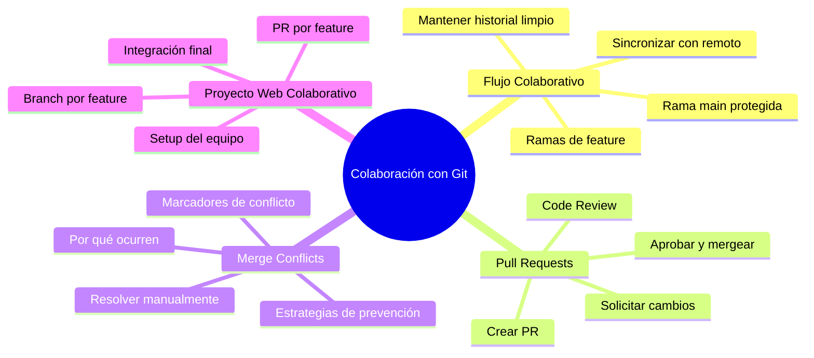

🇪🇸 **Español** | [🇬🇧 English](README.en.md)

# 📋 Día 06: Construcción de un Sitio Web HTML/CSS de forma Colaborativa con Git y GitHub

## 📚 Contexto

Hasta ahora has trabajado con Git en proyectos individuales. Pero en el mundo real **nadie programa solo**: cada equipo de desarrollo coordina cambios entre varias personas que tocan los mismos archivos al mismo tiempo. Git y GitHub son las herramientas que hacen posible esa coordinación.

En este día vas a aprender a **trabajar como un equipo profesional** sobre un mismo repositorio: cada persona en su rama, integrando cambios mediante Pull Requests, resolviendo conflictos de merge y haciendo code review. Lo aplicaremos construyendo entre varias personas un sitio web HTML/CSS.

---

## 🎯 Objetivos del día

Al terminar este día deberías poder:

- Explicar el modelo `main` + ramas de feature y por qué es el estándar de la industria
- Crear, revisar y aprobar un Pull Request en GitHub
- Resolver un conflicto de merge sin perder código
- Coordinar con tu equipo para evitar conflictos antes de que ocurran
- Construir un sitio web HTML/CSS completo donde cada miembro contribuye con su parte vía Pull Request

---

## 🗺️ Mapa Mental: Colaboración con Git



---

## 🗂️ Estructura del día

```text
day_06/
├── README.md
├── step0-flujo-colaborativo/
│   └── README.md          # Por qué colaborar, modelo main + ramas
├── step1-pull-requests/
│   └── README.md          # Crear, revisar y aprobar PRs
├── step2-merge-conflicts/
│   └── README.md          # Causa, resolución y prevención de conflictos
└── step3-proyecto-web-colaborativa/
    └── README.md          # Proyecto guiado: sitio HTML/CSS en equipo
```

---

## 🧭 Orden sugerido de estudio

1. `step0-flujo-colaborativo` — Entender el modelo y por qué importa
2. `step1-pull-requests` — Aprender el mecanismo central de colaboración
3. `step2-merge-conflicts` — Resolver el problema más temido del trabajo en equipo
4. `step3-proyecto-web-colaborativa` — Aplicar todo en un proyecto real

---

## ✅ Checklist de cierre del día

- [ ] Entiendo el modelo `main` + ramas de feature
- [ ] Sé crear una rama, hacer commits y subirla al remoto
- [ ] Puedo abrir un Pull Request con un buen título y descripción
- [ ] Sé revisar un PR ajeno y dejar comentarios constructivos
- [ ] Puedo resolver un conflicto de merge sin pánico
- [ ] He colaborado en el sitio web HTML/CSS del equipo vía Pull Request
- [ ] Mi PR fue aprobado y mergeado a `main`
