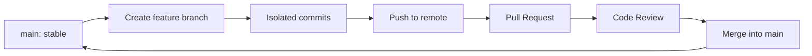

[🇪🇸 Español](README.md) | 🇬🇧 **English**

# Step 0: The Collaborative Git Workflow

## 🎯 Goal

Understand **why teams don't commit directly to `main`** and learn the industry-standard model: one protected main branch and isolated feature branches for each task.

---

## 🤔 Why does this matter?

Imagine your team has 4 people and everyone pushes their code directly to `main` on the same day. What do you think would happen?

- Each push would overwrite earlier changes
- One person breaking `main` would block the rest of the team
- There would be no way to review code before integrating it
- The history would be an audit nightmare

The **branch-based collaborative workflow** exists precisely to prevent all of that. It's not an "optional best practice": it's how **every professional team** works with Git.

---

## 🌳 The `main` + Feature-Branches Model

The core idea is simple:

1. **`main` must always be stable and deployable.** Nobody commits directly to it.
2. **Every new task is born on its own branch** (feature branch) created from `main`.
3. **When the task is ready**, it gets integrated into `main` via a Pull Request reviewed by the team.



> 💡 **Key idea:** `main` is like a store window — it should only contain finished product. Feature branches are the workshop where things are built and tested before being put on display.

---

## 🔀 Anatomy of a Feature Branch

A feature branch should be:

- **Small**: one task, not ten
- **Short-lived**: days, not weeks
- **Named with intent**: `feature/login`, `fix/header-overflow`, `docs/readme-update`
- **Synced often with `main`** to avoid divergence

```bash
# 1. Make sure you're on main and up to date
git checkout main
git pull origin main

# 2. Create your feature branch
git checkout -b feature/hero-section

# 3. Work, make small atomic commits
git add index.html
git commit -m "feat: add hero section markup"

# 4. Push your branch to the remote
git push -u origin feature/hero-section
```

---

## 📛 Branch Naming Convention

A consistent naming convention makes the repository readable to anyone on the team.

| Prefix | What it's for | Example |
|--------|---------------|---------|
| `feature/` | New functionality | `feature/contact-form` |
| `fix/` | Bug fix | `fix/mobile-menu-overlap` |
| `docs/` | Documentation changes | `docs/update-readme` |
| `refactor/` | Rewrites without behavior change | `refactor/css-variables` |
| `chore/` | Maintenance tasks | `chore/upgrade-dependencies` |

> 💡 **Tip:** If your team uses a ticketing tool (Jira, Linear, GitHub Issues), include the ID: `feature/PROJ-42-contact-form`. It automatically links the code to its "why".

---

## 🧭 Essential Workflow Commands

```bash
# See which branch I'm on
git branch

# See all local and remote branches
git branch -a

# Switch to an existing branch
git checkout feature/hero-section

# Create a new branch from main
git checkout main
git pull origin main
git checkout -b feature/new-task

# Sync my branch with the latest changes from main
git checkout feature/hero-section
git fetch origin
git merge origin/main

# Push my branch to the remote for the first time
git push -u origin feature/hero-section

# Push later changes
git push

# Delete a local branch that's already been merged
git branch -d feature/hero-section

# Delete a remote branch
git push origin --delete feature/hero-section
```

---

## 🛡️ Protecting the `main` Branch

In serious projects, **`main` is protected on GitHub** so it's impossible to bypass the workflow. Typical rules are:

- ❌ Direct pushes to `main` are forbidden
- ✅ Changes must go through a Pull Request
- ✅ At least 1 approval from another member
- ✅ All CI checks must pass before merging
- ✅ The branch must be up to date with `main` before merging

> 💡 **Even when you're working alone on a personal project, enabling branch protection is a good habit.** It forces you through the workflow and stops you from accidentally breaking your own `main`.

---

## 🧠 Question to reflect on

<details>
<summary>Why do you think it's a bad idea to have very large, long-lived feature branches?</summary>

Long-lived branches cause several problems:

1. **Massive merge conflicts**: the longer a branch takes to integrate, the more divergent it gets from `main`, and the more likely its PR is to have conflicts across many files.
2. **Painful code reviews**: reviewing a 2,000-line PR is far harder than reviewing a 200-line one. Review quality drops.
3. **Accumulated risk**: if the branch breaks or gets lost, you lose weeks of work instead of hours.
4. **Blocked feedback**: nobody sees your work until the end, so you discover too late that you were going in the wrong direction.

**Rule of thumb:** if a branch has been open for more than a week, split it. It's better to merge incomplete code behind a feature flag than to keep a giant branch alive.

</details>

---

## ✅ Step checklist

- [ ] I understand why `main` must always be stable
- [ ] I can create a feature branch from an up-to-date `main`
- [ ] I know a naming convention and apply it
- [ ] I can sync my branch with the latest changes from `main`
- [ ] I understand what branch protection is and what it's for
