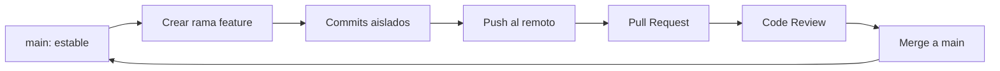

🇪🇸 **Español** | [🇬🇧 English](README.en.md)

# Step 0: Flujo Colaborativo en Git

## 🎯 Objetivo

Entender **por qué los equipos no trabajan directamente sobre `main`** y aprender el modelo estándar de la industria: una rama principal protegida y ramas de feature aisladas para cada tarea.

---

## 🤔 ¿Por qué importa esto?

Imagina que tu equipo tiene 4 personas y todas pushean su código directamente a `main` durante el mismo día. ¿Qué crees que pasaría?

- Cada push sobrescribiría cambios anteriores
- Una persona que rompa `main` bloquearía al resto del equipo
- No habría forma de revisar el código antes de integrarlo
- El historial sería un caos imposible de auditar

El **flujo colaborativo basado en ramas** existe precisamente para evitar todo eso. No es una "buena práctica opcional": es la forma en que **todos los equipos profesionales** trabajan con Git.

---

## 🌳 El Modelo `main` + Ramas de Feature

La idea central es simple:

1. **`main` siempre debe estar estable y desplegable.** Nadie commitea directamente a ella.
2. **Cada tarea nueva nace en su propia rama** (rama de feature) creada desde `main`.
3. **Cuando la tarea está lista**, se integra a `main` mediante un Pull Request revisado por el equipo.



> 💡 **Idea clave:** `main` es como el escaparate de una tienda — solo debe contener producto terminado. Las ramas de feature son el taller donde se construye y se prueba antes de exponerlo.

---

## 🔀 Anatomía de una Rama de Feature

Una rama de feature debe ser:

- **Pequeña**: una sola tarea, no diez
- **De corta duración**: días, no semanas
- **Nombrada con intención**: `feature/login`, `fix/header-overflow`, `docs/readme-update`
- **Sincronizada frecuentemente con `main`** para evitar divergencia

```bash
# 1. Asegúrate de estar en main y actualizado
git checkout main
git pull origin main

# 2. Crea tu rama de feature
git checkout -b feature/hero-section

# 3. Trabaja, haz commits pequeños y atómicos
git add index.html
git commit -m "feat: add hero section markup"

# 4. Sube tu rama al remoto
git push -u origin feature/hero-section
```

---

## 📛 Convención de Nombres de Ramas

Una nomenclatura consistente hace el repositorio legible para cualquier persona del equipo.

| Prefijo | Para qué sirve | Ejemplo |
|---------|----------------|---------|
| `feature/` | Funcionalidad nueva | `feature/contact-form` |
| `fix/` | Corrección de bug | `fix/mobile-menu-overlap` |
| `docs/` | Cambios en documentación | `docs/update-readme` |
| `refactor/` | Reescritura sin cambio de comportamiento | `refactor/css-variables` |
| `chore/` | Tareas de mantenimiento | `chore/upgrade-dependencies` |

> 💡 **Tip:** Si tu equipo usa una herramienta de tickets (Jira, Linear, GitHub Issues), incluye el ID: `feature/PROJ-42-contact-form`. Conecta el código con el "por qué" de forma automática.

---

## 🧭 Comandos Esenciales del Flujo

```bash
# Ver en qué rama estoy
git branch

# Ver todas las ramas locales y remotas
git branch -a

# Cambiar a una rama existente
git checkout feature/hero-section

# Crear una rama nueva desde main
git checkout main
git pull origin main
git checkout -b feature/nueva-tarea

# Sincronizar mi rama con los últimos cambios de main
git checkout feature/hero-section
git fetch origin
git merge origin/main

# Subir mi rama al remoto por primera vez
git push -u origin feature/hero-section

# Subir cambios posteriores
git push

# Borrar una rama local que ya fue mergeada
git branch -d feature/hero-section

# Borrar una rama remota
git push origin --delete feature/hero-section
```

---

## 🛡️ Protección de la Rama `main`

En proyectos serios, **`main` se protege en GitHub** para que sea imposible saltarse el flujo. Las reglas típicas son:

- ❌ Prohibido pushear directamente a `main`
- ✅ Cambios obligatoriamente vía Pull Request
- ✅ Al menos 1 aprobación de otro miembro
- ✅ Todos los checks de CI deben pasar antes de mergear
- ✅ La rama debe estar actualizada con `main` antes de mergear

> 💡 **Aunque trabajes solo en tu proyecto personal, activar protección de rama es buen hábito.** Te fuerza a pasar por el flujo y a no romper tu propio `main` por error.

---

## 🧠 Pregunta para reflexionar

<details>
<summary>¿Por qué crees que es mala idea hacer ramas de feature muy grandes y de larga duración?</summary>

Las ramas largas generan varios problemas:

1. **Conflictos masivos al mergear**: cuanto más tarda una rama en integrarse, más divergente está respecto a `main` y más probable es que su PR tenga conflictos en muchos archivos.
2. **Code reviews dolorosas**: revisar un PR de 2.000 líneas es mucho más difícil que revisar uno de 200. La revisión pierde calidad.
3. **Riesgo acumulado**: si la rama se rompe o se pierde, pierdes semanas de trabajo en vez de horas.
4. **Bloqueo de feedback**: nadie ve tu trabajo hasta el final, así que descubres tarde que estabas yendo en la dirección equivocada.

**Regla práctica:** si una rama lleva más de una semana abierta, divídela. Es mejor mergear código incompleto detrás de un feature flag que mantener una rama gigante.

</details>

---

## ✅ Checklist de este step

- [ ] Entiendo por qué `main` debe estar siempre estable
- [ ] Sé crear una rama de feature partiendo de un `main` actualizado
- [ ] Conozco una convención de nombres y la aplico
- [ ] Sé sincronizar mi rama con los últimos cambios de `main`
- [ ] Entiendo qué es la protección de rama y para qué sirve
