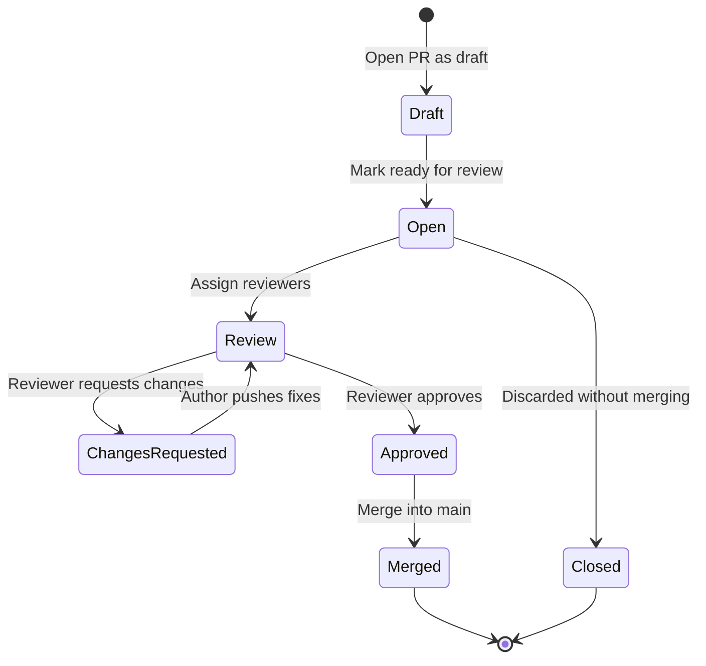
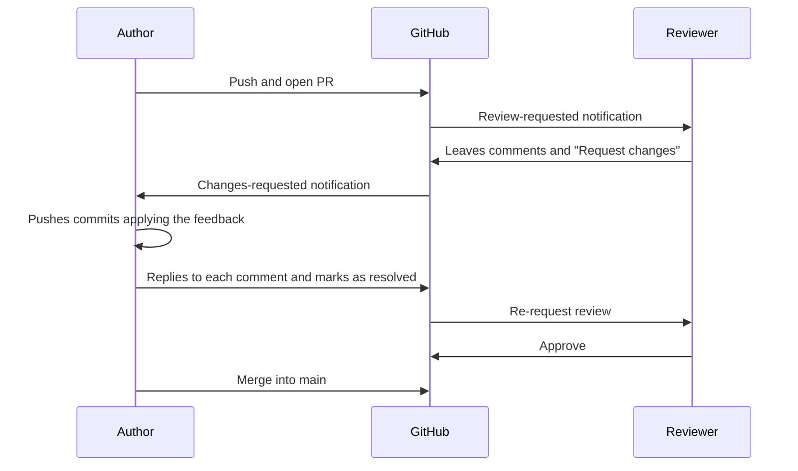

[🇪🇸 Español](README.md) | 🇬🇧 **English**

# Step 1: Pull Requests and Code Review

## 🎯 Goal

Learn to **open, review, and approve Pull Requests** on GitHub, and to communicate effectively during code review — the most important conversation that happens in a development team.

---

## 🤔 Why does this matter?

A Pull Request (PR) isn't just "the button that merges code". It's:

- A **formal integration request**: "I've finished this task, can we put it into `main`?"
- A **review space**: the rest of the team reads, comments, and suggests improvements
- A **safety net**: four eyes see more than two, and the most expensive bugs are the ones that reach production
- A **historical record**: six months from now you'll know *why* this decision was made

Knowing how to open good PRs and give good reviews is what separates a junior developer from a senior one.

---

## 🚀 Lifecycle of a Pull Request



Every state has a clear meaning and the whole team understands it.

---

## ✍️ How to Open a Good Pull Request

```bash
# 1. Make sure your branch is up to date and pushed
git checkout feature/hero-section
git fetch origin
git merge origin/main          # or git rebase origin/main
git push
```

Then on GitHub:

1. Go to **Compare & pull request** (it appears automatically)
2. Check that the base is `main` and the compare is your branch
3. Write a **descriptive title** in the imperative: `Add hero section to landing page`
4. Fill in the description with the template below
5. Assign reviewers and labels
6. Mark as "Draft" if you're still working, or "Ready for review" if it's done

### Description template

```markdown
## What does this PR do?
Adds the hero section to the landing with title, subtitle, and CTA.

## Why?
Closes ticket #42. The home had no focal point on mobile.

## How to test it
1. `git checkout feature/hero-section`
2. Open `index.html` in the browser
3. Verify the hero is responsive on mobile, tablet, and desktop

## Screenshots
<before/after image>

## Checklist
- [x] Tested on Chrome, Firefox, Safari
- [x] Doesn't break the existing header
- [x] CSS follows the BEM convention
```

> 💡 **A good PR explains itself.** If the reviewer has to ask you what it does or why, the PR isn't ready.

---

## 👀 How to Give a Good Code Review

When you're assigned as a reviewer, your job is to **help the code reach `main` in the best shape possible**, not to find defects to feel important.

### Reviewer etiquette

| Do this | Don't do this |
|---------|---------------|
| Ask before asserting: *"Did you consider using grid here?"* | Impose style: *"This is wrong, use grid"* |
| Differentiate opinion from blocker with labels: `nit:`, `question:`, `blocking:` | Mix everything in the same tone |
| Suggest with GitHub's **suggested change** tool | Paste 20 lines of code into a comment |
| Approve when the code is good even if you'd have done it differently | Block based on personal preferences |
| Mention what's **well done** | Only point out the negative |

### Comment types

```text
nit: minor change, non-blocking (at your discretion)
question: I don't get it, can you explain?
suggestion: optional improvement proposal
blocking: this must change before merging
praise: I love how you solved this!
```

> 💡 **A review with not a single `praise:` is probably too harsh.** Recognizing the good also teaches.

---

## ✅ Approve, ❌ Request Changes, or 💬 Comment

GitHub offers three actions when finishing a review:

| Action | When to use it |
|--------|----------------|
| **Approve** ✅ | The code can be merged as-is or with `nit:` applied |
| **Request changes** ❌ | There's at least one `blocking:` that must be resolved before merge |
| **Comment** 💬 | You left feedback but don't want to block or approve (e.g. just questions) |

---

## 🔄 The Author ↔ Reviewer Cycle



**Unwritten rules of the dance:**

- The **author** marks comments as "Resolved" when applying them
- The **reviewer** decides whether to re-open a comment if they're not convinced by the fix
- Only the **author** merges their PR (except in teams with different policies)
- If a reviewer requested changes, you must **re-request review** before merging

---

## 🧰 Useful Commands While a PR Is Open

```bash
# Apply reviewer feedback
git checkout feature/hero-section
# ... edit files ...
git add .
git commit -m "fix: address review feedback on hero spacing"
git push                # The PR updates automatically

# Sync with main if they asked for a rebase
git fetch origin
git merge origin/main   # or git rebase origin/main
git push

# If you need to rewrite the last commit (only if nobody else touches the branch)
git commit --amend
git push --force-with-lease

# See which files changed compared to main
git diff main...HEAD --stat
```

> 💡 **Never use plain `git push --force` on a shared branch.** Use `--force-with-lease`, which aborts if someone else has pushed in the meantime.

---

## 🧠 Question to reflect on

<details>
<summary>Is it a good idea to approve a PR without really reading it, just to not block your teammate?</summary>

No. It's one of the worst practices in a team.

- If you approve without reading, **unreviewed code reaches `main`** with your approval signature on it
- Bugs that slip through **are your responsibility** as much as the author's — you said you verified it
- The whole branch-protection system loses its meaning
- It creates a fake culture of "I always approve if you always approve me"

**If you don't have time to review properly, say you can't right now and ask to reassign the review.** That's far more professional than a rubber stamp.

</details>

---

## ✅ Step checklist

- [ ] I can open a PR with a clear title and description
- [ ] I use a template with what/why/how to test
- [ ] I can tell `nit:`, `question:`, `suggestion:`, `blocking:`, and `praise:` apart
- [ ] I understand when to use Approve, Request changes, or Comment
- [ ] I can apply feedback and push new commits to the PR
- [ ] I mark comments as resolved and request re-review
