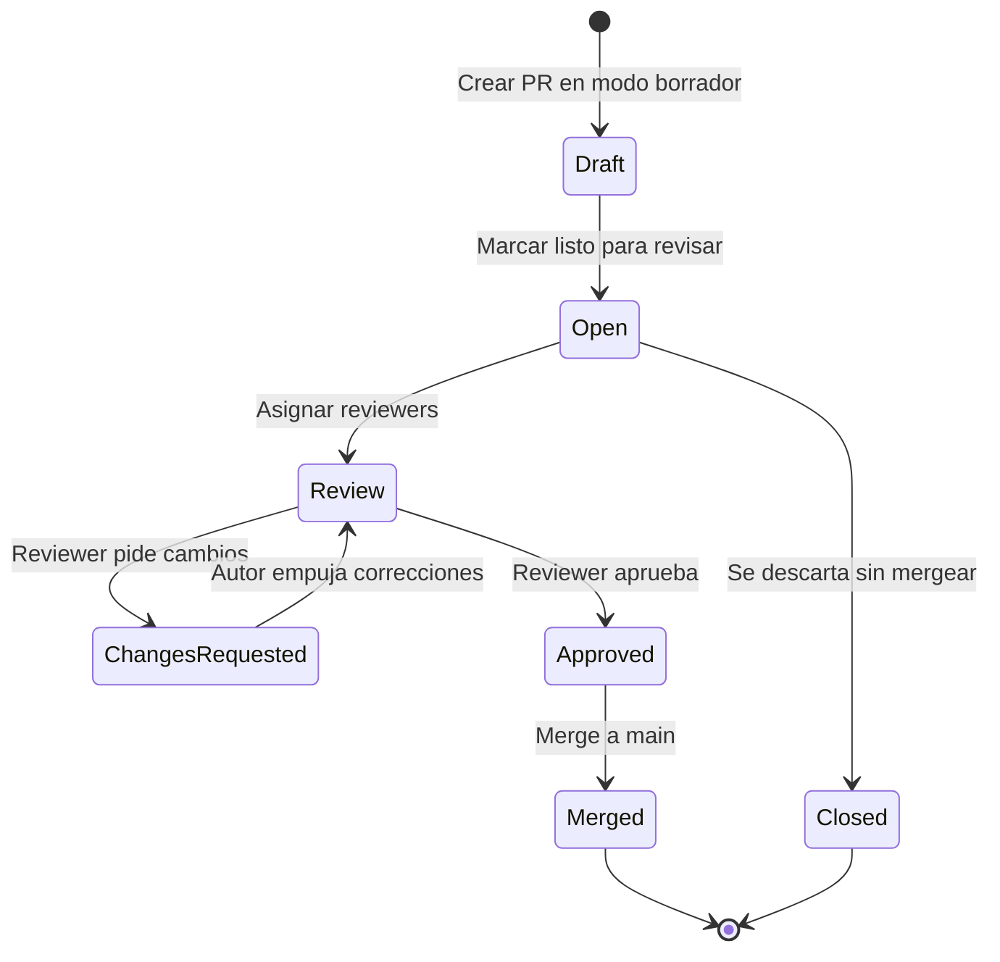
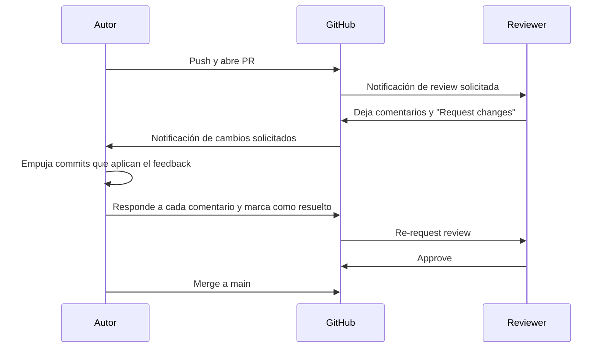

🇪🇸 **Español** | [🇬🇧 English](README.en.md)

# Step 1: Pull Requests y Code Review

## 🎯 Objetivo

Aprender a **abrir, revisar y aprobar Pull Requests** en GitHub, y a comunicarte de forma efectiva durante el code review — la conversación más importante que existe en un equipo de desarrollo.

---

## 🤔 ¿Por qué importa esto?

Un Pull Request (PR) no es solo "el botón que mergea código". Es:

- Una **petición formal de integración**: "He terminado esta tarea, ¿podemos meterla a `main`?"
- Un **espacio de revisión**: el resto del equipo lee, comenta y sugiere mejoras
- Una **red de seguridad**: cuatro ojos ven más que dos, y los bugs más caros son los que llegan a producción
- Un **registro histórico**: dentro de seis meses sabrás *por qué* se tomó esta decisión

Saber abrir buenos PRs y dar buenos reviews es lo que separa a un desarrollador junior de uno senior.

---

## 🚀 Ciclo de Vida de un Pull Request



Cada estado tiene un significado claro y todo el equipo lo entiende.

---

## ✍️ Cómo Abrir un Buen Pull Request

```bash
# 1. Asegúrate de que tu rama está actualizada y subida
git checkout feature/hero-section
git fetch origin
git merge origin/main          # o git rebase origin/main
git push
```

Después en GitHub:

1. Ve a **Compare & pull request** (aparece automáticamente)
2. Verifica que la base sea `main` y el compare sea tu rama
3. Escribe un **título descriptivo** en imperativo: `Add hero section to landing page`
4. Rellena la descripción con la plantilla de abajo
5. Asigna reviewers y labels
6. Marca como "Draft" si todavía estás trabajando, o "Ready for review" si está listo

### Plantilla de descripción

```markdown
## ¿Qué hace este PR?
Añade la sección hero a la landing con título, subtítulo y CTA.

## ¿Por qué?
Cierra el ticket #42. La home no tenía punto focal en mobile.

## Cómo probarlo
1. `git checkout feature/hero-section`
2. Abre `index.html` en el navegador
3. Verifica que el hero es responsive en mobile, tablet y desktop

## Screenshots
<imagen del antes/después>

## Checklist
- [x] Probado en Chrome, Firefox, Safari
- [x] No rompe el header existente
- [x] CSS sigue la convención BEM
```

> 💡 **Un buen PR se autoexplica.** Si el reviewer tiene que preguntarte qué hace o por qué, el PR no está listo.

---

## 👀 Cómo Hacer un Buen Code Review

Cuando te asignan como reviewer, tu trabajo es **ayudar a que el código llegue a `main` lo mejor posible**, no encontrar defectos para sentirte importante.

### Etiqueta del reviewer

| Haz esto | No hagas esto |
|----------|---------------|
| Pregunta antes de afirmar: *"¿Consideraste usar grid aquí?"* | Imponer estilo: *"Esto está mal, usa grid"* |
| Diferenciar opinión de bloqueante con etiquetas: `nit:`, `question:`, `blocking:` | Mezclar todo en el mismo tono |
| Sugerir con la herramienta de **sugerencia de cambio** de GitHub | Escribir 20 líneas de código pegado en un comentario |
| Aprobar cuando el código está bien aunque tú lo hubieras hecho distinto | Bloquear por preferencias personales |
| Mencionar lo que está **bien hecho** | Solo señalar lo negativo |

### Tipos de comentario

```text
nit: cambio menor, no bloqueante (a tu discreción)
question: no entiendo, ¿puedes explicarme?
suggestion: propuesta de mejora opcional
blocking: hay que cambiar esto antes de mergear
praise: ¡me gusta cómo resolviste esto!
```

> 💡 **Una review sin un solo `praise:` es probablemente una review demasiado dura.** Reconocer lo bueno también enseña.

---

## ✅ Aprobar, ❌ Solicitar Cambios o 💬 Comentar

GitHub te ofrece tres acciones al terminar la revisión:

| Acción | Cuándo usarla |
|--------|---------------|
| **Approve** ✅ | El código se puede mergear tal cual o con los `nit:` aplicados |
| **Request changes** ❌ | Hay al menos un `blocking:` que debe resolverse antes del merge |
| **Comment** 💬 | Has dejado feedback pero no quieres bloquear ni aprobar (ej: solo preguntas) |

---

## 🔄 El Ciclo Autor ↔ Reviewer



**Reglas no escritas del baile:**

- El **autor** marca los comentarios como "Resolved" cuando los aplica
- El **reviewer** decide si re-abrir un comentario si la solución no le convence
- Solo el **autor** mergea su PR (excepto en equipos con políticas distintas)
- Si un reviewer pidió cambios, hay que **re-pedirle review** antes de mergear

---

## 🧰 Comandos Útiles Mientras un PR Está Abierto

```bash
# Aplicar feedback del reviewer
git checkout feature/hero-section
# ... edita los archivos ...
git add .
git commit -m "fix: address review feedback on hero spacing"
git push                # El PR se actualiza automáticamente

# Sincronizar con main si pidieron rebase
git fetch origin
git merge origin/main   # o git rebase origin/main
git push

# Si necesitas reescribir el último commit (solo si nadie más toca la rama)
git commit --amend
git push --force-with-lease

# Ver qué archivos cambiaron respecto a main
git diff main...HEAD --stat
```

> 💡 **Nunca uses `git push --force` a secas en una rama compartida.** Usa `--force-with-lease`, que aborta si alguien más ha pusheado en el medio.

---

## 🧠 Pregunta para reflexionar

<details>
<summary>¿Es buena idea aprobar un PR sin leerlo realmente, solo para no bloquear al compañero?</summary>

No. Es una de las peores prácticas que existen en un equipo.

- Si apruebas sin leer, **el código sin revisar llega a `main`** con tu firma de aprobación encima
- Los bugs que se cuelan **son tu responsabilidad** tanto como del autor — has dicho que lo verificaste
- Pierde sentido todo el sistema de protección de rama
- Genera una falsa cultura de "siempre apruebo si me apruebas"

**Si no tienes tiempo para revisar bien, di que no puedes ahora y pide reasignar la review.** Es mucho más profesional que un rubber stamp.

</details>

---

## ✅ Checklist de este step

- [ ] Sé abrir un PR con título y descripción claros
- [ ] Uso una plantilla con qué/por qué/cómo probar
- [ ] Sé diferenciar `nit:`, `question:`, `suggestion:`, `blocking:` y `praise:`
- [ ] Entiendo cuándo usar Approve, Request changes o Comment
- [ ] Puedo aplicar feedback y empujar nuevos commits al PR
- [ ] Marco comentarios como resueltos y pido re-review
