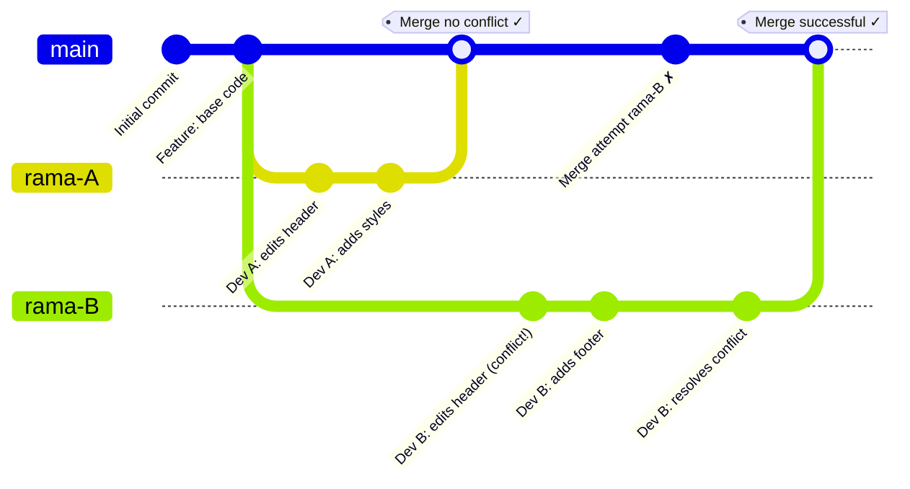
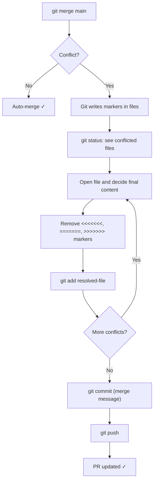

[🇪🇸 Español](README.md) | 🇬🇧 **English**

# Step 2: Resolving Merge Conflicts

## 🎯 Goal

Understand **why merge conflicts arise**, learn how to **resolve them step by step without losing code**, and know the practices that prevent them from happening in the first place.

---

## 🤔 Why does this matter?

Merge conflicts are the **number one fear** of anyone starting to collaborate with Git. And it's understandable: the first time you see the `<<<<<<<` and `=======` markers in the middle of your code, it looks like something broke.

The good news is that **a conflict isn't an error**: it's Git telling you *"two people edited the same thing and I need you to decide which version stays"*. Once you know how to read the markers and follow the right process, conflicts get resolved in minutes.

---

## ⚙️ Why Do Conflicts Happen?

A conflict appears when Git **can't automatically decide** how to combine two changes. The most common causes:

1. **Two people edit the same line** of the same file on different branches
2. **One person deletes a file** another was modifying
3. **Renaming files** on one branch while another edits them



**Typical case:** Two developers branch off `main`, both touch the `<header>` of `index.html`. The first one merges without issues. The second, when updating their branch, finds that their version of the header and the new version on `main` occupy the same lines: conflict.

---

## 🔬 Anatomy of a Conflict

When Git can't auto-merge, it writes **conflict markers** in the file:

```html
<header>
  <<<<<<< HEAD (rama-B)
  <h1>My Website - Version 2.0</h1>
  
  =======
  <h1>My Refreshed Website</h1>
  
  >>>>>>> main (rama-A)
</header>
```

Meaning of each marker:

| Marker | What it means |
|--------|---------------|
| `<<<<<<< HEAD` | Start of **your version** (the branch you're on) |
| `=======` | Separator between the two versions |
| `>>>>>>> main` | End of the version that **comes from the other branch** |

> 💡 **Resolving the conflict = removing the markers and leaving the file as you decide it should be.** It can be your version, the other one, a combination, or something brand new.

---

## 🛠️ The Full Resolution Flow



### Step by step with commands

```bash
# 1. You're on your feature branch
git checkout rama-B

# 2. Bring the latest changes from main
git fetch origin
git merge origin/main
# Output: CONFLICT (content): Merge conflict in index.html

# 3. See which files are in conflict
git status
# Unmerged paths:
#   both modified:   index.html

# 4. Open the file, decide what to keep, remove markers
# (see next section)

# 5. Mark the file as resolved
git add index.html

# 6. Finish the merge
git commit -m "fix: resolve merge conflict with main"

# 7. Push to the remote
git push
```

### If things get messy, abort and start over

```bash
git merge --abort
# Your branch returns to the state before the merge, no work lost
```

> 💡 **Abort without fear.** Better to retry calmly than to finish a broken merge. `merge --abort` is completely safe.

---

## ✏️ Full Practical Example

### Initial state on `main`

```html
<!DOCTYPE html>
<html>
  <head>
    <title>My Site</title>
  </head>
  <body>
    <header>
      <h1>My Website</h1>
      
    </header>
  </body>
</html>
```

### Dev A's changes (merged first)

```html
<header>
  <h1>My Refreshed Website</h1>
  
</header>
```

### Dev B's changes (not merged yet)

```html
<header>
  <h1>My Website - Version 2.0</h1>
  
</header>
<footer>
  <p>© 2025 My Company</p>
</footer>
```

### The conflict Dev B sees when updating their branch

```html
<header>
  <<<<<<< HEAD
  <h1>My Website - Version 2.0</h1>
  
  =======
  <h1>My Refreshed Website</h1>
  
  >>>>>>> origin/main
</header>
<footer>
  <p>© 2025 My Company</p>
</footer>
```

### Final version (combining the best of both)

```html
<header>
  <h1>My Refreshed Website - Version 2.0</h1>
  
</header>
<footer>
  <p>© 2025 My Company</p>
</footer>
```

B's footer stays (no conflict there), and for the header we combine B's new title with A's new logo.

---

## ⚔️ Merge vs Rebase (for resolving conflicts)

There are two ways to bring `main`'s changes into your branch:

| Aspect | `git merge main` | `git rebase main` |
|--------|------------------|-------------------|
| **What it does** | Creates a merge commit | Rewrites your commits on top of `main`'s tip |
| **History** | Preserves the fork | Linear, no merge commit |
| **Conflicts** | Resolved once | Resolved commit by commit |
| **For beginners** | ✅ Simpler | ⚠️ More subtle |
| **On shared branches** | ✅ Safe | ❌ Dangerous (rewrites history) |
| **My recommendation** | Start here | Learn once you're comfortable with merge |

**Golden rule:** **NEVER** rebase commits that have already been pushed to a public branch where others are working.

---

## 🛡️ How to Prevent Conflicts

Most conflicts are avoidable with good habits:

| Practice | Why it works |
|----------|--------------|
| **Pull `main` often** | Your branch doesn't drift too far |
| **Small, short branches** | Less code touched = fewer collisions |
| **Communicate which files you touch** | Your team avoids stepping on you |
| **Modularize CSS/HTML** | Each feature lives in separate files |
| **Merge small features first** | Reduces the risk of divergence |

```bash
# Recommended habit: each morning, update your branch
git checkout feature/my-branch
git fetch origin
git merge origin/main
```

> 💡 **Communicate before coding:** if your team uses Slack or Discord, a simple *"starting on `styles.css` this afternoon"* can save someone a 1-hour conflict.

---

## 🧰 Emergency Commands

```bash
# See the conflict status
git status

# See the conflicted files and their diffs
git diff

# After resolving by hand
git add resolved-file.html

# Continue the merge
git commit -m "fix: resolve conflict"

# If you want to abort the merge and go back
git merge --abort

# If you were in a rebase and want to abort
git rebase --abort

# See who did what
git log --oneline --graph --all
```

---

## 🧠 Question to reflect on

<details>
<summary>If two people edit completely different files, can there still be a conflict?</summary>

Usually **no**: Git merges without trouble because the modified code regions don't overlap.

But there are interesting edge cases:

- **Renames**: if one person renames `header.html` → `nav.html` while another edits `header.html`, Git can get confused.
- **Delete vs edit**: if A deletes a file and B modifies it, Git asks you to decide.
- **Semantic conflicts** (not structural): A and B edit different files but the changes contradict each other (for example, A renames a CSS class that B still uses in another file). Git doesn't detect this — you'll see it when running the site.

That's why **testing the app after merging** still matters even if Git doesn't flag conflicts.

</details>

---

## ✅ Step checklist

- [ ] I know why Git produces a merge conflict
- [ ] I recognize the `<<<<<<<`, `=======`, `>>>>>>>` markers and know what each one means
- [ ] I can resolve a conflict by editing the file and removing the markers
- [ ] I know how to abort a merge with `git merge --abort`
- [ ] I know the difference between `git merge` and `git rebase`
- [ ] I have at least 3 habits to prevent conflicts
