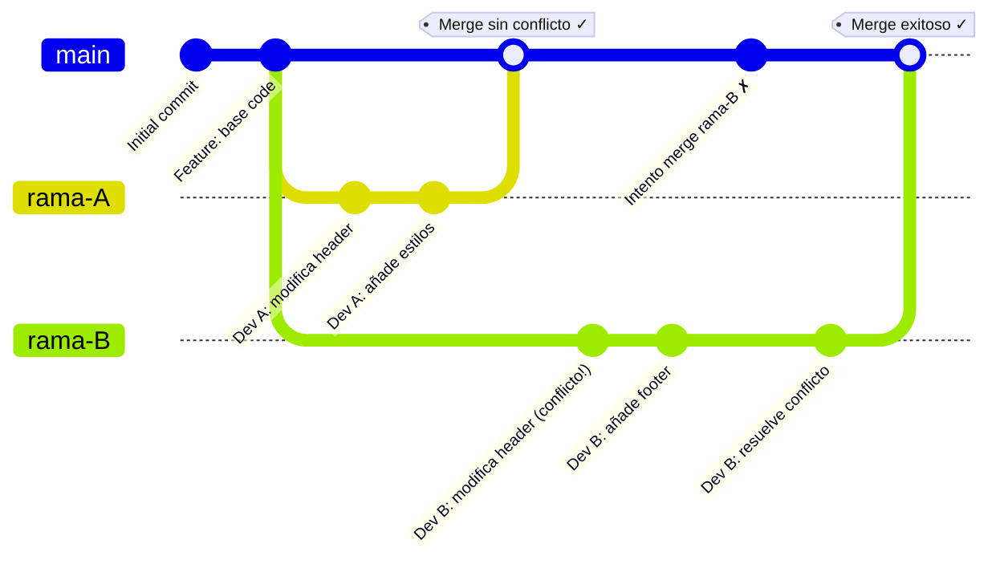
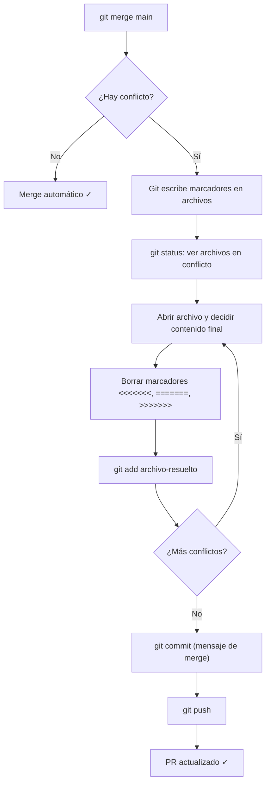

🇪🇸 **Español** | [🇬🇧 English](README.en.md)

# Step 2: Resolución de Merge Conflicts

## 🎯 Objetivo

Entender **por qué surgen los conflictos de merge**, aprender a **resolverlos paso a paso sin perder código**, y conocer las prácticas que los previenen antes de que aparezcan.

---

## 🤔 ¿Por qué importa esto?

Los conflictos de merge son **el miedo número uno** de quien empieza a trabajar en equipo con Git. Y es normal: la primera vez que ves los marcadores `<<<<<<<` y `=======` en mitad de tu código, parece que algo se rompió.

La buena noticia es que **un conflicto no es un error**: es Git diciéndote *"dos personas modificaron lo mismo y necesito que tú decidas qué versión queda"*. Sabiendo leer los marcadores y siguiendo el proceso correcto, los conflictos se resuelven en minutos.

---

## ⚙️ ¿Por Qué Se Producen los Conflictos?

Un conflicto aparece cuando Git **no puede decidir automáticamente** cómo combinar dos cambios. Las causas más comunes:

1. **Dos personas editan la misma línea** del mismo archivo en ramas distintas
2. **Una persona borra un archivo** que otra estaba modificando
3. **Renombrar archivos** en una rama mientras otra los edita



**Caso típico:** Dos desarrolladores parten de `main`, los dos tocan el `<header>` de `index.html`. El primero mergea sin problemas. El segundo, al actualizar su rama, encuentra que su versión del header y la nueva versión en `main` ocupan las mismas líneas: conflicto.

---

## 🔬 Anatomía de un Conflicto

Cuando Git no puede mergear automáticamente, escribe **marcadores de conflicto** en el archivo:

```html
<header>
  <<<<<<< HEAD (rama-B)
  <h1>Mi Sitio Web - Versión 2.0</h1>
  
  =======
  <h1>Mi Sitio Web Renovado</h1>
  
  >>>>>>> main (rama-A)
</header>
```

Significado de cada marcador:

| Marcador | Qué significa |
|----------|---------------|
| `<<<<<<< HEAD` | Inicio de **tu versión** (la rama donde estás parado) |
| `=======` | Separador entre las dos versiones |
| `>>>>>>> main` | Fin de la versión que **viene desde la otra rama** |

> 💡 **Resolver el conflicto = borrar los marcadores y dejar el archivo como tú decidas que debe quedar.** Puede ser tu versión, la otra, una combinación, o algo completamente nuevo.

---

## 🛠️ El Flujo Completo de Resolución



### Paso a paso con comandos

```bash
# 1. Estás en tu rama de feature
git checkout rama-B

# 2. Traes los cambios más recientes de main
git fetch origin
git merge origin/main
# Salida: CONFLICT (content): Merge conflict in index.html

# 3. Ver qué archivos están en conflicto
git status
# Unmerged paths:
#   both modified:   index.html

# 4. Abrir el archivo, decidir qué dejar, borrar marcadores
# (ver siguiente sección)

# 5. Marcar el archivo como resuelto
git add index.html

# 6. Completar el merge
git commit -m "fix: resuelve conflicto de merge con main"

# 7. Subir al remoto
git push
```

### Si todo se complica, aborta y empieza de nuevo

```bash
git merge --abort
# Tu rama vuelve al estado previo al merge, sin pérdida de trabajo
```

> 💡 **Aborta sin miedo.** Mejor reintentar tranquilo que terminar un merge mal hecho. `merge --abort` es completamente seguro.

---

## ✏️ Ejemplo Práctico Completo

### Estado inicial en `main`

```html
<!DOCTYPE html>
<html>
  <head>
    <title>Mi Sitio</title>
  </head>
  <body>
    <header>
      <h1>Mi Sitio Web</h1>
      
    </header>
  </body>
</html>
```

### Cambios de la Dev A (mergeada primero)

```html
<header>
  <h1>Mi Sitio Web Renovado</h1>
  
</header>
```

### Cambios de la Dev B (todavía sin mergear)

```html
<header>
  <h1>Mi Sitio Web - Versión 2.0</h1>
  
</header>
<footer>
  <p>© 2025 Mi Empresa</p>
</footer>
```

### Conflicto que ve la Dev B al actualizar su rama

```html
<header>
  <<<<<<< HEAD
  <h1>Mi Sitio Web - Versión 2.0</h1>
  
  =======
  <h1>Mi Sitio Web Renovado</h1>
  
  >>>>>>> origin/main
</header>
<footer>
  <p>© 2025 Mi Empresa</p>
</footer>
```

### Versión final (combinando lo mejor de cada uno)

```html
<header>
  <h1>Mi Sitio Web Renovado - Versión 2.0</h1>
  
</header>
<footer>
  <p>© 2025 Mi Empresa</p>
</footer>
```

El footer de B se mantiene (no había conflicto ahí), y para el header combinamos el título nuevo de B con el logo nuevo de A.

---

## ⚔️ Merge vs Rebase (para resolver conflictos)

Hay dos formas de traer los cambios de `main` a tu rama:

| Aspecto | `git merge main` | `git rebase main` |
|---------|------------------|-------------------|
| **Qué hace** | Crea un commit de merge | Reescribe tus commits sobre la punta de `main` |
| **Historial** | Conserva la bifurcación | Lineal, sin merge commit |
| **Conflictos** | Se resuelven una sola vez | Se resuelven commit por commit |
| **Para principiantes** | ✅ Más simple | ⚠️ Más sutil |
| **En ramas compartidas** | ✅ Seguro | ❌ Peligroso (reescribe historial) |
| **Mi recomendación** | Empieza aquí | Aprende cuando estés cómodo con merge |

**Regla de oro:** **NUNCA** hagas rebase de commits que ya han sido pusheados a una rama pública donde otros trabajan.

---

## 🛡️ Cómo Prevenir Conflictos

La mayoría de conflictos son evitables con buenos hábitos:

| Práctica | Por qué funciona |
|----------|------------------|
| **Pull frecuente** de `main` | Tu rama no se aleja demasiado |
| **Ramas pequeñas y cortas** | Menos código tocado = menos colisiones |
| **Comunicación de qué archivos tocas** | Tu equipo evita pisarte |
| **Modularizar el CSS/HTML** | Que cada feature viva en archivos separados |
| **Mergear features pequeñas antes** | Reduces el riesgo de divergencia |

```bash
# Hábito recomendado: cada mañana, actualizar tu rama
git checkout feature/mi-rama
git fetch origin
git merge origin/main
```

> 💡 **Comunica antes que código:** si tu equipo usa Slack o Discord, un simple *"empiezo a tocar `styles.css` esta tarde"* puede ahorrar a alguien un conflicto de 1 hora.

---

## 🧰 Comandos de Emergencia

```bash
# Ver el estado del conflicto
git status

# Ver los archivos en conflicto y sus diffs
git diff

# Después de resolver manualmente
git add archivo-resuelto.html

# Continuar el merge
git commit -m "fix: resuelve conflicto"

# Si quieres abortar el merge y volver al estado anterior
git merge --abort

# Si estabas en rebase y quieres abortar
git rebase --abort

# Ver quién hizo qué cambios
git log --oneline --graph --all
```

---

## 🧠 Pregunta para reflexionar

<details>
<summary>Si dos personas modifican archivos completamente distintos, ¿puede haber conflicto?</summary>

Normalmente **no**: Git mergea sin problema porque las regiones de código modificadas no se solapan.

Pero hay excepciones interesantes:

- **Renombrados**: si una persona renombra `header.html` → `nav.html` y otra edita `header.html`, Git puede confundirse.
- **Borrado vs modificación**: si A borra un archivo y B lo modifica, Git pide tu decisión.
- **Conflictos semánticos** (no estructurales): A y B modifican archivos distintos pero los cambios se contradicen entre sí (por ejemplo, A renombra una clase CSS que B sigue usando en otro archivo). Git no detecta esto — lo verás al probar la web.

Por eso **probar la app después de mergear** sigue siendo importante aunque Git no marque conflictos.

</details>

---

## ✅ Checklist de este step

- [ ] Sé por qué Git produce un conflicto de merge
- [ ] Reconozco los marcadores `<<<<<<<`, `=======`, `>>>>>>>` y sé qué significa cada uno
- [ ] Puedo resolver un conflicto editando el archivo y borrando los marcadores
- [ ] Sé abortar un merge con `git merge --abort`
- [ ] Conozco la diferencia entre `git merge` y `git rebase`
- [ ] Tengo al menos 3 hábitos para prevenir conflictos
