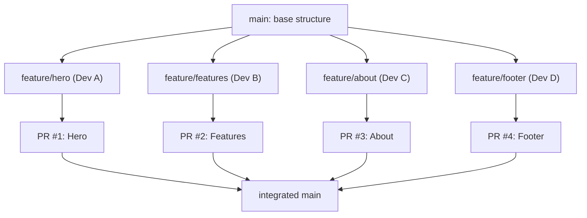

[🇪🇸 Español](README.md) | 🇬🇧 **English**

# Step 3: Collaborative HTML/CSS Web Project

## 🎯 Goal

Apply everything you've learned (branch workflow, Pull Requests, conflict resolution) by building an **HTML/CSS website as a team**, where each member contributes their section via Pull Request and ends up with an integrated product.

---

## 🤔 Why this project?

Reading theory is fine, but the only way to **internalize** the collaborative workflow is by living it. An HTML/CSS site is ideal for this practice:

- Each member can work on a different section (Hero, Features, About, Footer...)
- You'll most likely clash at least once on `styles.css` → a real conflict to resolve
- The result is visible and shareable: each one of you ends up with a site in your portfolio made with a real team

---

## 🧑‍🤝‍🧑 Team Setup (15 min)

### 1. Form groups

Teams of **3 to 4 people**. Each member will have a role and at least one assigned section.

### 2. Assign roles

| Role | Responsibility |
|------|----------------|
| **Repo Owner** | Creates the repo on GitHub, sets up `main` protection, adds collaborators |
| **Designer** | Defines color palette, typography, and overall layout (a simple Figma or sketch works) |
| **Reviewer-on-duty** | Rotates each day: the person who makes sure PRs get reviewed quickly to not block the team |
| **Integrator** | In charge of merging approved PRs and keeping `main` healthy |

> 💡 Roles **rotate** during the project. The idea is for everyone to do everything.

### 3. Create the repo

Only the Repo Owner runs this:

```bash
# 1. Create empty repo on GitHub: my-team-website
# 2. Clone locally
git clone https://github.com/<team-org>/my-team-website.git
cd my-team-website

# 3. Minimum initial structure
mkdir css images
touch index.html css/styles.css README.md

# 4. First commit
git add .
git commit -m "chore: initial project structure"
git push origin main
```

After that, the Repo Owner:

- Goes to **Settings → Collaborators** and adds the rest of the team
- Goes to **Settings → Branches → Branch protection rules** and protects `main`:
  - ✅ Require a pull request before merging
  - ✅ Require approvals: `1`
  - ✅ Require branches to be up to date before merging

---

## 🗺️ Site Architecture: One Section = One PR



**Rules of the game:**

- One site section = one feature branch = one PR
- Nobody commits directly to `main`
- Every PR needs at least 1 approval before merging
- The PR author is the one who merges it

---

## 🧱 Suggested File Structure

To minimize CSS conflicts, each section has its own file:

```text
my-team-website/
├── index.html
├── css/
│   ├── styles.css        # Global variables, reset, layout
│   ├── hero.css          # Dev A
│   ├── features.css      # Dev B
│   ├── about.css         # Dev C
│   └── footer.css        # Dev D
├── images/
└── README.md
```

In `index.html`, all CSS files are linked at the top:

```html
<link rel="stylesheet" href="css/styles.css">
<link rel="stylesheet" href="css/hero.css">
<link rel="stylesheet" href="css/features.css">
<link rel="stylesheet" href="css/about.css">
<link rel="stylesheet" href="css/footer.css">
```

> 💡 **Modularizing = avoiding conflicts.** If each person touches their own CSS, conflicts are reduced to `index.html` and, occasionally, `styles.css`.

---

## 🔁 The Individual Work Cycle

Each member repeats this cycle for their section:

```bash
# 1. Start the day by updating main
git checkout main
git pull origin main

# 2. Create a branch for your section
git checkout -b feature/hero

# 3. Work in small commits
git add css/hero.css index.html
git commit -m "feat(hero): add hero section markup and base styles"

# 4. Repeat commits as you make progress
git add css/hero.css
git commit -m "feat(hero): make hero responsive on mobile"

# 5. Push the branch
git push -u origin feature/hero
```

On GitHub:

1. Open a **Pull Request** from `feature/hero` to `main`
2. Assign the day's **reviewer-on-duty**
3. Fill in the PR template (what/why/how to test/screenshots)
4. Mark as **Ready for review**

---

## 👀 Peer Code Review

The reviewer-on-duty:

1. Reads the full PR (description + diff)
2. Checks out the branch locally to test it:
   ```bash
   git fetch origin
   git checkout feature/hero
   # Open index.html in the browser
   ```
3. Leaves comments using the Step 1 prefixes: `nit:`, `question:`, `suggestion:`, `blocking:`, `praise:`
4. Approves or requests changes

The PR author:

1. Applies the feedback and pushes new commits
2. Replies and marks each applied comment as **Resolved**
3. **Re-requests review**
4. When approved → **Merge pull request** (button on GitHub)
5. Deletes the branch from GitHub ("Delete branch" button)

---

## ⚔️ The Inevitable Conflict

Sooner or later two PRs will touch the same file (typically `index.html`). When that happens:

```bash
# The second one to merge sees the warning on GitHub:
# "This branch has conflicts that must be resolved"

# 1. Update your branch with main
git checkout feature/about
git fetch origin
git merge origin/main
# CONFLICT (content): Merge conflict in index.html

# 2. Resolve it with what you learned in Step 2
# (edit the file, remove markers, leave the correct version)

git add index.html
git commit -m "fix: resolve merge conflict with main"
git push
```

After the push, the PR updates itself and the conflict disappears.

> 💡 **Treat every conflict as a team learning opportunity.** Whoever resolves it tells the group how they did it; that way everyone does it better next time.

---

## 📋 Suggested PR Template for this Project

```markdown
## Section
Hero / Features / About / Footer

## What does this PR do
<1-2 sentence description>

## How to test it
1. Check out this branch
2. Open `index.html` in the browser
3. Verify section X looks good on mobile (375px), tablet (768px), and desktop (1280px)

## Screenshots
<mobile image> <desktop image>

## Checklist
- [ ] Semantic HTML (using `<section>`, `<header>`, etc.)
- [ ] CSS in its own file inside `css/`
- [ ] Tested in at least 2 browsers
- [ ] Doesn't break other existing sections
- [ ] Conflicts with `main` resolved
```

---

## ✅ Definition of Done

A PR is "done" when:

- [ ] The section looks good on mobile, tablet, and desktop
- [ ] HTML is semantic and accessible (alt on images, sufficient contrast)
- [ ] At least 1 reviewer has approved
- [ ] No conflicts with `main`
- [ ] The author has merged it and deleted the branch

---

## 🧠 Question to reflect on

<details>
<summary>What would happen if everyone started working on `styles.css` at the same time, with no coordination?</summary>

This is what would happen, in this order:

1. The first person merges with no issue.
2. The second, when updating their branch, hits **the first serious conflict of the project**: two versions of `styles.css` with changes on similar lines.
3. The third person, while waiting, also accumulates divergence.
4. When the second finishes their merge, the third has a conflict again because `main` changed.
5. The fourth inherits **two accumulated rounds** of changes to rebase over.

The result: a whole morning resolving conflicts instead of coding.

**The solution we already saw:** modularize (each section with its own CSS), communicate before touching shared files, and merge small PRs fast so divergence doesn't accumulate.

</details>

---

## ✅ Step checklist

- [ ] My team has a repo created with `main` protected and collaborators added
- [ ] I have my section assigned and my `feature/<section>` branch
- [ ] I've opened at least one PR following the team template
- [ ] I've reviewed at least one PR from a teammate
- [ ] I've resolved at least one conflict during the project (or helped resolve one)
- [ ] The final site is merged into `main` with contributions from the whole team
