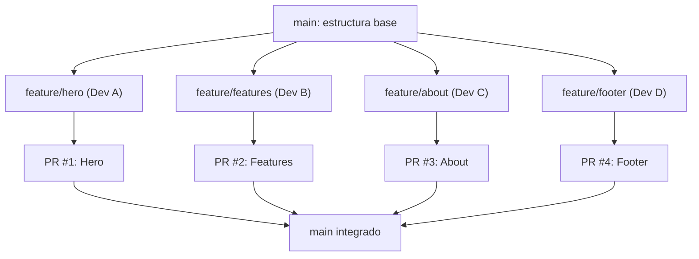

🇪🇸 **Español** | [🇬🇧 English](README.en.md)

# Step 3: Proyecto Web Colaborativo HTML/CSS

## 🎯 Objetivo

Aplicar todo lo aprendido (flujo de ramas, Pull Requests, resolución de conflictos) construyendo un **sitio web HTML/CSS en equipo**, donde cada miembro contribuye con su sección vía Pull Request y termina con un producto integrado.

---

## 🤔 ¿Por qué este proyecto?

Leer la teoría está bien, pero la única forma de **fijar** el flujo colaborativo es viviéndolo. Un sitio HTML/CSS es ideal para esta práctica:

- Cada miembro puede trabajar en una sección distinta (Hero, Features, About, Footer...)
- Es muy probable que choquéis al menos una vez en `styles.css` → conflicto real para resolver
- El resultado es visible y compartible: cada uno tiene en su portfolio un sitio hecho con un equipo de verdad

---

## 🧑‍🤝‍🧑 Setup del Equipo (15 min)

### 1. Formar grupos

Equipos de **3 a 4 personas**. Cada miembro tendrá un rol y al menos una sección asignada.

### 2. Designar roles

| Rol | Responsabilidad |
|-----|-----------------|
| **Repo Owner** | Crea el repo en GitHub, configura protección de `main`, añade colaboradores |
| **Designer** | Define la paleta de colores, tipografía y maqueta general (puede ser un Figma simple o un sketch) |
| **Reviewer-on-duty** | Rota cada día: la persona que se asegura de revisar PRs rápido para no bloquear al equipo |
| **Integrator** | Encargada de mergear PRs ya aprobados y mantener `main` sano |

> 💡 Los roles **rotan** durante el proyecto. La idea es que todos pasen por todo.

### 3. Crear el repo

Solo el Repo Owner ejecuta esto:

```bash
# 1. Crear repo vacío en GitHub: my-team-website
# 2. Clonar localmente
git clone https://github.com/<team-org>/my-team-website.git
cd my-team-website

# 3. Estructura inicial mínima
mkdir css images
touch index.html css/styles.css README.md

# 4. Primer commit
git add .
git commit -m "chore: initial project structure"
git push origin main
```

Después, el Repo Owner:

- Va a **Settings → Collaborators** y añade al resto del equipo
- Va a **Settings → Branches → Branch protection rules** y protege `main`:
  - ✅ Require a pull request before merging
  - ✅ Require approvals: `1`
  - ✅ Require branches to be up to date before merging

---

## 🗺️ Arquitectura del Sitio: Una Sección = Un PR



**Reglas del juego:**

- Una sección del sitio = una rama de feature = un PR
- Nadie commitea a `main` directamente
- Todo PR necesita al menos 1 aprobación antes de mergear
- El autor del PR es quien lo mergea

---

## 🧱 Estructura de Archivos Sugerida

Para minimizar conflictos en CSS, cada sección tiene su propio archivo:

```text
my-team-website/
├── index.html
├── css/
│   ├── styles.css        # Variables globales, reset, layout
│   ├── hero.css          # Dev A
│   ├── features.css      # Dev B
│   ├── about.css         # Dev C
│   └── footer.css        # Dev D
├── images/
└── README.md
```

En `index.html`, todos los CSS se enlazan al inicio:

```html
<link rel="stylesheet" href="css/styles.css">
<link rel="stylesheet" href="css/hero.css">
<link rel="stylesheet" href="css/features.css">
<link rel="stylesheet" href="css/about.css">
<link rel="stylesheet" href="css/footer.css">
```

> 💡 **Modularizar = evitar conflictos.** Si cada persona toca su propio CSS, los conflictos quedan reducidos a `index.html` y, ocasionalmente, `styles.css`.

---

## 🔁 El Ciclo de Trabajo Individual

Cada miembro repite este ciclo para su sección:

```bash
# 1. Empezar el día actualizando main
git checkout main
git pull origin main

# 2. Crear rama para tu sección
git checkout -b feature/hero

# 3. Trabajar en commits pequeños
git add css/hero.css index.html
git commit -m "feat(hero): add hero section markup and base styles"

# 4. Repetir commits según avances
git add css/hero.css
git commit -m "feat(hero): make hero responsive on mobile"

# 5. Subir la rama
git push -u origin feature/hero
```

En GitHub:

1. Abrir **Pull Request** desde `feature/hero` hacia `main`
2. Asignar al **reviewer-on-duty** del día
3. Rellenar la plantilla del PR (qué/por qué/cómo probar/screenshots)
4. Marcar como **Ready for review**

---

## 👀 Code Review Entre Compañeros

El reviewer-on-duty:

1. Lee el PR completo (descripción + diff)
2. Baja la rama localmente para probarla:
   ```bash
   git fetch origin
   git checkout feature/hero
   # Abre index.html en el navegador
   ```
3. Deja comentarios usando los prefijos del Step 1: `nit:`, `question:`, `suggestion:`, `blocking:`, `praise:`
4. Aprueba o solicita cambios

El autor del PR:

1. Aplica el feedback y empuja nuevos commits
2. Responde y marca como **Resolved** cada comentario aplicado
3. **Re-request review**
4. Cuando hay aprobación → **Merge pull request** (botón en GitHub)
5. Borra la rama desde GitHub (botón "Delete branch")

---

## ⚔️ El Conflicto Inevitable

Tarde o temprano dos PRs tocarán el mismo archivo (típicamente `index.html`). Cuando eso pase:

```bash
# El segundo en mergear ve el aviso en GitHub:
# "This branch has conflicts that must be resolved"

# 1. Actualiza tu rama con main
git checkout feature/about
git fetch origin
git merge origin/main
# CONFLICT (content): Merge conflict in index.html

# 2. Resuelve con lo aprendido en Step 2
# (edita el archivo, borra marcadores, deja la versión correcta)

git add index.html
git commit -m "fix: resolve merge conflict with main"
git push
```

Tras el push, el PR se actualiza solo y el conflicto desaparece.

> 💡 **Tratad cada conflicto como una oportunidad de aprendizaje del equipo.** Quien resuelve cuenta al grupo cómo lo hizo; así todos lo hacen mejor la próxima vez.

---

## 📋 Plantilla Sugerida del PR para este Proyecto

```markdown
## Sección
Hero / Features / About / Footer

## Qué hace este PR
<descripción de 1-2 frases>

## Cómo probarlo
1. Checkout a esta rama
2. Abre `index.html` en el navegador
3. Verifica que la sección X se ve bien en mobile (375px), tablet (768px) y desktop (1280px)

## Screenshots
<imagen mobile> <imagen desktop>

## Checklist
- [ ] HTML semántico (uso `<section>`, `<header>`, etc.)
- [ ] CSS en archivo propio dentro de `css/`
- [ ] Probado en al menos 2 navegadores
- [ ] No rompe otras secciones existentes
- [ ] Conflictos con `main` resueltos
```

---

## ✅ Definición de Hecho (Definition of Done)

Un PR está "hecho" cuando:

- [ ] La sección se ve bien en mobile, tablet y desktop
- [ ] HTML es semántico y accesible (alt en imágenes, contraste suficiente)
- [ ] Al menos 1 reviewer ha aprobado
- [ ] No hay conflictos con `main`
- [ ] El autor lo ha mergeado y borrado la rama

---

## 🧠 Pregunta para reflexionar

<details>
<summary>¿Qué pasaría si todos os pusierais a trabajar en `styles.css` al mismo tiempo, sin coordinaros?</summary>

Pasaría lo siguiente, en este orden:

1. La primera persona mergea sin problema.
2. La segunda, al actualizar su rama, tiene **el primer conflicto serio del proyecto**: dos versiones de `styles.css` con cambios en líneas similares.
3. La tercera persona, mientras espera, también acumula divergencia.
4. Cuando la segunda termina su merge, la tercera vuelve a tener conflicto porque `main` cambió otra vez.
5. La cuarta hereda **dos rondas acumuladas** de cambios sobre los que rebasar.

El resultado: una mañana entera resolviendo conflictos en vez de programando.

**La solución que ya hemos visto:** modularizar (cada sección con su CSS), comunicar antes de tocar archivos compartidos y mergear PRs pequeños rápido para que la divergencia no se acumule.

</details>

---

## ✅ Checklist de este step

- [ ] Mi equipo tiene un repo creado con `main` protegida y colaboradores añadidos
- [ ] Tengo asignada mi sección y mi rama `feature/<seccion>`
- [ ] He abierto al menos un PR siguiendo la plantilla del equipo
- [ ] He revisado al menos un PR de un compañero
- [ ] He resuelto al menos un conflicto durante el proyecto (o ayudado a resolverlo)
- [ ] El sitio final está mergeado en `main` con las contribuciones de todo el equipo
