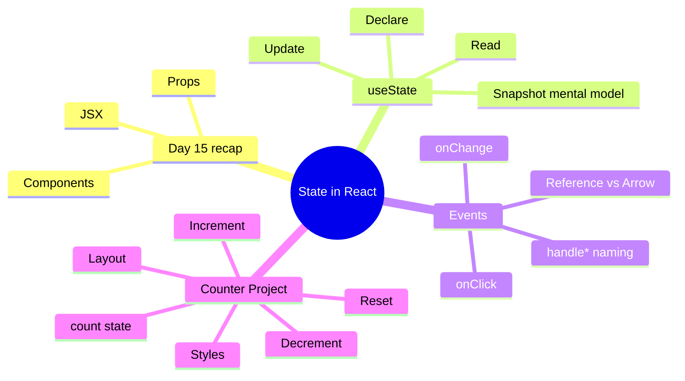

[🇪🇸 Español](README.md) | 🇬🇧 **English**

# ⚛️ Day 16: Simple Counter with React

## 📚 Context

Yesterday (day 15) you saw how **components**, **JSX**, and **props** are born. Today we take the next leap: making a component **remember things** and **react to clicks**. To do that you'll learn the `useState` hook, **event handlers**, and you'll wrap up the day building the **Simple Counter** project.

---

## 🎯 Goals for the day

By the end of this day you should be able to:

- Recap components, JSX, and props from day 15
- Explain what state is in React and why `useState` is needed
- Declare, read, and update state with `useState`
- Wire DOM events to functions (`onClick`, `onChange`)
- Tell the difference between passing a function **reference** vs calling it inline with an **arrow**
- Build a working counter with increment, decrement, and reset

---

## 🗺️ Mind Map: State and Interactivity in React



---

## 🗂️ Structure of the day

```text
day_16/
├── README.md
├── step0-react-recap/
│   └── README.md          # Recap of components, JSX, and props
├── step1-usestate-basico/
│   └── README.md          # useState hook fundamentals
├── step2-eventos-y-handlers/
│   └── README.md          # Event handlers: onClick, onChange
└── step3-proyecto-contador/
    └── README.md          # Project: Simple Counter
```

---

## 🧭 Suggested study order

1. `step0-react-recap` — Remember what you learned and understand why we need state
2. `step1-usestate-basico` — Learn the `useState` hook in depth
3. `step2-eventos-y-handlers` — Wire UI to functions through events
4. `step3-proyecto-contador` — Apply everything in the Simple Counter project

---

## ✅ End-of-day checklist

- [ ] I remember what a component is, what JSX is, and what props are
- [ ] I know why a regular variable can't show changes on screen
- [ ] I can declare state with `const [value, setValue] = useState(initial)`
- [ ] I understand that the render uses a **snapshot** of state at that moment
- [ ] I can pass a function as a reference to `onClick` (no parentheses)
- [ ] I know when I need an inline **arrow function**
- [ ] I have finished the Simple Counter project with increment, decrement, and reset
