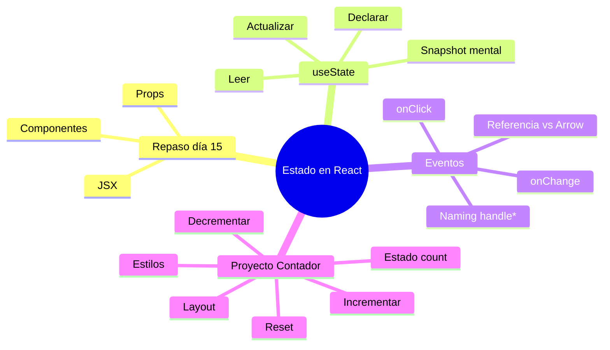

🇪🇸 **Español** | [🇬🇧 English](README.en.md)

# ⚛️ Día 16: Simple Counter con React

## 📚 Contexto

Ayer (día 15) viste cómo nacen los **componentes**, **JSX** y las **props**. Hoy damos el siguiente salto: hacer que un componente **recuerde cosas** y **reaccione a clicks**. Para ello aprenderás el hook `useState`, los **event handlers** y cerrarás el día construyendo el proyecto **Simple Counter**.

---

## 🎯 Objetivos del día

Al terminar este día deberías poder:

- Repasar componentes, JSX y props del día 15
- Explicar qué es el estado en React y por qué `useState` es necesario
- Declarar, leer y actualizar estado con `useState`
- Conectar eventos del DOM a funciones (`onClick`, `onChange`)
- Distinguir entre pasar una **referencia** a una función vs llamarla en línea con una **arrow**
- Construir un contador funcional con incrementar, decrementar y resetear

---

## 🗺️ Mapa Mental: Estado e Interactividad en React



---

## 🗂️ Estructura del día

```text
day_16/
├── README.md
├── step0-react-recap/
│   └── README.md          # Repaso de componentes, JSX y props
├── step1-usestate-basico/
│   └── README.md          # Fundamentos del hook useState
├── step2-eventos-y-handlers/
│   └── README.md          # Event handlers: onClick, onChange
└── step3-proyecto-contador/
    └── README.md          # Proyecto: Simple Counter
```

---

## 🧭 Orden sugerido de estudio

1. `step0-react-recap` — Recordar lo aprendido y entender por qué necesitamos estado
2. `step1-usestate-basico` — Aprender el hook `useState` a fondo
3. `step2-eventos-y-handlers` — Conectar la UI a funciones con eventos
4. `step3-proyecto-contador` — Aplicar todo en el proyecto Simple Counter

---

## ✅ Checklist de cierre del día

- [ ] Recuerdo qué es un componente, qué es JSX y qué son las props
- [ ] Sé por qué una variable normal no sirve para mostrar cambios en pantalla
- [ ] Puedo declarar estado con `const [valor, setValor] = useState(inicial)`
- [ ] Entiendo que el render usa un **snapshot** del estado de ese momento
- [ ] Sé pasar una función como referencia a `onClick` (sin paréntesis)
- [ ] Sé cuándo necesito una **arrow function** en línea
- [ ] He terminado el proyecto Simple Counter con incrementar, decrementar y reset
