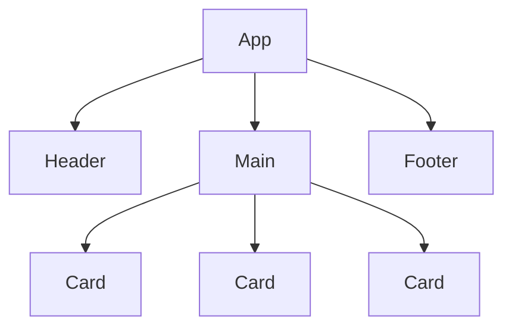
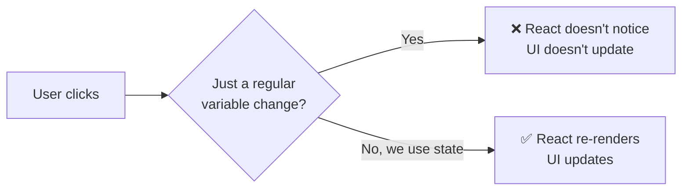

[🇪🇸 Español](README.md) | 🇬🇧 **English**

# Step 0: React Recap (Components, JSX, and Props)

## 🎯 Goal

Refresh the three pillars you saw on day 15 — **components, JSX, and props** — and understand why, to build a counter, those pillars are **not enough**: we're missing a piece called **state**.

---

## 🤔 Why it matters

If you open an editor and write `let count = 0; count = count + 1;`, in "vanilla" JavaScript the variable changes, but the browser **shows nothing new**. For React to paint a different number on screen, you have to explicitly ask it to **re-render**. Before learning how that's done (with `useState`), it pays to have day 15's pieces fresh.

---

## 🧱 Components: LEGO blocks

A **component** is an independent piece of UI. In practice, it's a **JavaScript function that returns JSX**.

```jsx
function Greeting() {
    return <h1>Hello World!</h1>;
}
```

To mount it on the page:

```jsx
import React from 'react';
import ReactDOM from 'react-dom/client';

const root = ReactDOM.createRoot(document.getElementById('root'));
root.render(<Greeting />);
```

Your final web page is a **tree of components**: a main one (`App`) that contains smaller ones.



> 💡 A useful rule: **a component's name always starts with a capital letter** (`Greeting`, `UserCard`). That's how React knows `<Greeting />` is your component and not an HTML tag.

---

## 🔤 JSX: HTML inside JavaScript

JSX is not HTML — it's a special syntax that React translates into function calls. But **it reads like HTML**, which makes it very comfortable.

```jsx
function UserCard() {
    const name = "Ana";
    return (
        <div className="card">
            <h2>{name}</h2>
            <p>Age: {25} years</p>
        </div>
    );
}
```

Three key details that get forgotten:

| Detail | HTML | JSX |
|--------|------|-----|
| CSS class | `class="card"` | `className="card"` |
| Insert JavaScript | Not possible | `{variable}` |
| Return multiple elements | Anything goes | Need a single parent (or `<>...</>`) |

---

## 📦 Props: data the parent passes to the child

**Props** are a component's arguments. The parent **sends** them as attributes, the child **receives** them in its parameter.

```jsx
// Child RECEIVES props
function Greeting(props) {
    return <h1>Hello, {props.name}!</h1>;
}

// Parent SENDS props
<Greeting name="Carlos" />
```

The same definition lets you show different data:

```jsx
<Greeting name="Carlos" />
<Greeting name="María" />
<Greeting name="Lucía" />
```

> 💡 **Strings** in quotes (`name="Ana"`). **Numbers, arrays, booleans, expressions** in braces (`age={25}`).

---

## 🆚 Why aren't props enough for a counter?

Imagine you try to build a counter with just props:

```jsx
function Counter(props) {
    return <h1>{props.number}</h1>;
}

let number = 0;
root.render(<Counter number={number} />);

// What if the user clicks a button?
number = number + 1;  // 🤔 I change the variable...
// ...but the component DOESN'T notice. No new render.
```

The problem: changing a JavaScript variable **doesn't tell React** to paint anything again. We need a way to say "this changed, re-render". That's **state**.



| Concept | Who controls it | Triggers re-render? |
|---------|-----------------|---------------------|
| **Regular variable** | Your code | ❌ No |
| **Prop** | The parent component | ✅ Yes (when the parent re-renders) |
| **State (`useState`)** | The component itself | ✅ Yes |

---

## 🧠 Question to reflect on

<details>
<summary>If props were enough, why do you think React added the concept of "state"?</summary>

Because props are **data that come from outside**. But many components need to **remember their own things**: whether a menu is open or closed, what's typed in an input, how many times the user clicked a button…

That "internal memory" of the component is the **state**. It's information:

1. That **lives inside** the component
2. That **changes over time** as the user interacts
3. That, when it changes, **triggers a new render** to reflect the change on screen

Without state, components could only show whatever the parent tells them — they'd be "dumb". With state, they can be **interactive**.

</details>

---

## ✅ Checklist for this step

- [ ] I know what a component is (a function that returns JSX)
- [ ] I recognize the differences between HTML and JSX (`className`, braces, single parent)
- [ ] I can pass and receive props
- [ ] I understand why a regular variable does **not** update the UI when it changes
- [ ] I'm clear that for a component to "remember" things I need **state**
