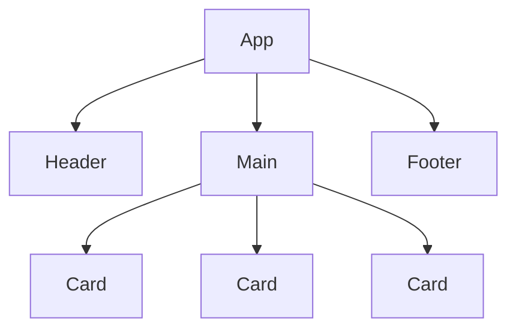
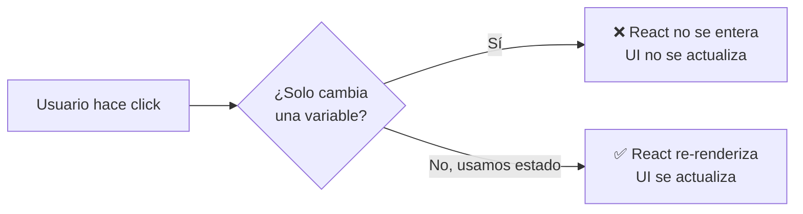

🇪🇸 **Español** | [🇬🇧 English](README.en.md)

# Step 0: Repaso de React (Componentes, JSX y Props)

## 🎯 Objetivo

Refrescar los tres pilares que viste en el día 15 — **componentes, JSX y props** — y entender por qué, para construir un contador, esos pilares **no son suficientes**: nos falta una pieza llamada **estado**.

---

## 🤔 ¿Por qué importa?

Si abres un editor y escribes `let count = 0; count = count + 1;`, en JavaScript "puro" la variable cambia, pero el navegador **no muestra nada nuevo**. Para que React pinte un número distinto en pantalla, hay que pedirle explícitamente que **vuelva a renderizar**. Antes de aprender cómo se hace eso (con `useState`), conviene tener muy frescas las piezas del día 15.

---

## 🧱 Componentes: bloques de LEGO

Un **componente** es una pieza independiente de la UI. En la práctica, es una **función de JavaScript que devuelve JSX**.

```jsx
function Saludo() {
    return <h1>¡Hola Mundo!</h1>;
}
```

Para montarlo en la página:

```jsx
import React from 'react';
import ReactDOM from 'react-dom/client';

const root = ReactDOM.createRoot(document.getElementById('root'));
root.render(<Saludo />);
```

Tu página web final es un **árbol de componentes**: uno principal (`App`) que contiene a otros más pequeños.



> 💡 Una regla útil: **el nombre de un componente siempre empieza por mayúscula** (`Saludo`, `TarjetaUsuario`). Así React sabe que `<Saludo />` es un componente tuyo y no una etiqueta HTML.

---

## 🔤 JSX: HTML dentro de JavaScript

JSX no es HTML — es una sintaxis especial que React traduce a llamadas de función. Pero **se lee como HTML**, lo que lo hace muy cómodo.

```jsx
function TarjetaUsuario() {
    const nombre = "Ana";
    return (
        <div className="tarjeta">
            <h2>{nombre}</h2>
            <p>Edad: {25} años</p>
        </div>
    );
}
```

Tres detalles clave que se olvidan:

| Detalle | HTML | JSX |
|---------|------|-----|
| Clase CSS | `class="tarjeta"` | `className="tarjeta"` |
| Insertar JavaScript | No se puede | `{variable}` |
| Devolver varios elementos | Cualquier cosa | Necesitan un único padre (o `<>...</>`) |

---

## 📦 Props: datos que el padre le pasa al hijo

Las **props** son los argumentos del componente. El padre las **envía** como atributos, el hijo las **recibe** en su parámetro.

```jsx
// El hijo RECIBE props
function Saludo(props) {
    return <h1>¡Hola, {props.nombre}!</h1>;
}

// El padre ENVÍA props
<Saludo nombre="Carlos" />
```

Una misma definición sirve para mostrar datos distintos:

```jsx
<Saludo nombre="Carlos" />
<Saludo nombre="María" />
<Saludo nombre="Lucía" />
```

> 💡 **Texto** entre comillas (`nombre="Ana"`). **Números, arrays, booleanos, expresiones** entre llaves (`edad={25}`).

---

## 🆚 ¿Por qué las props no bastan para un contador?

Imagina que intentas construir un contador solo con props:

```jsx
function Contador(props) {
    return <h1>{props.numero}</h1>;
}

let numero = 0;
root.render(<Contador numero={numero} />);

// ¿Y si el usuario pulsa un botón?
numero = numero + 1;  // 🤔 Cambio la variable...
// ...pero el componente NO se entera. No hay nuevo render.
```

El problema: cambiar una variable de JavaScript **no le dice a React** que vuelva a pintar nada. Necesitamos una forma de decir "esto cambió, vuelve a renderizar". Eso es el **estado**.



| Concepto | Quién lo controla | ¿Provoca re-render? |
|----------|-------------------|---------------------|
| **Variable normal** | Tu código | ❌ No |
| **Prop** | El componente padre | ✅ Sí (cuando el padre re-renderiza) |
| **Estado (`useState`)** | El propio componente | ✅ Sí |

---

## 🧠 Pregunta para reflexionar

<details>
<summary>Si las props fueran suficientes, ¿por qué crees que React añadió el concepto de "estado"?</summary>

Porque las props son **datos que vienen de fuera**. Pero muchos componentes necesitan **recordar cosas propias**: si un menú está abierto o cerrado, qué hay escrito en un input, cuántas veces el usuario pulsó un botón…

Esa "memoria interna" del componente es el **estado**. Es información:

1. Que **vive dentro** del componente
2. Que **cambia con el tiempo** según interactúa el usuario
3. Que, cuando cambia, **dispara un nuevo render** para reflejar el cambio en pantalla

Sin estado, los componentes solo podrían mostrar lo que el padre les diga — serían "tontos". Con estado, pueden ser **interactivos**.

</details>

---

## ✅ Checklist de este step

- [ ] Sé qué es un componente (una función que devuelve JSX)
- [ ] Reconozco las diferencias entre HTML y JSX (`className`, llaves, padre único)
- [ ] Sé pasar y recibir props
- [ ] Entiendo por qué una variable normal **no** actualiza la UI al cambiar
- [ ] Tengo claro que para que un componente "recuerde" cosas necesito **estado**
