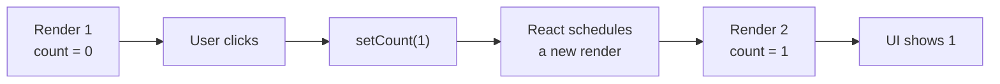
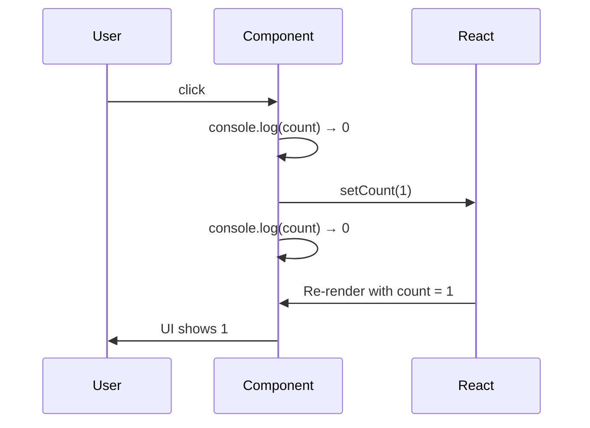

[🇪🇸 Español](README.md) | 🇬🇧 **English**

# Step 1: `useState` — Fundamentals

## 🎯 Goal

Learn the `useState` hook: how to **declare** it, how to **read** it, and how to **update** it. Also, understand the **snapshot** mental model — key to not losing your mind when a value "doesn't update immediately".

---

## 🤔 Why it matters

`useState` is **the** hook you'll use in nearly every interactive component. Without it there are no forms, no reactive buttons, no dropdowns. It's the tool that turns a "static" component into a **living** one.

---

## 🪝 What is a Hook?

**Hooks** are special functions starting with `use` that let you "hook into" React's capabilities (state, lifecycle, context…) **from a function component**.

Minimum rules:

1. They can only be called **inside a component** (or another hook).
2. Always **at the top level** of the component: never inside an `if`, `for`, or nested function.

---

## 🧬 Anatomy of `useState`

```jsx
import { useState } from 'react';

function Counter() {
    const [count, setCount] = useState(0);
    //     ↑       ↑              ↑
    //     │       │              └── initial value
    //     │       └── function to UPDATE state
    //     └── CURRENT value of state

    return <h1>{count}</h1>;
}
```

Three pieces:

| Piece | What it's for |
|-------|---------------|
| `useState(initial)` | Creates a "memory slot" with an initial value |
| `count` | The **current** value of state (read only) |
| `setCount(newValue)` | The **only way** to change state |

> 💡 **Important:** never assign `count = 5` directly. It won't work. React only notices a change if you call `setCount`.

---

## 🔁 The update flow



Every time you call `setCount`, React:

1. Stores the new value.
2. Runs the component function from scratch.
3. Computes the new JSX and updates only what changed in the DOM.

---

## 👀 Reading state: just like any variable

```jsx
function Counter() {
    const [count, setCount] = useState(0);

    return (
        <div>
            <h1>{count}</h1>
            <p>The counter is {count}</p>
            <p>Double is {count * 2}</p>
        </div>
    );
}
```

---

## ✍️ Updating state: two ways

### Way 1: passing the new value

```jsx
setCount(5);          // count becomes 5
setCount(count + 1);  // count becomes count + 1
```

### Way 2: passing an **updater function**

```jsx
setCount(prev => prev + 1);
```

This second form is safer when the new value **depends on the previous value**, especially if you have several `setCount` calls in a row.

```jsx
// ❌ This does NOT increment 3 times
setCount(count + 1);
setCount(count + 1);
setCount(count + 1);

// ✅ This DOES increment 3 times
setCount(prev => prev + 1);
setCount(prev => prev + 1);
setCount(prev => prev + 1);
```

Why? Because within a single render, `count` is **a fixed value** (a snapshot).

---

## 📸 The "snapshot" mental model

Each render works with a **snapshot** (still picture) of the state.

```jsx
function Counter() {
    const [count, setCount] = useState(0);

    function handleClick() {
        console.log("Before:", count);    // 0
        setCount(count + 1);
        console.log("After:", count);     // 0 (still 0!)
    }

    return <button onClick={handleClick}>Click ({count})</button>;
}
```

When you call `setCount`, you're **not changing `count` in this render** — you're asking for the next render with a new value. In the current render, `count` is still what it was when React ran the function.



> 💡 Practical rule: if you need to work with the "new value" right after setting, **save it in a constant**: `const next = count + 1; setCount(next);`.

---

## 🗂️ State vs Props: quick comparison

| Aspect | Props | State (`useState`) |
|--------|-------|--------------------|
| Where does it come from? | Sent by the parent component | Created by the component itself |
| Who changes it? | The parent | The component itself, via `setX` |
| Mutable from inside? | No (read only) | Yes, via the setter function |
| Triggers re-render on change? | Yes (when parent re-renders) | Yes |
| Typical example | A user's `name` coming from outside | `count`, `isOpen`, `inputValue` |

---

## 🧪 Minimal complete example

```jsx
import { useState } from 'react';

function Counter() {
    const [count, setCount] = useState(0);

    return (
        <div>
            <h1>{count}</h1>
            <button onClick={() => setCount(count + 1)}>+1</button>
            <button onClick={() => setCount(0)}>Reset</button>
        </div>
    );
}
```

Four conceptual lines:

1. Import the hook.
2. Declare state with an initial value.
3. Read the state in JSX.
4. Call the setter from an event to update it.

---

## 🧠 Question to reflect on

<details>
<summary>What would happen if we could modify `count` directly (without `setCount`)?</summary>

Two bad things would happen:

1. **React wouldn't notice the change** and the UI wouldn't refresh. Your variable changes but the `<h1>` keeps showing the old value.

2. **We'd break React's predictable model**. React trusts that state only changes through the setter so it can schedule renders efficiently, diff DOM versions, and apply only the necessary changes.

That's why `useState` returns **two separate things**: the value (read only) and the function to change it. It's not a limitation: it's the guarantee that the UI always reflects the state.

</details>

---

## ✅ Checklist for this step

- [ ] I can import `useState` from `react`
- [ ] I can destructure `const [value, setValue] = useState(initial)`
- [ ] I understand that `setValue` is the **only way** to change state
- [ ] I know the "updater function" form `setValue(prev => prev + 1)`
- [ ] I'm clear on the **snapshot** model: within a render, state is fixed
- [ ] I can tell **state** apart from **props**
