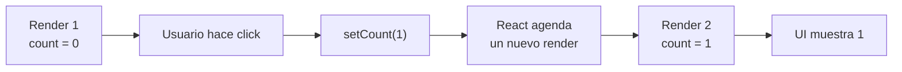
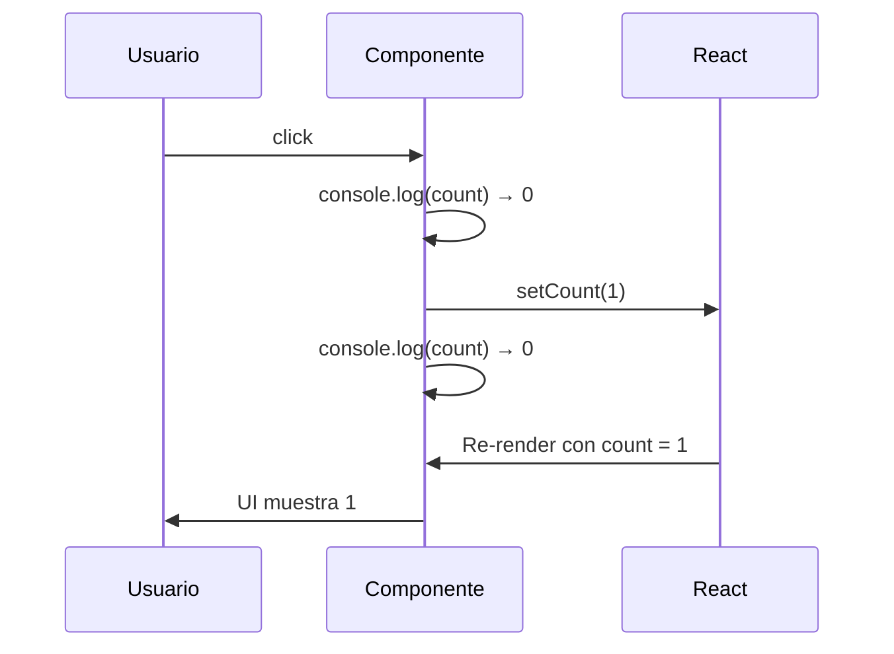

🇪🇸 **Español** | [🇬🇧 English](README.en.md)

# Step 1: `useState` — Fundamentos

## 🎯 Objetivo

Aprender el hook `useState`: cómo se **declara**, cómo se **lee** y cómo se **actualiza**. Además, entender el modelo mental del **snapshot** — clave para no enloquecer cuando un valor "no se actualiza inmediatamente".

---

## 🤔 ¿Por qué importa?

`useState` es **el** hook que vas a usar en prácticamente todos los componentes interactivos. Sin él, no hay formularios, ni botones que reaccionen, ni menús desplegables. Es la herramienta que convierte un componente "estático" en uno **vivo**.

---

## 🪝 ¿Qué es un Hook?

Los **Hooks** son funciones especiales que empiezan por `use` y permiten "engancharte" a las capacidades de React (estado, ciclo de vida, contexto…) **desde un componente función**.

Reglas mínimas:

1. Solo se llaman **dentro de un componente** (o de otro hook).
2. Siempre **en el nivel superior** del componente: nunca dentro de un `if`, `for` o función anidada.

---

## 🧬 Anatomía de `useState`

```jsx
import { useState } from 'react';

function Contador() {
    const [count, setCount] = useState(0);
    //     ↑       ↑              ↑
    //     │       │              └── valor inicial
    //     │       └── función para ACTUALIZAR el estado
    //     └── valor ACTUAL del estado

    return <h1>{count}</h1>;
}
```

Tres piezas:

| Pieza | Para qué sirve |
|-------|----------------|
| `useState(initial)` | Crea una "casilla de memoria" con un valor inicial |
| `count` | El valor **actual** del estado (solo lectura) |
| `setCount(nuevoValor)` | La **única forma** de cambiar el estado |

> 💡 **Importante:** nunca asignes directamente `count = 5`. No funcionará. React solo se entera de un cambio si llamas a `setCount`.

---

## 🔁 El flujo de una actualización



Cada vez que llamas a `setCount`, React:

1. Guarda el nuevo valor.
2. Vuelve a ejecutar la función del componente desde cero.
3. Calcula el nuevo JSX y actualiza solo lo que cambió en el DOM.

---

## 👀 Leer estado: igual que cualquier variable

```jsx
function Contador() {
    const [count, setCount] = useState(0);

    return (
        <div>
            <h1>{count}</h1>
            <p>El contador vale {count}</p>
            <p>El doble es {count * 2}</p>
        </div>
    );
}
```

---

## ✍️ Actualizar estado: dos formas

### Forma 1: pasando el nuevo valor

```jsx
setCount(5);          // count pasa a valer 5
setCount(count + 1);  // count pasa a valer count + 1
```

### Forma 2: pasando una **función actualizadora**

```jsx
setCount(prev => prev + 1);
```

Esta segunda forma es más segura cuando el nuevo valor **depende del valor anterior**, sobre todo si hay varios `setCount` seguidos.

```jsx
// ❌ Esto NO incrementa 3 veces
setCount(count + 1);
setCount(count + 1);
setCount(count + 1);

// ✅ Esto SÍ incrementa 3 veces
setCount(prev => prev + 1);
setCount(prev => prev + 1);
setCount(prev => prev + 1);
```

¿Por qué? Porque dentro de un mismo render, `count` es **un valor fijo** (un snapshot).

---

## 📸 El modelo mental del "snapshot"

Cada render trabaja con un **snapshot** (foto fija) del estado.

```jsx
function Contador() {
    const [count, setCount] = useState(0);

    function handleClick() {
        console.log("Antes:", count);     // 0
        setCount(count + 1);
        console.log("Después:", count);   // 0 (¡sigue siendo 0!)
    }

    return <button onClick={handleClick}>Click ({count})</button>;
}
```

Cuando llamas a `setCount`, **no estás cambiando `count` en este render** — estás pidiendo el próximo render con un nuevo valor. En el render actual, `count` sigue siendo lo que era cuando React ejecutó la función.



> 💡 Regla práctica: si necesitas trabajar con el "nuevo valor" justo después de setear, **guarda el valor en una constante**: `const next = count + 1; setCount(next);`.

---

## 🗂️ Estado vs Props: comparativa rápida

| Aspecto | Props | Estado (`useState`) |
|---------|-------|---------------------|
| ¿De dónde viene? | Lo envía el componente padre | Lo crea el propio componente |
| ¿Quién lo cambia? | El padre | El propio componente, con `setX` |
| ¿Es mutable desde dentro? | No (solo lectura) | Sí, vía la función setter |
| ¿Provoca re-render al cambiar? | Sí (cuando el padre re-renderiza) | Sí |
| Ejemplo típico | `nombre` de un usuario que llega de fuera | `count`, `isOpen`, `inputValue` |

---

## 🧪 Ejemplo mínimo y completo

```jsx
import { useState } from 'react';

function Contador() {
    const [count, setCount] = useState(0);

    return (
        <div>
            <h1>{count}</h1>
            <button onClick={() => setCount(count + 1)}>+1</button>
            <button onClick={() => setCount(0)}>Reset</button>
        </div>
    );
}
```

Cuatro líneas conceptuales:

1. Importas el hook.
2. Declaras el estado con valor inicial.
3. Lees el estado en el JSX.
4. Llamas al setter desde un evento para actualizarlo.

---

## 🧠 Pregunta para reflexionar

<details>
<summary>¿Qué pasaría si pudiéramos modificar `count` directamente (sin `setCount`)?</summary>

Pasarían dos cosas malas:

1. **React no se enteraría del cambio** y la UI no se refrescaría. Tu variable cambia pero el `<h1>` sigue mostrando lo viejo.

2. **Romperíamos el modelo predecible** de React. React confía en que el estado solo cambia a través del setter para poder programar los renders eficientemente, comparar versiones del DOM y aplicar solo los cambios necesarios.

Por eso `useState` te devuelve **dos cosas separadas**: el valor (solo lectura) y la función para cambiarlo. No es una limitación: es la garantía de que la UI siempre refleja el estado.

</details>

---

## ✅ Checklist de este step

- [ ] Sé importar `useState` desde `react`
- [ ] Sé desestructurar `const [valor, setValor] = useState(inicial)`
- [ ] Entiendo que `setValor` es la **única forma** de cambiar el estado
- [ ] Conozco la forma "función actualizadora" `setValor(prev => prev + 1)`
- [ ] Tengo claro el modelo del **snapshot**: dentro de un render, el estado es fijo
- [ ] Sé diferenciar **estado** de **props**
