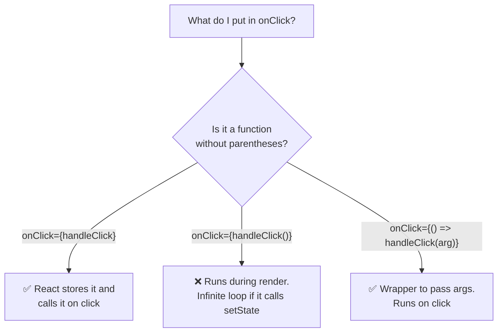
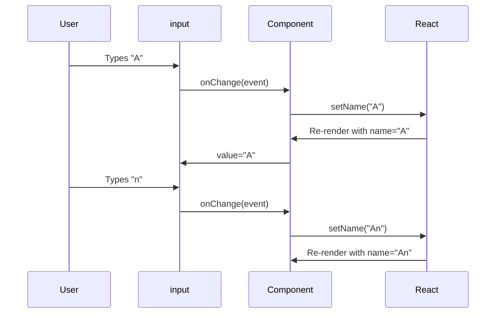

[🇪🇸 Español](README.md) | 🇬🇧 **English**

# Step 2: Events and Handlers in React

## 🎯 Goal

Learn how to **wire UI to functions**: how handlers are written, what naming convention we use (`handleClick`, `onClick`), and the most typical trap — the difference between **passing a reference** and **calling the function** inside JSX.

---

## 🤔 Why it matters

Without events, your app is a poster: pretty but lifeless. A component's state only changes because **something triggers it** (a click, a key, an input change). Tying those events to functions correctly is what separates a decorative component from a **useful** one.

---

## 🪞 Events in HTML vs Events in React

In plain HTML you write handlers in lowercase and as strings:

```html
<button onclick="doSomething()">Click</button>
```

In React they are element props, **camelCase**, and receive **a function**:

```jsx
<button onClick={doSomething}>Click</button>
```

| Detail | HTML | React (JSX) |
|--------|------|-------------|
| Attribute name | `onclick` (lowercase) | `onClick` (camelCase) |
| Value | String with code | JavaScript function |
| How it's wired | `"doSomething()"` | `{doSomething}` |

Typical events you'll see:

| Event | When it fires |
|-------|---------------|
| `onClick` | Click on the element |
| `onChange` | User changes an input's value |
| `onSubmit` | A form is submitted |
| `onMouseEnter` / `onMouseLeave` | Cursor enters/leaves |
| `onKeyDown` / `onKeyUp` | Key pressed/released |

---

## 🪜 Basic pattern: define handler + wire to event

```jsx
function Greeter() {
    function handleClick() {
        alert("Hello!");
    }

    return <button onClick={handleClick}>Greet</button>;
}
```

> 💡 **Naming convention:** the function is called `handleX` (what it does) and the prop is `onX` (when it fires). `handleClick` is wired to `onClick`. `handleSubmit` to `onSubmit`.

---

## ⚠️ The trap: reference vs call

This is **the most common confusion** of the day.

```jsx
// ✅ CORRECT: you pass the function (reference). React will call it on click.
<button onClick={handleClick}>Click</button>

// ❌ WRONG: you're CALLING the function right now, during render.
//    onClick receives handleClick's return value (probably undefined).
<button onClick={handleClick()}>Click</button>
```



---

## 🧩 Inline arrow vs named function

There are two perfectly valid forms:

### Named function (recommended if logic grows)

```jsx
function Counter() {
    const [count, setCount] = useState(0);

    function handleIncrement() {
        setCount(count + 1);
    }

    return <button onClick={handleIncrement}>+1</button>;
}
```

### Inline arrow (handy for one-liners)

```jsx
function Counter() {
    const [count, setCount] = useState(0);

    return <button onClick={() => setCount(count + 1)}>+1</button>;
}
```

When do I use which?

| Situation | Recommendation |
|-----------|----------------|
| One line, no logic | Inline arrow |
| Multiple lines or conditional logic | Named `handleX` function |
| Need to pass arguments | Inline arrow `() => handleX(arg)` |
| Reuse in multiple places | Named function |

---

## 🧷 Passing arguments to a handler

If your function needs an argument, **don't call it directly** in `onClick` — wrap it in an arrow.

```jsx
function Greeter() {
    function greet(name) {
        alert(`Hello ${name}!`);
    }

    return (
        <div>
            {/* ❌ Runs during render */}
            <button onClick={greet("Ana")}>Wrong</button>

            {/* ✅ Runs on click */}
            <button onClick={() => greet("Ana")}>Right</button>
        </div>
    );
}
```

---

## 📝 `onChange` and the input flow

`onChange` fires on every key the user presses in an `<input>`. The new value lives in `event.target.value`.

```jsx
function NameField() {
    const [name, setName] = useState("");

    function handleChange(event) {
        setName(event.target.value);
    }

    return (
        <div>
            <input value={name} onChange={handleChange} />
            <p>Hello, {name}</p>
        </div>
    );
}
```



> 💡 When the input's `value` is tied to state, we call it a **controlled input**: React is the source of truth, not the DOM.

---

## 🧪 Combined example: counter with named handlers

```jsx
import { useState } from 'react';

function Counter() {
    const [count, setCount] = useState(0);

    function handleIncrement() {
        setCount(prev => prev + 1);
    }

    function handleReset() {
        setCount(0);
    }

    return (
        <div>
            <h1>{count}</h1>
            <button onClick={handleIncrement}>+1</button>
            <button onClick={handleReset}>Reset</button>
        </div>
    );
}
```

When you read this code, at a glance you already know:

- `count` is **state** because you see `useState`.
- `handleIncrement` and `handleReset` are **handlers** (the prefix says so).
- `onClick={handleIncrement}` passes the **reference**, not a call.

---

## 🧠 Question to reflect on

<details>
<summary>Why does `onClick={myFunction()}` cause an infinite loop if it calls `setState` inside?</summary>

Because `onClick={myFunction()}` runs `myFunction` **during render**, not on click. If `myFunction` calls `setSomething(...)`, this happens:

1. React renders the component.
2. While rendering, it accidentally runs `myFunction()`.
3. `myFunction` calls `setSomething`, which schedules **another render**.
4. React renders again.
5. Runs `myFunction()` again…
6. …infinite loop.

The typical error in the console reads something like *"Too many re-renders. React limits the number of renders to prevent an infinite loop."*

The fix: pass the function **without parentheses** (`onClick={myFunction}`) or wrap it in an arrow (`onClick={() => myFunction()}`).

</details>

---

## ✅ Checklist for this step

- [ ] I know JSX events are **camelCase** (`onClick`, not `onclick`)
- [ ] I know the event's value must be **a function**
- [ ] I tell the difference between passing the **reference** (`onClick={fn}`) and **calling it** (`onClick={fn()}`)
- [ ] I can wrap calls with arguments in an arrow (`() => fn(arg)`)
- [ ] I use the `handleX` convention for handlers
- [ ] I can read an input value with `event.target.value` in `onChange`
