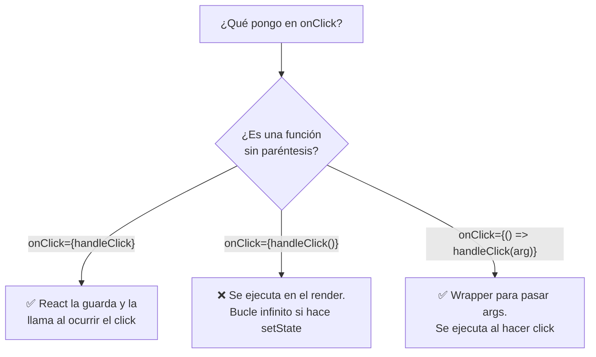
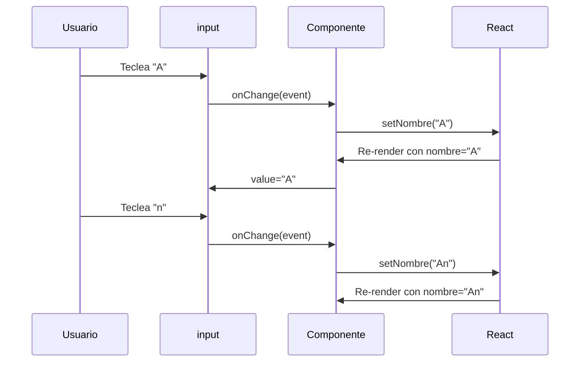

🇪🇸 **Español** | [🇬🇧 English](README.en.md)

# Step 2: Eventos y Handlers en React

## 🎯 Objetivo

Aprender a **conectar la UI a funciones**: cómo se escriben los handlers, qué convención de nombres usamos (`handleClick`, `onClick`), y la trampa más típica — la diferencia entre **pasar una referencia** y **llamar a la función** dentro del JSX.

---

## 🤔 ¿Por qué importa?

Sin eventos, tu app es un poster: bonita pero inerte. El estado del componente solo cambia porque **algo lo desencadena** (un click, una tecla, un cambio en un input). Saber atar esos eventos a funciones de forma correcta es lo que separa un componente de adorno de uno **útil**.

---

## 🪞 Eventos en HTML vs Eventos en React

En HTML puro escribes los handlers con minúsculas y como strings:

```html
<button onclick="hacerAlgo()">Click</button>
```

En React son props del elemento, **camelCase**, y reciben **una función**:

```jsx
<button onClick={hacerAlgo}>Click</button>
```

| Detalle | HTML | React (JSX) |
|---------|------|-------------|
| Nombre del atributo | `onclick` (minúscula) | `onClick` (camelCase) |
| Valor | String con código | Función JavaScript |
| Cómo se ata | `"hacerAlgo()"` | `{hacerAlgo}` |

Eventos típicos que verás:

| Evento | Cuándo se dispara |
|--------|-------------------|
| `onClick` | Click sobre el elemento |
| `onChange` | El usuario cambia el valor de un input |
| `onSubmit` | Se envía un formulario |
| `onMouseEnter` / `onMouseLeave` | Entra/sale el cursor |
| `onKeyDown` / `onKeyUp` | Pulsa/suelta una tecla |

---

## 🪜 Patrón básico: definir handler + conectar al evento

```jsx
function Saludador() {
    function handleClick() {
        alert("¡Hola!");
    }

    return <button onClick={handleClick}>Saludar</button>;
}
```

> 💡 **Convención de nombres:** la función se llama `handleX` (lo que hace) y la prop es `onX` (cuándo se dispara). `handleClick` conectada a `onClick`. `handleSubmit` a `onSubmit`.

---

## ⚠️ La trampa: referencia vs llamada

Esta es **la confusión más común** del día.

```jsx
// ✅ CORRECTO: pasas la función (referencia). React la llamará cuando haya click.
<button onClick={handleClick}>Click</button>

// ❌ MAL: estás LLAMANDO a la función ahora mismo, en el render.
//    onClick recibe el return de handleClick (probablemente undefined).
<button onClick={handleClick()}>Click</button>
```



---

## 🧩 Inline arrow vs función nombrada

Hay dos formas perfectamente válidas:

### Función nombrada (recomendado si la lógica crece)

```jsx
function Contador() {
    const [count, setCount] = useState(0);

    function handleIncrement() {
        setCount(count + 1);
    }

    return <button onClick={handleIncrement}>+1</button>;
}
```

### Arrow inline (cómodo para una sola línea)

```jsx
function Contador() {
    const [count, setCount] = useState(0);

    return <button onClick={() => setCount(count + 1)}>+1</button>;
}
```

¿Cuándo uso cuál?

| Situación | Recomendación |
|-----------|---------------|
| Una sola línea, sin lógica | Arrow inline |
| Varias líneas o lógica condicional | Función nombrada `handleX` |
| Necesitas pasar argumentos | Arrow inline `() => handleX(arg)` |
| Reutilizas la función en varios sitios | Función nombrada |

---

## 🧷 Pasar argumentos a un handler

Si tu función necesita un argumento, **no la llames directamente** en `onClick` — envuélvela en una arrow.

```jsx
function Saludador() {
    function saludarA(nombre) {
        alert(`¡Hola ${nombre}!`);
    }

    return (
        <div>
            {/* ❌ Se ejecuta en el render */}
            <button onClick={saludarA("Ana")}>Mal</button>

            {/* ✅ Se ejecuta al hacer click */}
            <button onClick={() => saludarA("Ana")}>Bien</button>
        </div>
    );
}
```

---

## 📝 `onChange` y el flujo en inputs

`onChange` se dispara en cada tecla que el usuario pulsa en un `<input>`. El nuevo valor está en `event.target.value`.

```jsx
function CampoNombre() {
    const [nombre, setNombre] = useState("");

    function handleChange(event) {
        setNombre(event.target.value);
    }

    return (
        <div>
            <input value={nombre} onChange={handleChange} />
            <p>Hola, {nombre}</p>
        </div>
    );
}
```



> 💡 Cuando el `value` del input está atado a un estado, decimos que es un **input controlado**: la fuente de la verdad es React, no el DOM.

---

## 🧪 Ejemplo combinado: contador con handler nombrado

```jsx
import { useState } from 'react';

function Contador() {
    const [count, setCount] = useState(0);

    function handleIncrement() {
        setCount(prev => prev + 1);
    }

    function handleReset() {
        setCount(0);
    }

    return (
        <div>
            <h1>{count}</h1>
            <button onClick={handleIncrement}>+1</button>
            <button onClick={handleReset}>Reset</button>
        </div>
    );
}
```

Cuando lees este código, ya sabes a primera vista:

- `count` es **estado** porque se ve `useState`.
- `handleIncrement` y `handleReset` son **handlers** (lo dice el prefijo).
- `onClick={handleIncrement}` pasa la **referencia**, sin llamarla.

---

## 🧠 Pregunta para reflexionar

<details>
<summary>¿Por qué `onClick={miFuncion()}` causa un bucle infinito si dentro hace `setState`?</summary>

Porque `onClick={miFuncion()}` ejecuta `miFuncion` **durante el render**, no al hacer click. Si dentro de `miFuncion` haces `setSomething(...)`, pasa esto:

1. React renderiza el componente.
2. Mientras lo renderiza, ejecuta `miFuncion()` por error.
3. `miFuncion` llama a `setSomething`, que programa **otro render**.
4. React vuelve a renderizar.
5. Vuelve a ejecutar `miFuncion()`…
6. …loop infinito.

El error típico que verás en consola es algo como *"Too many re-renders. React limits the number of renders to prevent an infinite loop."*

La solución: pasa la función **sin paréntesis** (`onClick={miFuncion}`) o envuélvela en una arrow (`onClick={() => miFuncion()}`).

</details>

---

## ✅ Checklist de este step

- [ ] Sé que en JSX los eventos son **camelCase** (`onClick`, no `onclick`)
- [ ] Sé que el valor del evento debe ser **una función**
- [ ] Distingo entre pasar la **referencia** (`onClick={fn}`) y **llamarla** (`onClick={fn()}`)
- [ ] Sé envolver llamadas con argumentos en una arrow (`() => fn(arg)`)
- [ ] Uso la convención `handleX` para handlers
- [ ] Sé leer el valor de un input con `event.target.value` en `onChange`
