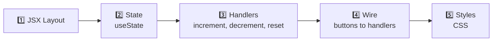
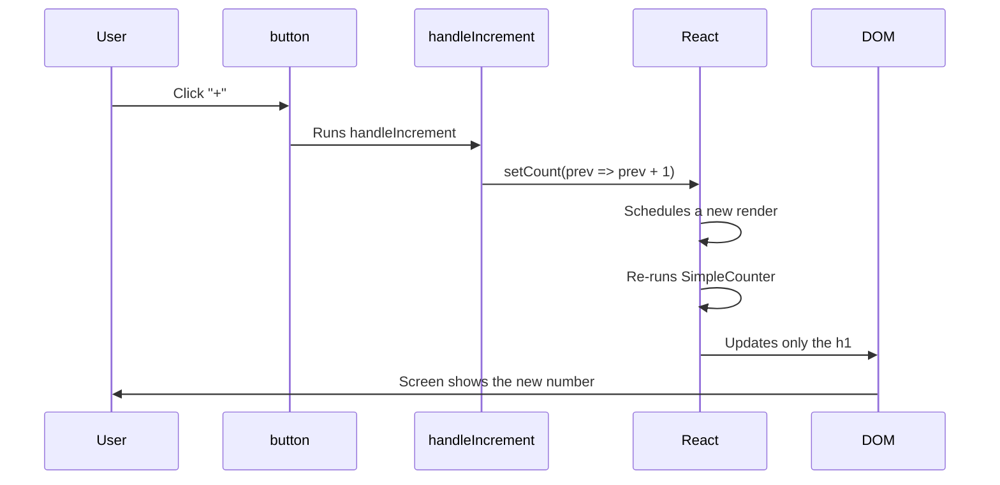

[🇪🇸 Español](README.md) | 🇬🇧 **English**

# Step 3: Project — Simple Counter

## 🎯 Goal

Build, end to end, a **Simple Counter** in React: a counter that increments, decrements, and resets via three buttons. You'll apply everything from the previous steps: components, props, `useState`, and handlers.

> 🔗 Official project reference: [Simple Counter (React)](https://4geeks.com/syllabus/spain-fs-pt-129/project/simple-counter-react)

---

## 🤔 Why it matters

A counter looks trivial, but it contains **the full pattern** of an interactive React app: local state, events, DOM updates. If you master this pattern, you master 80% of the components you'll ever write.

---

## 🧭 5-step plan



1. Paint the layout without logic.
2. Add the `count` state.
3. Write the handlers.
4. Wire each button to its handler.
5. Apply CSS so it looks decent.

---

## 🏗️ Step 1: JSX layout (no logic)

Always start with the "shell": plain HTML/JSX, no state, just to visualize the UI.

```jsx
function SimpleCounter() {
    return (
        <div className="counter">
            <h1 className="counter__value">0</h1>
            <div className="counter__buttons">
                <button>-</button>
                <button>Reset</button>
                <button>+</button>
            </div>
        </div>
    );
}
```

You'll see a `0` and three dead buttons. Perfect: the UI is there, now we'll give it life.

---

## 🧠 Step 2: Add state

The counter needs to **remember its current value**. That's state.

```jsx
import { useState } from 'react';

function SimpleCounter() {
    const [count, setCount] = useState(0);

    return (
        <div className="counter">
            <h1 className="counter__value">{count}</h1>
            <div className="counter__buttons">
                <button>-</button>
                <button>Reset</button>
                <button>+</button>
            </div>
        </div>
    );
}
```

Changes:

- Import `useState`.
- Declare `count` with initial value `0`.
- Replace the literal `0` with `{count}` in JSX.

Your UI still shows `0`, but now we're reading from state.

---

## ✋ Step 3: Design the handlers

Three actions, three handlers:

| Handler | What it does | Implementation |
|---------|--------------|----------------|
| `handleIncrement` | Adds 1 to `count` | `setCount(prev => prev + 1)` |
| `handleDecrement` | Subtracts 1 from `count` | `setCount(prev => prev - 1)` |
| `handleReset` | Back to 0 | `setCount(0)` |

```jsx
function SimpleCounter() {
    const [count, setCount] = useState(0);

    function handleIncrement() {
        setCount(prev => prev + 1);
    }

    function handleDecrement() {
        setCount(prev => prev - 1);
    }

    function handleReset() {
        setCount(0);
    }

    // ... return omitted for now
}
```

> 💡 Using `setCount(prev => prev + 1)` instead of `setCount(count + 1)` is optional here, but it's a good habit: it protects you if you ever trigger several updates in a row.

---

## 🔌 Step 4: Wire buttons to handlers

Remember from Step 2: we pass the **reference**, not the call.

```jsx
return (
    <div className="counter">
        <h1 className="counter__value">{count}</h1>
        <div className="counter__buttons">
            <button onClick={handleDecrement}>-</button>
            <button onClick={handleReset}>Reset</button>
            <button onClick={handleIncrement}>+</button>
        </div>
    </div>
);
```

You already have a **working** counter. Click the buttons and watch the number change in real time.

---

## 🎨 Step 5: CSS

```css
.counter {
    display: flex;
    flex-direction: column;
    align-items: center;
    gap: 1.5rem;
    margin-top: 4rem;
    font-family: 'Courier New', monospace;
}

.counter__value {
    font-size: 6rem;
    color: #282c34;
    background: #f4f4f4;
    padding: 1rem 2rem;
    border-radius: 12px;
    min-width: 6rem;
    text-align: center;
    box-shadow: 0 4px 6px rgba(0, 0, 0, 0.08);
}

.counter__buttons {
    display: flex;
    gap: 0.5rem;
}

.counter__buttons button {
    padding: 0.75rem 1.5rem;
    font-size: 1.25rem;
    border: none;
    border-radius: 8px;
    background: #61dafb;
    color: #282c34;
    cursor: pointer;
    transition: transform 0.1s;
}

.counter__buttons button:hover {
    transform: translateY(-2px);
}
```

---

## ✅ Full final component

```jsx
import { useState } from 'react';
import './SimpleCounter.css';

function SimpleCounter() {
    const [count, setCount] = useState(0);

    function handleIncrement() {
        setCount(prev => prev + 1);
    }

    function handleDecrement() {
        setCount(prev => prev - 1);
    }

    function handleReset() {
        setCount(0);
    }

    return (
        <div className="counter">
            <h1 className="counter__value">{count}</h1>
            <div className="counter__buttons">
                <button onClick={handleDecrement}>-</button>
                <button onClick={handleReset}>Reset</button>
                <button onClick={handleIncrement}>+</button>
            </div>
        </div>
    );
}

export default SimpleCounter;
```

And to mount it:

```jsx
import React from 'react';
import ReactDOM from 'react-dom/client';
import SimpleCounter from './SimpleCounter';

const root = ReactDOM.createRoot(document.getElementById('root'));
root.render(<SimpleCounter />);
```

---

## 🔁 Full flow when the user clicks "+"



> 💡 Notice how `<h1>{count}</h1>` updates but the `<button>` elements aren't re-created. React is efficient: it diffs and only changes what's needed.

---

## 🚀 Optional extras

To level up the project:

| Idea | Hint |
|------|------|
| Button to add/subtract 10 | Another handler `setCount(prev => prev + 10)` |
| Don't go below 0 | `setCount(prev => Math.max(0, prev - 1))` |
| Change color when it hits a number | `style={{ color: count > 5 ? 'red' : 'black' }}` |
| Show "negative" when < 0 | Conditional in JSX `{count < 0 && <p>negative</p>}` |
| Input to "jump" to a number | `useState` for the input + handler that parses and calls `setCount` |

---

## 🧠 Question to reflect on

<details>
<summary>Why do we define `count` with `useState(0)` and not with `let count = 0` above the component?</summary>

Because the component is **a function React runs over and over** (every render). If you write `let count = 0` inside, **it resets to 0 on every render** — the counter would never go up.

If you put it **outside** the function, it'd be a global variable, shared across all components and, worst of all, **it wouldn't trigger a re-render** when changed.

`useState` solves both at once:

1. It persists the value **across renders** (React stores it in its internal memory).
2. When you call `setCount`, it **triggers a new render** so the UI reflects the change.

It's React's specific way of saying "this is a variable for my component that remembers its value and, when it changes, redraws".

</details>

---

## ✅ Checklist for this step

- [ ] I painted the empty JSX layout
- [ ] I added `useState` for `count`
- [ ] I created three handlers: `handleIncrement`, `handleDecrement`, `handleReset`
- [ ] I wired each button with `onClick={handlerWithoutParens}`
- [ ] The counter increments, decrements, and resets correctly
- [ ] I applied CSS so the counter looks presentable
- [ ] (Optional) I implemented at least one extra from the list
